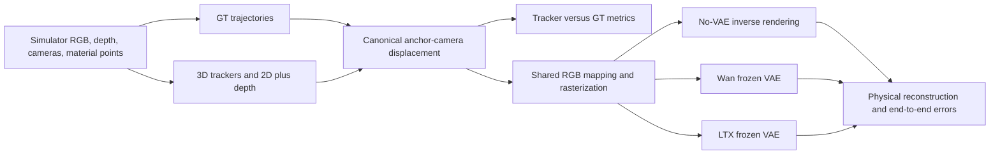

# Experiment 1: simulator-grounded 3D tracking and motion-label VAE reconstruction

**Status:** proposed experiment and implementation specification. No GPU measurements or benchmark results are asserted here. The GPU host, checkpoint pins, and measured resource requirements will be recorded when SSH access is available.

**Purpose:** determine whether the 3D motion labels used by a FloMo-style system are geometrically accurate, and how much additional information is lost when those labels are represented as RGB displacement videos and compressed by frozen Wan and LTX video VAEs.

## 1. Questions and experimental logic

The experiment has two main stages and one optional diagnostic stage.

1. **Tracking:** generate simulation clips with exact cameras and material-point trajectories; run SpaTrackerV2, other 3D trackers, and 2D trackers lifted with depth; measure their errors against the same ground-truth points.
2. **Representation and codec:** convert GT and every predicted trajectory into the same cumulative 3D displacement representation, render it as RGB, and run frozen Wan and LTX VAE encode/decode. Measure both self-reconstruction and decoded error against GT.
3. **Controlled perturbations:** optionally inject known spatial or temporal disturbances into GT labels to identify what each codec suppresses or introduces.

This separates three questions that must not be conflated:

- Does a tracker recover the correct motion?
- Does a VAE preserve the motion label it receives?
- How accurate is the resulting decoded motion relative to simulator truth?

A smooth but incorrect label can reconstruct exceptionally well. Therefore, high RGB PSNR or low codec self-error is insufficient evidence that a label pipeline is good. GT-through-VAE establishes a reference reconstruction floor; zero-motion labels establish a deliberately easy-to-compress but often incorrect control.

The connection to [FloMo](https://flomo-wam.github.io/FloMo%20Paper.pdf) is its use of 3D motion represented through image-like channels. This protocol makes explicit choices about coordinate frames, query sampling, normalization, and masks. Those choices are experimental specifications, not claims that every detail matches author code.

### Claims this experiment can support

It can establish relative tracker accuracy under specified synthetic conditions; sensitivity to depth and camera estimation; motion information retained by the two frozen codecs; and which label/codec combinations preserve physical motion best at their actual compression rates.

It cannot establish robot task success, action grounding, beneficial pretraining, or equivalence to a complete FloMo reproduction. There is no diffusion denoising, pretraining, midtraining, SFT, inverse-dynamics training, or policy rollout in Experiment 1. Those stages can later consume the saved labels and codec artifacts.

## 2. Dataset: a small paired pilot, then a larger benchmark

Start with **12 clips**: six motion archetypes, each rendered with a fixed camera and an orbiting camera. Replay the same object motions and assets across the camera pair, preferably with identical initial camera pose. This directly tests whether camera motion creates false object motion.

| Archetype | Scene behavior | Main diagnostic |
|---|---|---|
| Static scene | Textured objects and background remain fixed | False flow; camera-motion cancellation |
| Translation | One object translates laterally and in depth | Metric displacement, depth scaling, speed |
| Rotation | A rigid object rotates about its own center | Surface-point identity and nonuniform motion |
| Articulation | Two or more rigid links move relative to one another | Link identity, boundaries, local deformation appearance |
| Occlusion and return | A tracked object passes behind an occluder and reappears | Persistence, visibility, reacquisition |
| Depth/speed/view stress | Motion crosses depth discontinuities or exits the view | Fast motion, discontinuities, out-of-view handling |

Pilot defaults are 256 × 256 RGB, 20 Hz, and 33 frames. The sequence includes the query frame; its elapsed duration is 32/20 = 1.6 seconds. Use a 16 × 16 query grid for debugging, then target a **64 × 64 grid, Q = 4,096**, for the main pilot. If profiling requires 32 × 32, freeze that setting for all methods before reading comparative results. Do not mix densities in one ranking.

A proposed expansion is **90 clips**: six archetypes × five independent test seeds × three cameras—fixed, translating, and orbiting—with 65 frames. Report the pilot as a diagnostic case study; it is too small to support strong statistical ranking claims. The expansion supports paired estimates across scene families.

Generate a separate GT-only calibration split, initially 12 clips with disjoint seeds, to fit RGB displacement bounds. Test clips must never determine normalization bounds. Record seeds and asset identities. For stronger generalization claims, hold out asset families and vary textures, lighting, distances, speeds, and object sizes. Kubric-style scenes may resemble tracker training data; newly rendered seeds alone do not prove out-of-distribution evaluation.

### Simulator choice

Use [Kubric](https://github.com/google-research/kubric) for MOVi-style scenes when its renderer/generation environment is available. Its scene annotations are suitable starting points for camera and object-coordinate supervision. Build the exact point oracle described below rather than assuming an exported flow field gives persistent material-point trajectories.

A ManiSkill/SAPIEN generator is a practical alternative for controlled rigid-body and articulated scenes. Render RGB, depth, segmentation, camera calibration, and actor/link poses together. Use scripted deterministic motions first, so the benchmark does not depend on learning a robot policy or obtaining task demonstrations. If the camera follows a sim robot, save its actual render-time pose on every frame. Ground truth should still describe the same surface points, not merely whatever is visible at a pixel later.

Kubric and ManiSkill should be separate dataset strata. Camera, material, renderer, and motion differences can change performance; do not pool them without showing per-source results. Disable motion blur initially so depth, RGB, pose, and surface geometry correspond to a single instant. Add motion blur or sensor noise as named stress tests later.

## 3. Ground truth: persistent material points and explicit visibility

At the initial query frame, cast a ray at each prescribed image location. Save the first visible surface hit and its identity:

- actor/object and rigid-link ID;
- mesh triangle and barycentric coordinate, or equivalent stable local material coordinate;
- initial world point and axial depth;
- query pixel, query time, grid index, and permanent query ID.

For a rigid link, transform the same local point by its recorded link pose at each time. For a mesh, preserve the material point rather than reselecting a nearest surface. Begin with rigid and articulated geometry. Deformable scenes require valid per-vertex or material-coordinate supervision and should be a separate extension.

This oracle continues through occlusion and outside the image. Optical-flow integration is not an acceptable replacement: it can drift, change surface identity, and lose points during occlusion.

**Visibility is a separate time-varying label.** A point is visible when it lies in front of the camera, projects into the image, and is the first intersected surface at that ray, within a declared numerical tolerance. Use material/instance identity and a ray/depth check together. Save separate masks for:

- initial query validity;
- valid material trajectory;
- positive camera depth;
- in-frame projection;
- visible versus occluded while in view;
- out of view versus behind camera.

Do not broadcast the initial validity mask across time and call it visibility. A point may have valid GT geometry while being invisible. An initially empty query slot remains invalid throughout its trajectory.

Use exact raycasting at fractional query coordinates, or choose integer pixel centers and matching depth samples. Combining fractional UV with nearest-pixel depth or segmentation creates an avoidable GT error near boundaries. Prefer integer-centered grid queries for the first implementation.

### Ground-truth acceptance checks

Before running a model, require these checks:

1. Reproject GT points through recorded camera calibration; initial points agree with query locations within 0.25 pixel. Investigate any systematic offset.
2. Static material points have zero world displacement and zero anchor-frame displacement under moving cameras, to numerical precision. Set the numerical tolerance after validating simulator precision, approximately 10⁻⁵ m for a meter-scale analytic fixture.
3. A known 1 cm translation produces a 1 cm recovered displacement with the expected sign on each axis.
4. Camera rotation, camera translation, and object motion can each be enabled independently.
5. Occlusion labels change when the occluder crosses a query ray, while the GT material trajectory remains continuous.
6. Projected visible GT depth agrees with the rendered surface depth under the documented convention.
7. Timestamps, poses, segmentation, and RGB identify the same render step.

Save the check report and annotated RGB overlays. A benchmark built on incorrect camera conventions is unusable regardless of tracker accuracy.

## 4. Coordinates and the motion representation

The canonical convention is meters, right-handed computer-vision camera coordinates: x right, y down, z forward. Save camera transforms as **camera-to-world**, Eₜ = [Rₜ, tₜ]. Save the original simulator convention too. Explicitly convert OpenGL-style axes and world-to-camera matrices.

Depth used for lifting is axial camera z. If a renderer exports distance along a ray, convert using z = range / ||K⁻¹[u,v,1]ᵀ||. Never silently treat ray range as z. Include depth convention, units, near/far handling, and invalid values in metadata.

For initial frame a and world-space point Pᵂₜ, define its coordinates in the fixed query camera:

```text
Pᶜᵃₜ = Eₐ⁻¹ Pᵂₜ
Dₜ = Pᶜᵃₜ − Pᶜᵃₐ = Rₐᵀ(Pᵂₜ − Pᵂₐ)
```

D is **cumulative displacement from the query frame**, not frame-to-frame velocity. Static background has zero D even when the camera moves.

For a tracker that outputs per-frame camera-space points and estimated camera-to-world poses:

```text
P̂ᶜᵃₜ = Êₐ⁻¹ Êₜ P̂ᶜᵗₜ
D̂ₜ = P̂ᶜᵃₜ − P̂ᶜᵃₐ
```

Validate native coordinate conventions against upstream code and fixtures. Do not compute P̂ᶜᵗₜ − P̂ᶜᵃₐ directly across moving camera frames. For world-space outputs, document the world gauge and map it into the common initial camera basis.

If a model resizes or crops input, save the image-coordinate transform A and use K′ = AK. Pixel-center-aware resizing follows u′ = s(u + 0.5) − 0.5 before any crop offset. Bring predictions back into original coordinates before evaluation. Preserve native outputs alongside canonical ones.

### Scale ambiguity

Known-geometry runs can be evaluated directly in meters. Native monocular runs require a separate scale policy. Report unaligned metric error only if their output units support that interpretation; also report native reprojection error.

A declared diagnostic may calibrate one scalar using initial GT depths, for example s = median(Z_GT,a / Z_pred,a) over a fixed valid initial point set. Apply that same scalar to point coordinates and camera translations for the entire clip. Label this **initial-GT-scale-calibrated**, because it uses privileged information. Define the point set before evaluation and record the resulting scalar.

Do not use per-frame scale fitting, per-frame rigid alignment, or whole-trajectory GT alignment for the primary motion scores. Those operations can remove the very errors being studied. A full-trajectory Sim(3) alignment may appear only as a clearly labeled oracle diagnostic.

When reconstructing trajectories from displacement labels, using P_GT,a + D̂ₜ gives an **anchor-corrected motion diagnostic**. It does not measure the model's initial absolute 3D accuracy. Report initial depth/position error separately and preserve native absolute-state scores.

## 5. Trackers, frontends, and fairness

The mandatory comparison includes GT, SpaTrackerV2, and a 2D tracker with depth lifting. Add at least one independent 3D tracker, ideally TAPIP3D and DELTA, subject to checkpoint availability and installation. Include native and matched-geometry regimes separately.

| Method family | Inputs/regime | Purpose |
|---|---|---|
| Simulator GT | Exact material trajectories | Reference and codec floor |
| Zero-motion control | All valid points have D = 0 | Exposes misleading codec-only rankings |
| GT 2D + GT depth + GT camera | Exact projected UV; visible points only | Lifting and coordinate closure |
| GT 2D + predicted depth + GT camera | Exact UV; shared depth | Isolates depth-induced error |
| CoTracker3 + GT depth + GT camera | RGB tracks with exact geometry | Isolates 2D correspondence error on visible points |
| CoTracker3 + shared depth + GT camera | Predicted UV/depth | Depth contribution under fixed camera geometry |
| CoTracker3 + shared depth + shared camera | Predicted UV and frontend geometry | Complete lifted pipeline |
| SpaTrackerV2 native RGB | Its native geometry frontend | Complete native pipeline |
| SpaTrackerV2 + GT geometry | RGB, GT depth/K/poses where supported | Tracking with privileged geometry |
| SpaTrackerV2 + shared geometry | Common cached frontend, if supported | Matched frontend comparison |
| TAPIP3D native / GT geometry | Native RGB pipeline and known-geometry branch | Independent 3D tracking architecture |
| DELTA native / GT depth | Native depth and matched depth branches | Dense/coarse-to-fine alternative |

[SpaTrackerV2](https://github.com/henry123-boy/SpaTrackerV2) provides RGB and RGBD/camera workflows. [TAPIP3D](https://github.com/zbw001/TAPIP3D) represents persistent 3D tracking in a world-space feature cloud and supports known geometry. [DELTA](https://github.com/snap-research/DELTA_densetrack3d) provides dense and sparse 3D tracking workflows. Use sparse query APIs when available so all methods receive the same points. These descriptions motivate the comparison; performance remains to be measured.

Use [CoTracker3](https://github.com/facebookresearch/co-tracker) as the first 2D baseline. Pin a specific checkpoint variant and record its training domain. An optional second baseline is TAPIR/BootsTAPIR from [TAPNet](https://github.com/google-deepmind/tapnet). More baselines are useful after the core benchmark is verified, not at the cost of delaying GT and codec validation.

### Architectural interfaces and error paths

The benchmark should expose each architecture through its native outputs instead of flattening every method into an identical black box.

**2D tracker plus geometry:** the tracker consumes RGB and queries and returns UV trajectories and visibility/confidence. The lifting stage samples a depth field and uses camera calibration:

```text
P_camera,t = z_t(u_hat,v_hat) K_t^-1 [u_hat,v_hat,1]^T
P_world,t = E_t P_camera,t
```

Its errors come from correspondence, depth sampling, intrinsic calibration, and extrinsics. Save each intermediate so GT substitutions can test those paths independently. Bilinear depth sampling can blend foreground/background surfaces; use a declared policy and compare nearest sampling at boundaries. Neither sampling choice provides the hidden material point's depth during occlusion.

**Direct 3D trackers:** their native interface returns 3D trajectories, often using a geometry frontend and sometimes estimated cameras. Retain the direct trajectory output rather than projecting it and rebuilding it through a depth map. An output labeled “3D” still needs a verified coordinate frame and scale. Shared depth/pose inputs make a correspondence-focused comparison possible only where the architecture genuinely supports them. Camera estimation and trajectory estimation may interact; replacing one output with GT is an intervention, not proof of an additive error budget.

**Frozen video VAEs:** the encoder maps a three-channel motion video to a lower-resolution spatiotemporal tensor; the decoder reconstructs the same video domain. The pretrained codecs learned natural-video statistics, so channel-coded physical displacement is a domain shift. Their temporal compression can change abrupt motion, and their spatial compression can blend neighboring objects. These are hypotheses to test with GT labels, temporal controls, and boundary-stratified errors. The exact encoder/decoder implementation comes from pinned weights and upstream code; Experiment 1 adds no learned layers and changes no weights.

The wider Wan/LTX text-image-to-video architecture includes text conditioning and a denoising transformer, but those components are outside this codec test. A future joint flow/action model can use the same latent interface; success at reconstruction alone does not verify that a diffusion model can predict useful future motion or actions.

### Two comparison groups

**Native pipelines** use each method's intended depth/camera frontend. This measures the practical pipeline a user would obtain, but differences include frontend quality.

**Matched frontend or privileged geometry** uses common cached depth, intrinsics, and camera poses wherever an upstream method actually supports them. These runs isolate correspondence/trajectory estimation more closely. Show GT-input runs in a distinct table; they are not deployable RGB-only baselines.

A convenient shared frontend is the geometry frontend already used by the pinned SpaTrackerV2 checkout, provided its output contract is verified. Cache it once per clip. TAPIP3D's native MegaSAM/MoGe workflow remains a native-pipeline result unless intentionally replaced. Do not silently equate different frontends or pretend a model accepted supplied intrinsics when its internal estimator ignored them.

For the 2D baseline, backproject predicted UV at time t with Dₜ(u,v), then transform by Eₜ. GT depth at an occluded query's projected location belongs to the visible occluder, not the tracked hidden material point. Consequently, **GT 2D + GT depth is an oracle only for visible points**. Continue saving naive lifted outputs through occlusion if useful, but identify this failure mode. Giving a depth lift the hidden point's GT depth would leak the desired answer.

Optionally run a depth × camera factorial using GT/predicted depth and GT/predicted poses. These interventions reveal sensitivities, but their effects need not add linearly. For 3D methods, converting raw predicted camera-space points using GT poses is a diagnostic extrinsics intervention, not a replacement native output.

### Adapter rules

- Identical query IDs, times, pixel locations, and input RGB across methods.
- Save the complete query/support-point set. Joint trackers can change behavior when query count or chunking changes; record chunks and do not assume invariance.
- Preserve native 2D points, 3D points, depth, cameras, confidence, visibility, and uncertainty when available.
- Preserve NaNs and explicit finite masks in raw artifacts. Fill values only for rendering. A missing prediction is not zero error.
- Do not reject difficult points using model confidence before computing the primary GT-conditioned geometry scores.
- If dense output must be sampled, declare the interpolation rule and map predicted pixels to the original query coordinates. Never select predictions by closest GT 3D location.
- Save checkpoint/repository revisions, SHA-256 hashes, preprocessing, precision, random seed, elapsed time, peak GPU memory, and frontend privileges.

## 6. Tracking metrics

Compute errors on the immutable GT query set. Exclude the query frame from primary motion scores; its displacement is identically zero. Show it separately as an initialization check.

| Metric | Definition/use |
|---|---|
| Absolute 3D position EPE | ||P̂ₜ − P_GT,ₜ|| in a documented common frame; meters |
| Cumulative displacement EPE | ||D̂ₜ − D_GT,ₜ||; primary motion fidelity |
| Axis errors | MAE/RMSE for dx, dy, dz; identifies depth-specific failure |
| Error distribution | Mean, median, p90, p95; tails matter at occlusions/boundaries |
| Metric success thresholds | Fractions within 1, 2, 5, and 10 cm; custom physical PCK |
| Depth-normalized error | EPE / initial GT depth; complements metric scale |
| Reprojection EPE | Pixels under GT K/cameras for compatible physical 3D outputs |
| Velocity error | ||(D̂ₜ−D̂ₜ₋₁)/Δt − (D_GT,ₜ−D_GT,ₜ₋₁)/Δt|| |
| Acceleration error | Difference of finite-difference velocities divided by Δt |
| Static false motion | Predicted displacement magnitude for static material points |
| Occlusion recovery | Error at first reappearance and subsequent frames |
| Coverage | Finite prediction fraction on the fixed eligible GT set |
| Visibility quality | Accuracy/F1 and optional calibration when outputs permit |

Report geometry separately for visible points, occluded-but-in-view points, out-of-view points, foreground objects, static background, and motion/depth-boundary points. Average per object as well as per clip. Pixel-weighted background dominance must not hide foreground failure. Direction angles are meaningful only above a predeclared motion threshold; use 5 mm cumulative GT motion initially and show threshold sensitivity.

For missing predictions, publish finite-only EPE **together with coverage**, and count missing predictions as failures in threshold success rates. An all-method common finite intersection is a secondary paired diagnostic, not the primary mask. Occlusion predictions should not remove model errors from the GT-visible denominator.

Include the official TAPVid-3D metrics as secondary benchmark-compatible scores, importing the pinned upstream implementation rather than recreating a similarly named approximation. Its published evaluation includes 3D-AJ, APD, and OA with scale/occlusion handling. Preserve its required coordinate and alignment policy and report that policy beside the scores. Our centimeter thresholds and fixed-scale EPE are additional metrics, not renamed TAPVid-3D scores. See the [official evaluation documentation](https://github.com/google-deepmind/tapnet/tree/main/tapnet/tapvid3d).

Where estimated cameras exist, also report rotation error, relative pose error, and translation error after initial-gauge correction and the declared fixed scale. Plot camera-motion magnitude against static false flow. Whole-trajectory camera alignment can be a diagnostic but must not erase drift in the primary analysis.

### Aggregation and uncertainty

Compute per-clip and per-object summaries first. Use paired comparisons on the same scenes. Bootstrap independent scene families, keeping fixed/orbit/translation camera siblings together in each bootstrap sample. Do not treat thousands of correlated points as independent experimental replicates. Report sample counts, confidence intervals, and failed clips. Pilot figures should show individual cases; avoid significance claims from one seed per archetype.

## 7. Convert tracks to pseudo-RGB motion videos

Arrange D[T,Q,3] on the **initial query grid**, G × G. R, G, and B represent dx, dy, and dz. The grid is attached to initial material-point queries; it is not a scatter plot of where the points project in a future frame. Reprojecting into future pixels would change the representation, lose correspondence at collisions, and make the codec comparison harder to interpret.

Fit channel-wise lower/upper bounds lⱼ,hⱼ using only GT calibration trajectories, with balanced clip/foreground sampling. The primary mapping uses the existing FloMo-style 1st/99th percentile choice:

```text
D_clip,j = clip(D_j, l_j, h_j)
RGB_j = (D_clip,j − l_j) / (h_j − l_j)
D_decoded,j = l_j + RGB_decoded,j (h_j − l_j)
```

Use one frozen mapping for GT and every model, every test clip, and both codecs. Compute the zero-displacement RGB code from those bounds; it is not necessarily gray. Give a degenerate channel a documented physical minimum range rather than dividing by zero. Save the exact bounds, fitting sample IDs, and statistics hash.

Include a symmetric-bound control, with channels centered at zero and calibrated absolute-displacement percentiles. This tests whether asymmetric scaling affects results. Do not make per-method or per-clip normalized images the primary comparison: that would hide scale errors and assign different physical meanings to the same RGB difference.

The primary rasterizer matches the current repository's grid-to-image approach: bilinear upsampling from G × G to 256 × 256 with explicitly recorded pixel-center convention. Save float32 RGB for scientific evaluation; MP4/JPEG files are previews only. A uint8 quantization branch is a separate ablation.

Invalid initial query slots receive the zero-displacement color and an accompanying mask. Predictions that become nonfinite are filled only in the render copy and retain a failure mask. Do not interpret the codec's output at an invalid slot as a recovered track. Score GT-valid points, track finite coverage, and report confidence-filtered training-label rendering as a separate practical regime.

### Measure rendering error before measuring a VAE

Let R turn grid flow into the image and U invert the RGB affine map and sample back at the query grid. The no-VAE roundtrip U(R(D_clip)) may differ from D_clip because bilinear interpolation and sampling are not necessarily exact inverses.

Implement and test U against the rasterizer's actual coordinate convention. Report its physical error as a representation floor. Include an exact integer block-replication rasterizer with center sampling as a control when 256/G is integral. This helps separate the learned codec from avoidable grid resampling loss.

Report channel-wise clipping frequency, clipped displacement magnitude, saturation maps, foreground versus background clipping, and the upper tail of unclipped displacement. Shared quantile bounds are useful for reproducing a training representation but deliberately truncate extremes; that loss must remain visible.

## 8. Frozen VAE comparison: Wan and LTX

Use the VAE associated with the repository's **Wan2.2 TI2V-5B** backend and the **LTX-Video 2B v0.9.6 non-distilled** backend. Pin exact VAE weights and component configs. Do not substitute a Wan2.1 VAE, another Wan2.2 variant, LTX-2, or a different LTX revision under the same model name.

These codecs are components of text/image-conditioned video systems, but this experiment requires only their encoders and decoders. No prompts or image-conditioning branches are needed to reconstruct motion videos. Load **neither T5 nor the diffusion transformer**. Use the same input pseudo-RGB video for both codecs and run deterministic posterior-mode encoding.

The targeted adapters have these nominal shapes at 256 × 256 with 17 input frames:

| Codec | Latent channels | Spatial stride | Temporal stride | Expected latent [C,T,H,W] | Scalar count |
|---|---:|---:|---:|---|---:|
| Wan2.2 target VAE | 48 | 16 | 4 | [48,5,16,16] | 61,440 |
| LTX v0.9.6 target VAE | 128 | 32 | 8 | [128,3,8,8] | 24,576 |

Confirm these shapes with actual pinned weights; reject mismatches. The model families and releases are documented in [Wan2.2](https://github.com/Wan-Video/Wan2.2), [LTX-Video](https://github.com/Lightricks/LTX-Video), and the [official LTX checkpoint collection](https://huggingface.co/Lightricks/LTX-Video).

A 17 × 3 × 256 × 256 input has 3,342,336 scalars. The nominal image-to-latent scalar compression is 54.4× for Wan and 136× for LTX. These are not entropy-coded file compression ratios or equal-capacity comparisons. Report actual bytes, precision, encoding/decoding latency, and compression relative to the original point grid too. At G = 64, the pre-rasterized source contains only 208,896 flow scalars.

### Codec protocol

1. Primary windows have 17 frames, compatible with both temporal layouts. Use the first 17 frames of each clip initially.
2. Run a 33-frame temporal-context control on the same subset. A legacy 16-frame branch may repeat the last frame to 17, then crop scores to the 16 valid frames; padding never counts as another observation.
3. Later windows require fresh queries at the new anchor and recomputed GT, or a verified multi-time-query adapter. Do not reshape frame-zero point IDs into a later-frame image grid.
4. Convert RGB [0,1] to the codec's expected input range, normally [-1,1], using the exact native preprocessing.
5. Apply native latent scaling and inverse scaling exactly once. LTX uses its native channel statistics in the current adapter.
6. Primary encoding is posterior mode. Record tiled/chunked settings; tiling is a separate condition if it changes reconstruction.
7. For the current LTX adapter, primary diagnostic decode uses timestep zero without stochastic decoder noise. Compare the pinned upstream recommended decode setting on a small subset and record any difference explicitly.
8. Save both decoder output before display clamping and the runtime-clamped RGB [0,1] output. Measure overshoot. Invert the affine map without secretly clipping raw decoded physical values.
9. Use BF16 inference initially where supported, with a small FP32 reference subset if feasible. Record actual dtype and differences. Cast metrics to float32/float64.
10. Batch size starts at one; profile before changing it. No training and no generated latent noise are involved.

Wan and LTX have different temporal and spatial compression. Interpret the primary result as a comparison of the deployed codecs at their native rates. Add simple spatial-only, temporal-only, and joint downsample/upsample controls at relevant grids to estimate how much error comes from reduced bandwidth versus learned reconstruction. Those controls are not capacity-matched trained VAEs.

## 9. Error decomposition and reconstruction metrics

For model m, denote raw motion Dₘ, range-clipped motion Dₘᶜ, pre-VAE render/inverse-render motion D̄ₘ, and decoded motion D̃ₘ. Then:

```text
e_tracking       = D_m − D_GT
e_range          = D_m^c − D_m
e_representation = Dbar_m − D_m^c
e_codec          = Dtilde_m − Dbar_m

Dtilde_m − D_GT = e_tracking + e_range + e_representation + e_codec
```

This vector identity should hold numerically on matching masks. If quantization is enabled, split it out as another term. Scalar EPE values do not add. MSE contains cross terms; a codec can partly cancel tracker noise while adding bias. Report those cancellations rather than attributing a signed improvement to inherently better labels.

**Primary physical reconstruction quantities:**

- representation-only EPE against clipped source flow;
- codec-only EPE against D̄ₘ, removing the no-VAE raster floor;
- decoded-versus-raw-source EPE, including range and representation loss;
- decoded-versus-GT EPE, the end-to-end result;
- the same metrics for GT as source, establishing the representation/codec floor;
- axis MAE/RMSE, p95, metric success thresholds, velocity error, and static false motion.

At a sampled query, the affine inverse implies e_D,j = (h_j − l_j) e_RGB,j when comparing decoded versus pre-codec RGB. Thus physical squared error is the sum of channel RGB squared errors weighted by their squared physical ranges. A single unweighted RGB MSE can obscure a much larger depth error when the depth channel has a larger range. Rasterization and clipping still require their separate terms.

**Image diagnostics:** RGB MSE/MAE, PSNR with data range 1, and SSIM. Publish both full-image values and foreground/valid-query-conditioned measurements. Image-space mask definitions differ from point-grid masks; report them explicitly. SSIM is a diagnostic of the image representation, not a measure of physical trajectory correctness. LPIPS/FVD are unnecessary for the primary geometry question and should not determine model selection.

**Motion-specific failure analysis:**

- attenuation of small displacements and high-frequency temporal motion;
- sign flips in channels above a predeclared GT magnitude threshold;
- temporal lag and endpoint drift;
- smoothing across object/motion boundaries;
- depth-channel loss relative to lateral channels;
- off-axis displacement introduced by reconstruction;
- phantom motion in the initially zero frame and static surfaces;
- reconstruction behavior at saturated values and decoder overshoot.

Estimate attenuation by projecting decoded motion onto nonzero source motion and reporting the signed gain, with amplitude-stratified plots. A temporal lag fit may diagnose the codec, but do not shift decoded trajectories before primary scoring. Report t = 0 separately and exclude it from the main motion averages. Average physical errors over queries, not over the larger upsampled RGB image.

Use a fixed common source-valid mask when comparing both codecs on one label set. End-to-end threshold success must still penalize source prediction failures. Missing labels should not become an apparently successful codec result merely because a filled zero image decoded smoothly.

### Optional controlled-label study

Render GT variants with known perturbations: Gaussian coordinate noise at several centimeter amplitudes; temporal jitter; sinusoidal motions spanning amplitudes and frequencies; thin object boundaries; and discontinuous neighboring motions. Evaluate codec response using the same frozen bounds. Keep these synthetic signals in a separate table from actual tracker labels. This identifies noise suppression and bandwidth limits without mistaking them for improved tracking.

## 10. Required saved artifacts and contracts

Use immutable per-clip artifacts and a small manifest, not a database service. NPZ arrays without object/pickle fields plus JSON metadata are sufficient; add Parquet only if point-level analysis warrants it. Hash scientific inputs and never use a preview video as the evaluator's input.

```text
experiment_01/
  protocol.yaml                 # frozen settings and exact run identity
  manifests/                    # clip list, calibration split, job ledger
  environments/                 # pinned dependency/checkpoint manifests
  clips/<clip_id>/
    rgb.npz                     # [T,H,W,3] uint8, lossless scientific input
    geometry.npz                # depth_z, K, camera_to_world, timestamps
    queries.npz                 # [Q,3] query_tuv, IDs, grid layout, material IDs
    gt.npz                      # world/camera/anchor XYZ, flow, visibility masks
    scene.json                  # simulator, seed, assets, units, scene family
  predictions/<method>/<regime>/<clip_id>/<anchor_id>/
    raw.npz                     # native points/cameras/depth/confidence
    canonical.npz               # flow/XYZ, query IDs, finite masks
    metadata.json               # provenance, privileges, transforms, costs
  renders/<statistics_id>/<rasterizer>/<method>/<regime>/<clip_id>/
    source.npz                  # raw/clipped/grid-roundtrip flow, float RGB, masks
    metadata.json
  codecs/<codec_id>/<source_hash>/
    latent.npz
    reconstruction.npz          # raw/clamped RGB and recovered flow
    metrics.json
    metadata.json               # weight hash, dtype, settings, time/memory
  results/
    per_clip.csv
    per_object.csv
    summary.csv
    figures/
    report.html
    failure_ledger.json
```

Canonical arrays must use stable query order. Required shapes include flow [T,Q,3], points [T,Q,3], visibility/finite masks [T,Q], K [T,3,3] or an explicit constant-camera equivalent, E [T,4,4], and timestamps [T]. Store optional outputs under explicit names such as predicted_depth_z, native_tracks_uv, native_tracks_xyz, predicted_camera_to_world, confidence, and predicted_visible. Do not make an absent field indistinguishable from an all-zero estimate.

A metadata record includes input/output hashes, simulator and method commits, checkpoint revision and SHA-256, native coordinate convention, unit/scale policy, image transforms, query/support configuration, confidence semantics, supplied GT fields, frontend identity, runtime environment, GPU model, dtype, seed, timing, and peak memory. Save a schema version. Writers use temporary files followed by atomic rename; completion markers appear only after validation. Failed jobs remain in the ledger rather than disappearing from averages.

Full lossless clips may be large, but point tracks are manageable: 65 × 4,096 × 3 float32 coordinates are about 3.19 MB per method/clip before extra fields. A 17-frame float32 RGB motion video is about 13.37 MB. Budget caches using these formulas, accounting for multiple methods, regimes, windows, and decoded outputs. Do not promise a storage or VRAM requirement before profiling.

## 11. Visualizations and side-by-side comparison

Every comparison uses the same query IDs, color assignment, camera viewpoint, time selection, and physical axis limits. Avoid independently auto-scaling each method's displacement map or 3D plot.

### Figure 1: experiment and error sources



### Figure 2: tracker accuracy

Paired dot plots or box plots of per-clip displacement EPE by method, with separate panels for native RGB, shared frontend, and GT geometry. Show visible/occluded and foreground/background strata. Include coverage beside EPE. Add paired fixed-camera versus orbit-camera changes for static and moving objects.

### Figure 3: motion-RGB reconstruction contact sheet

Rows: GT, SpaTrackerV2, CoTracker3 + depth, TAPIP3D, DELTA, and zero-motion control. Columns: original motion RGB, no-VAE roundtrip, Wan decoded, LTX decoded, Wan physical error map, and LTX physical error map. Use selected frames at query, early motion, occlusion, reappearance, and endpoint. Use one shared normalization and error colorbar; mark clipped/invalid slots. Show dx/dy/dz grayscale panels when composite RGB hides an axis-specific failure.

### Figure 4: real image and trajectory overlay

Overlay the same selected projected point trails on simulator RGB: GT versus predictions, with a distinct style for invisible points. Show object boundaries and camera path. Add a synchronized 3D viewer with world-frame and fixed-query-camera toggles, GT/prediction visibility controls, camera frusta, and a time slider. Use a deterministic display subset of IDs while quantitative metrics use all eligible points.

### Figure 5: temporal and component errors

Time curves for cumulative displacement EPE, velocity error, static false flow, and axis MAE. Overlay occlusion intervals. Plot raw labels and both codec reconstructions for selected point coordinates with fixed y-axis scales.

### Figure 6: end-to-end versus self-reconstruction

Scatter each label method's pre-codec GT error against post-codec GT error, with a diagonal line and separate Wan/LTX markers. Another panel plots codec self-error against GT error. This makes the smooth-but-wrong case visible. Include GT and zero-motion controls.

### Figure 7: boundaries, amplitudes, and compression

Error versus GT displacement magnitude; depth; distance to a motion boundary; and temporal frequency in the controlled study. Show latent scalar count/bytes and runtime beside reconstruction accuracy. Treat this as a rate/distortion/cost comparison, not an equal-capacity architecture ranking.

### Figure 8: failure gallery and coverage

Preselect archetype/seed coverage, then add the highest-error cases by a documented rule. Show missing predictions, scale mistakes, camera-induced motion, occlusion lifting to the front surface, clipping, and codec boundary blending. Report confidence-risk/coverage curves only when confidence definitions are understood.

Build a local HTML report with links to lossless artifacts, synchronized previews, the result tables, and the failure ledger. Preview video compression is acceptable for viewing, never for metric computation. No fabricated plots or placeholder numerical results should appear as measured outcomes.

## 12. Implementation in the existing repository

Keep the current compact package. Add one experiment orchestrator and explicit optional adapters rather than another training framework:

```text
experiments/
  exp01.py                      # stage orchestration and manifest handling
  exp01_protocol.yaml           # experiment-specific configuration
  exp01_metrics.py              # geometry/codec metrics and aggregation
  exp01_report.py                # figures and HTML report
  adapters/                     # only external-worker interfaces that need separation
    spatracker.py
    cotracker.py
    tapip3d.py
    delta.py
```

If an adapter is small and shares an environment, it can live in the orchestrator; do not create empty layers merely to satisfy this tree. Keep simulator generation in the existing sim module or a small experiment-specific generator when Kubric requires a separate process. File interchange is the common interface across environments.

### Reuse and changes needed

| Existing area | Useful code | Required Experiment 1 change |
|---|---|---|
| geometry.py | Coordinate transforms, normalization, rendering helpers | Verify conventions; add correct inverse raster sampling and decomposed errors |
| data.py | Existing SpatialTracker integration and NPZ patterns | Preserve complete raw outputs; retain invalid masks; expose GT/native/shared input regimes |
| sim.py | Simulation/oracle infrastructure | Stable surface query oracle, per-frame true visibility, calibrated camera export |
| model.py | Wan/LTX VAE integration and scaling | VAE-only loader; raw decoder outputs; no text-model dependency for this benchmark |
| cli.py | Existing command organization | Optional thin experiment entrypoint after experiment script is stable |

The current tracker wrapper sanitizes nonfinite coordinates and primarily returns canonical labels; it is insufficient as the sole scientific artifact. The current training encoder wrapper loads a text encoder alongside its VAE; avoid that path for this experiment. The current oracle's initial-valid mask is insufficient for visibility evaluation. These are implementation gaps, not existing verified experiment capabilities.

Use narrow contracts:

```text
generate(scene_spec) -> immutable ClipBundle + GTBundle
track(ClipBundle, QueryBundle, InputRegime) -> RawPredictionBundle
canonicalize(RawPredictionBundle, CameraPolicy) -> TrackBundle
render(TrackBundle, FrozenStatistics, RasterPolicy) -> MotionRGBBundle
codec(MotionRGBBundle, CodecSpec) -> LatentBundle + ReconstructionBundle
score(GTBundle, TrackBundle, ReconstructionBundle) -> MetricBundle
report(MetricBundles, ArtifactManifest) -> tables + figures + HTML
```

Geometry and metrics should be pure functions usable on CPU. GPU workers should only load their method, perform inference, and export documented arrays. Never couple the benchmark evaluator to a model's training dataset loader or silently fetch checkpoints during scoring.

The training interface later consumes selected TrackBundles through the existing label renderer and encoded-data pipeline. Wan and LTX require separate caches tagged by codec signature. Keep GT and every baseline label set independently addressable so a later pretraining/midtraining/SFT study can change labels without rerunning simulation or trackers. Experiment 1's reconstruction metrics inform that choice; they do not validate the downstream training objective.

## 13. GPU environments, execution, and recovery

On SSH connection, first inventory GPU model/VRAM, driver/CUDA, available system RAM/disk, Python, and permitted download/cache locations. Then pin actual revisions and record a source snapshot. Do not assume that the laptop's dependency lock is appropriate for Linux CUDA.

Use separate environments where upstream dependencies conflict:

- simulator generation: Kubric/Blender or ManiSkill/SAPIEN;
- SpaTrackerV2: upstream-compatible CUDA environment;
- CoTracker3: reuse a compatible tracker environment if validated;
- TAPIP3D: its compiled point operations and geometry dependencies;
- DELTA: its own legacy dependency environment when necessary;
- codecs: pinned Wan runtime and current LTX adapter dependencies, split if required.

The currently targeted SpaTrackerV2/TAPIP3D workflows use PyTorch 2.4.1-era dependencies; DELTA documents an older Python environment. Follow pinned source requirements rather than forcing everything into one universal environment. LTX's existing adapter targets Diffusers 0.33.1 and Transformers 4.49.0. Any upgrade requires acceptance checks, not just a successful import.

Pre-download pinned checkpoints and frontend assets. Record license/source and content hashes; disable untracked auto-downloads. For codec-only work, extract/load only VAE components and compatible configs. The existing full LTX conversion routine expects extra generative assets, so a VAE-only path is needed to avoid a needless T5/transformer requirement.

Execute one clip at a time initially, with a resumable stage ledger, captured stdout/stderr, and per-job resource measurements. Keep raw predictions before canonicalization so a coordinate bug can be fixed without rerunning expensive inference. Use a persistent SSH session/tmux for the driver once paths are known. Retry only failed jobs; do not replace failed scene seeds silently.

A future command interface can be:

```bash
# Proposed commands: not implemented by this document.
python experiments/exp01.py --config experiments/exp01_protocol.yaml --stage sanity
python experiments/exp01.py --config experiments/exp01_protocol.yaml --stage generate
python experiments/exp01.py --config experiments/exp01_protocol.yaml --stage track
python experiments/exp01.py --config experiments/exp01_protocol.yaml --stage render
python experiments/exp01.py --config experiments/exp01_protocol.yaml --stage codec
python experiments/exp01.py --config experiments/exp01_protocol.yaml --stage score
python experiments/exp01.py --config experiments/exp01_protocol.yaml --stage report
```

Independent per-clip/model jobs can be scheduled across GPUs when available, but the evaluation contract stays file-based. A single GPU is sufficient to attempt stages serially; fitting a particular density or codec configuration still needs profiling. Estimate total runtime from measured pilot timings, not parameter counts or an assumed ten-hour budget.

## 14. Milestones and acceptance gates

| Milestone | Deliverable | Gate before proceeding |
|---|---|---|
| M0: freeze protocol | Dataset/query/scale/mask/normalization choices and pins | No unrecorded choices that change physical interpretation |
| M1: validate oracle | Analytic fixtures, two rendered clips, true visibility, overlay report | Projection closure, known translation, camera-only zero-flow checks pass |
| M2: first tracker pilot | SpaTrackerV2 and GT/2D lifting controls on those clips | Raw artifacts preserved; native conventions and query IDs validated |
| M3: first codec pilot | GT labels through both VAEs | Expected shapes, scaling, raw/clamped decode, inverse-render checks pass |
| M4: full 12-clip matrix | Required trackers/regimes plus independent 3D baseline | Every planned job completed or explicitly failed with cause; no silent denominator changes |
| M5: analysis | Paired tables, contact sheets, temporal plots, 3D viewer/report | Error decomposition closes; metrics trace to immutable artifacts |
| M6: expansion | 90-clip benchmark or targeted stress extension | Core pipeline stable; configuration frozen before larger-run results |

Testing should target scientific correctness: transforms and units, ray-range conversion, resizing/cropping intrinsics, exact material identity, visibility, missing-prediction scoring, renderer inverse conventions, quantization/clipping decomposition, codec scaling and latent shape, and paired aggregation. Unit tests on synthetic arrays run on the laptop. Actual checkpoint loading, rendering, and CUDA inference require remote acceptance tests. Existing CPU integration checks do not establish those outcomes.

A baseline installation failure is a reportable limitation. It does not justify presenting an incomplete comparison as all trackers evaluated. Preserve a core result with GT, SpaTrackerV2, CoTracker3 lifts, both codecs, and the control suite while resolving optional installations.

## 15. Result tables and interpretation

Populate these schemas only with measured values.

**Tracking:** method, input regime, simulator, camera family, scale policy, query density, visible displacement EPE, occluded EPE, foreground EPE, static false flow, 2D reprojection EPE, coverage, threshold success, runtime, peak memory, completed/failed clips.

**Representation:** label source, normalization/rasterizer, clipping fraction, clipped magnitude, no-VAE point EPE, optional quantization EPE.

**Codec:** label source, codec/checkpoint, horizon, latent shape/bytes, self-EPE, decoded-to-raw EPE, decoded-to-GT EPE, depth-axis error, velocity error, static false flow, RGB PSNR/SSIM, overshoot, encode/decode runtime, peak memory, coverage.

Interpret outcomes carefully:

- High GT-through-VAE error indicates a representation/codec bottleneck independent of tracker quality.
- Low self-error with high GT error indicates faithfully compressed bad labels.
- Good visible lifting with poor occluded lifting indicates missing hidden-surface depth, not automatically inferior 2D correspondence.
- Errors appearing mainly under moving cameras suggest pose, scale, or coordinate issues; inspect saved raw cameras and camera-only fixtures first.
- Improvements after GT depth/pose interventions attribute sensitivity to geometry inputs, with possible interactions.
- A codec reducing end-to-end error may suppress tracker noise, but report motion attenuation and cross terms before calling it beneficial.
- A tracker with better raw geometry may produce a harder-to-compress signal. Preserve both rankings and choose a downstream label pipeline using final physical fidelity, coverage, and cost.

The completed experiment should deliver a reproducible evidence chain from simulator material points to saved tracker estimates, shared RGB labels, frozen latent codes, reconstructed trajectories, and paired physical-error reports. It should be possible to swap a codec, change a rendering ablation, or fix an evaluator without rerunning tracker inference.
