# Experiment 1: simulator 3D material tracking — complete results and analysis

## Motivation and hypotheses

This experiment measures frozen tracker outputs against simulator material-point trajectories, with known camera motion and object poses. The tracked quantities are cumulative 3D displacement, visibility, and physical derivatives. The saved tracks also supply inputs to the separate motion-image VAE reconstruction experiment.

The hypotheses specified for measurement are: (H1) fixed and moving cameras produce different errors on paired object trajectories; (H2) frozen 3D trackers and 2D tracking followed by depth lifting produce different 3D displacement errors; (H3) measurements differ between visible scene points and visible foreground objects; and (H4) changing the number of jointly queried points changes predictions at the same material IDs. Measured observations and their practical limits are discussed in the analysis below.

## Experimental setup and data

Data were collected on October 9, 2026 UTC (October 8 Pacific) using actual SAPIEN 3.0.3 rendering. Each clip has 33 RGB frames, 256 × 256 pixels, at 20 Hz; frame 0 to frame 32 spans 1.6 seconds. Axial camera depth, camera intrinsics, camera-to-world transforms, actor poses, material IDs, exact material trajectories, and visibility are saved with every GT bundle. Rigid box surfaces form the scene assets. Object motion and camera paths are scripted; the linked-box condition uses prescribed rigid-link poses rather than a native robot joint simulation.

There are six conditions, each rendered with a fixed camera and an orbiting camera:

1. Static scene.
2. Object translation.
3. Rigid rotation.
4. Scripted articulated links.
5. Occlusion and return.
6. Depth, speed, and out-of-view stress.

The executed data regimes are:

| Regime | Test clips | Separate calibration clips | Query slots | Appearance |
|---|---|---|---|---|
| Primary textured64 | 12 | 12 | 64 × 64 = 4,096 | Seeded surface textures |
| Matched textured16 | 12 | 0 | 16 × 16 = 256, exact dense material-ID subset | Same primary RGB frames |
| Original debug16 | 12 | 12 | 16 × 16 = 256 | Uniform-color surfaces |

This totals 60 saved GT bundles. Calibration seeds are distinct from the test seeds. The primary test has one seed per scene condition, paired between camera modes. Initially invalid grid slots remain invalid; the first listed primary test clip has 2,104 valid material queries. The static-scene primary clip has 2,131. Calibration clips were published for Experiment 2; they are not included in the tracker test averages below.

## Ground-truth construction and coordinate convention

A query originates at frame 0. Its camera ray passes through the renderer pixel center, using `(u + 0.5, v + 0.5)` and the saved intrinsics. Exact ray-box intersection determines the first visible material surface and its actor-local coordinate. Applying each saved actor pose to that same local coordinate produces its trajectory. GT material identity and position continue through occlusion and departure from the image. Visibility is computed separately from in-frame, positive-depth and first-surface ray checks.

Let `P_t` be the material point in world coordinates and `R_0` the initial camera-to-world rotation. The canonical saved target is `D_t = R_0ᵀ(P_t − P_0)`, in meters. Axes are initial-camera x right, y down and z forward. This is a fixed initial-camera basis; it is not a time-varying camera-coordinate position. Static world material points have zero canonical flow even when the camera moves.

Saved GT validation records include initial reprojection errors, static-background flow, renderer-versus-exact depth errors, valid-query counts and GT visibility fractions. Initial reprojection maximum is approximately `2.5914 × 10⁻⁷` pixels and static-background flow maximum is exactly zero. Per-bundle measured values and SHA256 hashes are in the [artifact ledger](../textured64-pilot/artifact-ledger.json).

## Frozen methods and supplied inputs

All tracker weights are frozen. There is no tracker fine-tuning, diffusion training, policy training or robot policy evaluation in Experiment 1.

| Method | Saved checkpoint | Geometry supplied for the primary measurement |
|---|---|---|
| CoTracker3 offline | `scaled_offline.pth` | Predicted 2D tracks lifted with rendered GT axial depth, GT intrinsics and GT camera poses |
| SpaTrackerV2 Offline | `SpatialTrackerV2-Offline` | Rendered GT depth, GT intrinsics and GT camera poses |
| DELTA sparse 3D predictor | `densetrack3d.pth` | Rendered GT depth and GT intrinsics; predicted camera-space points transformed with GT camera poses |

CoTracker lifting samples the front-surface depth at its predicted image location. Nonpositive or missing depth creates missing geometry rather than an accepted 3D prediction. Raw tracker arrays and raw visibility outputs are retained separately from canonical flow. DELTA checkpoint loading recorded zero missing and zero unexpected parameter keys.

Three controls are included: zero 3D motion; GT image coordinates lifted using rendered nearest front depth; and GT image coordinates intersected with the exact front ray. The front-depth controls sample the current visible surface; they do not receive the hidden tracked material's depth during occlusion.

The compute node had eight NVIDIA B300 GPUs; Experiment 1 used physical GPUs 0 and 1. The verified CUDA runtime used Torch 2.12 / CUDA 13.0. Tracker and rendering environments were isolated. The corrected SpaTracker run uses a float32 outer inference path with supported SDPA/math fallback; some internal attention computations retain their upstream precision. This is one architecture, not an additional independent tracker.

## Metric definitions

Frame 0 is excluded from displacement-error averages. Visible EPE is the mean Euclidean error `‖D̂_t − D_t‖₂` over GT-visible eligible queries with finite predictions. Its companion **coverage** is the fraction of GT-visible eligible queries with finite geometry. **PCK at 1 cm** is the fraction of all GT-visible eligible queries whose 3D flow error is below 1 cm; missing predictions count as failures. Tracker-reported visibility does not replace GT visibility in this mask.

Each clip is averaged first; the tables then average clip means with equal clip weight. Fixed and orbit columns each contain six clips. The overall columns contain twelve. The visible scene metric gives every eligible visible point equal weight within a clip. Foreground-point EPE restricts to foreground materials. Foreground-object macro EPE instead gives each foreground actor equal weight within a clip before averaging clips.

Axis MAE uses all valid finite trajectory samples after frame 0, including occluded and out-of-view materials. Velocity error uses finite consecutive valid samples and `Δt = 0.05 s`; acceleration error uses finite triples. These derivative masks are not the visible-only EPE mask.

## Primary textured64 measurements

| Method | Fixed EPE cm | Orbit EPE cm | Overall EPE cm | PCK <1 cm % | Visible coverage % |
|---|---|---|---|---|---|
| CoTracker3 + GT geometry | 0.627 | 2.637 | 1.632 | 64.71 | 99.947 |
| DELTA + GT geometry | 0.708 | 5.189 | 2.949 | 51.72 | 100.000 |
| SpaTrackerV2 + GT geometry (corrected float32 outer / SDPA) | 2.379 | 3.336 | 2.857 | 88.87 | 100.000 |
| GT UV + exact front ray | 0.000 | 0.000 | 0.000 | 100.00 | 100.000 |
| GT UV + rendered front depth | 0.036 | 0.512 | 0.274 | 96.06 | 99.960 |
| Zero motion | 1.897 | 1.931 | 1.914 | 95.96 | 100.000 |

Full precision source: [per-clip measurements](../textured64-pilot/per_clip.csv).

| Method | Foreground-point EPE cm | Foreground-object macro EPE cm |
|---|---|---|
| CoTracker3 + GT geometry | 1.862 | 3.893 |
| DELTA + GT geometry | 4.767 | 6.401 |
| SpaTrackerV2 + GT geometry (corrected float32 outer / SDPA) | 22.000 | 21.282 |
| GT UV + exact front ray | 0.000 | 0.000 |
| GT UV + rendered front depth | 0.708 | 0.667 |
| Zero motion | 25.141 | 22.289 |

| Method | dx MAE cm | dy MAE cm | dz MAE cm | Velocity EPE m/s | Acceleration EPE m/s² |
|---|---|---|---|---|---|
| CoTracker3 + GT geometry | 1.614 | 0.463 | 2.568 | 0.1455 | 4.5680 |
| DELTA + GT geometry | 1.231 | 0.599 | 2.534 | 0.0633 | 1.2711 |
| SpaTrackerV2 + GT geometry (corrected float32 outer / SDPA) | 2.806 | 0.600 | 1.349 | 0.0658 | 0.9202 |

Foreground and derivative source: [foreground and physical measurements](../textured64-pilot/foreground_and_physical_metrics.csv).

### Per-condition visible EPE

All numbers below are centimeters, with the same finite-conditional visible mask.

| Clip | CoTracker3 + GT | DELTA + GT | SpaTrackerV2 + GT |
|---|---|---|---|
| articulated_links_fixed | 1.325 | 0.677 | 3.072 |
| articulated_links_orbit | 3.546 | 3.641 | 4.708 |
| depth_speed_out_of_view_stress_fixed | 0.722 | 1.390 | 4.997 |
| depth_speed_out_of_view_stress_orbit | 2.846 | 4.565 | 6.593 |
| object_translation_fixed | 0.659 | 0.582 | 2.162 |
| object_translation_orbit | 2.838 | 4.729 | 2.541 |
| occlusion_and_return_fixed | 0.498 | 0.452 | 3.206 |
| occlusion_and_return_orbit | 2.641 | 4.588 | 3.913 |
| rigid_rotation_fixed | 0.431 | 0.629 | 0.728 |
| rigid_rotation_orbit | 2.103 | 8.264 | 1.734 |
| static_scene_fixed | 0.127 | 0.519 | 0.106 |
| static_scene_orbit | 1.849 | 5.351 | 0.527 |

### Measured plots and scene videos

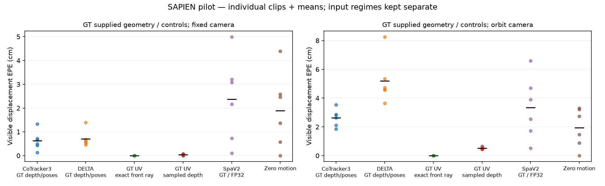

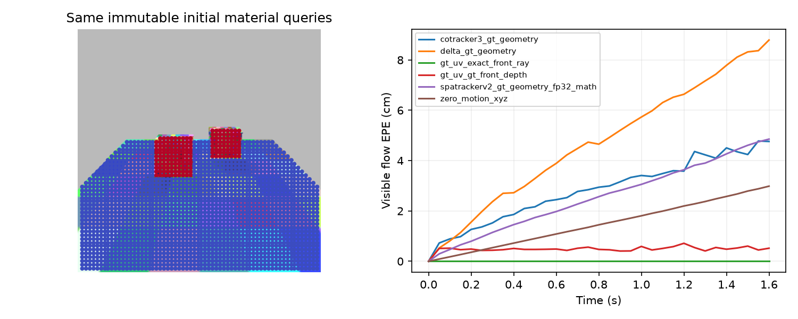

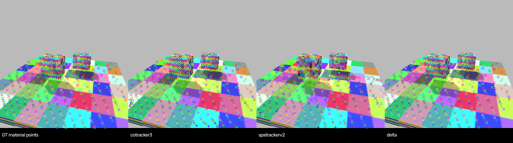

[Open the synchronized interactive 3D material-track comparison](../interactive/index.html). The standalone viewer uses the saved object-translation/orbit primary clip, all initially valid foreground queries and 250 deterministic background queries (423 total). Four panels show GT, CoTracker3, SpaTrackerV2 and DELTA at the same frame, material IDs and view. A shared frame slider, view rotation, GT visibility filter, foreground filter and cumulative-flow arrows are available. Positions are initial GT camera-space positions plus canonical cumulative flow, in meters. Prediction colors show flow EPE on a fixed 0–20 cm scale. Viewer subset scores are explicitly separate from the full-query benchmark table. Extracted source arrays and their original member hashes are in [the viewer source manifest](source-manifest.json).

The existing videos show the rendered clip and saved comparison panels:

- static scene: [fixed video](../textured64-pilot/videos/static_scene_fixed.mp4), [orbit video](../textured64-pilot/videos/static_scene_orbit.mp4).
- object translation: [fixed video](../textured64-pilot/videos/object_translation_fixed.mp4), [orbit video](../textured64-pilot/videos/object_translation_orbit.mp4).
- rigid rotation: [fixed video](../textured64-pilot/videos/rigid_rotation_fixed.mp4), [orbit video](../textured64-pilot/videos/rigid_rotation_orbit.mp4).
- articulated links: [fixed video](../textured64-pilot/videos/articulated_links_fixed.mp4), [orbit video](../textured64-pilot/videos/articulated_links_orbit.mp4).
- occlusion and return: [fixed video](../textured64-pilot/videos/occlusion_and_return_fixed.mp4), [orbit video](../textured64-pilot/videos/occlusion_and_return_orbit.mp4).
- depth speed out of view stress: [fixed video](../textured64-pilot/videos/depth_speed_out_of_view_stress_fixed.mp4), [orbit video](../textured64-pilot/videos/depth_speed_out_of_view_stress_orbit.mp4).

## Paired query-density measurements

For this control, the 256-query run and the 4,096-query run use identical RGB, geometry, scene seed and model checkpoint. The dense predictions are rescored only at the exact 256 shared material IDs. GT visibility is shared. Model-specific additional support-query settings are held constant within each model. Each row below averages the same twelve paired test clips. The difference column is `(256-query EPE − 4,096-query EPE on those same points)`.

| Method | Mask | 256-query EPE cm | 4,096-query same-ID EPE cm | Difference cm |
|---|---|---|---|---|
| CoTracker3 + GT geometry | visible | 1.644 | 1.736 | -0.092 |
| CoTracker3 + GT geometry | foreground_visible | 2.363 | 2.279 | 0.083 |
| DELTA + GT geometry | visible | 2.919 | 3.011 | -0.091 |
| DELTA + GT geometry | foreground_visible | 3.579 | 4.081 | -0.502 |
| SpaTrackerV2 + GT geometry (corrected float32 outer / SDPA) | visible | 2.571 | 3.497 | -0.926 |
| SpaTrackerV2 + GT geometry (corrected float32 outer / SDPA) | foreground_visible | 24.347 | 26.207 | -1.860 |

Source with per-clip coverage and PCK: [paired query-density measurements](../query-density-control/paired_query_density.csv). Dense full-query averages in the primary table and these dense subset averages use different eligible point sets.

## Separate predicted-geometry measurement

This completed measurement uses the original twelve uniform-color debug16 clips, not the textured64 clips. `SpatialTrackerV2_Front` predicts depth, intrinsics and camera poses from RGB. Its unmodified frontend outputs are cached and shared between the CoTracker lifting run and the native SpaTracker pipeline; the latter also applies its native refinement. Frontend inference receives no GT geometry.

The evaluation applies one scalar per clip, measured from initial-frame GT depth divided by predicted depth. That scalar is applied to points and camera translations throughout the whole clip. No per-frame or future-frame GT alignment is applied. These are **initial-GT-scale diagnostic measurements**, rather than scale-unassisted monocular metric scores.

| Method / initial-GT-scale diagnostic | Fixed visible EPE cm | Orbit visible EPE cm | PCK <1 cm % |
|---|---|---|---|
| CoTracker3 + shared predicted frontend | 22.818 | 43.531 | 10.38 |
| SpaTrackerV2 native frontend + refinement | 5.232 | 16.180 | 14.28 |

Source: [debug and predicted-geometry per-clip measurements](../debug-pilot/per_clip.csv). The separate original debug known-geometry matrix and BF16 precision diagnostic are retained in that CSV. The original debug CoTracker depth lift used its earlier zero-depth handling; the primary textured and matched-query runs use the strict positive-depth mask described above.

## Recorded scope and validation exclusions

The measured primary suite contains primitive rigid box assets, scripted linked poses, two camera modes and one seed per scene condition. It does not contain native robot joint articulation, a multi-seed asset/domain evaluation, official TAPVid3D benchmark scoring, or downstream policy outcomes. No confidence intervals are reported for this single-seed pilot.

An initial SpaTracker float32 attempt encountered an upstream attention exception that was swallowed by the implementation. Those twelve outputs were quarantined and excluded from these measured tables. The corrected patch enables supported SDPA fallback and raises remaining exceptions. Patch SHA256 is `35108abe01a6ff9ae9b34227f3e77730fa47c497bf4a0274515f52bb967131b8`. The old malformed `[T,Q,1]` zero-motion control was also excluded; the accepted `zero_motion_xyz` source is `[T,Q,3]`.

Checkpoint hashes, upstream revisions, environment records, GT validations and scientific-file hashes are retained in the [artifact ledger](../textured64-pilot/artifact-ledger.json). The interactive source NPZs were copied directly from the locally saved textured incremental archive without rerunning inference.

## Analysis of the measured pilot

### Scene-wide averages and moving-object errors answer different questions

CoTracker3 has the lowest primary scene-wide visible EPE (1.632 cm), followed by SpaTrackerV2 (2.857 cm) and DELTA (2.949 cm). The foreground-object macro ordering is CoTracker3 (3.893 cm), DELTA (6.401 cm), then SpaTrackerV2 (21.282 cm). These are distinct masks and weighting schemes. The zero-motion control has 95.96% PCK below 1 cm but 22.289 cm foreground-object macro error; a high scene-wide threshold score can coexist with substantial moving-object error. PCK and mean EPE also summarize different parts of the error distribution.

### Camera motion and geometry

Orbit-camera visible EPE exceeds fixed-camera EPE for all three primary trackers: 2.637 versus 0.627 cm for CoTracker3, 5.189 versus 0.708 cm for DELTA, and 3.336 versus 2.379 cm for SpaTrackerV2. These are measurements on six paired scripted conditions, not a multi-seed estimate of general camera robustness.

The supplied-GT-geometry experiment isolates tracking and lifting under privileged depth and camera information. It does not establish an RGB-only deployment ranking. In the separate uniform-color shared predicted-frontend study, CoTracker3 records 22.818/43.531 cm fixed/orbit error, versus SpaTrackerV2's 5.232/16.180 cm. That diagnostic still uses one initial GT-depth scale scalar and different appearance/query density, so it cannot be substituted into the primary textured table as an otherwise controlled comparison.

### Query density and temporal derivatives

At identical material IDs, changing query count changes predictions: the visible sparse-minus-dense EPE differences are −0.092 cm, −0.091 cm and −0.926 cm for CoTracker3, DELTA and SpaTrackerV2. Full dense-grid averages and matched-subset averages must be kept separate. CoTracker3's lower primary displacement error coexists with higher measured acceleration error (4.5680 m/s² versus 1.2711 and 0.9202); derivative scores use a different mask and amplify temporal variation, so neither metric substitutes for the other.

### What these results support

The pilot supports comparisons on these saved primitive scenes, cameras, geometry regimes and query configurations. It does not establish a universal tracker ranking, robot articulation accuracy, or downstream policy benefit. The linked-box condition uses prescribed link poses. One seed per condition and correlated points limit inference. The quarantined failed-attention SpaTracker outputs are excluded. A broader study should add scene/asset seeds, actual articulated robots, a common learned geometry frontend without GT-scale calibration, and paired downstream policy evaluations.

## Complete saved media catalog

Every existing media file from this experiment is listed below. Galleries preserve the original debug/textured and geometry-regime names. Interactive point selection is available in the linked demo; the remaining clips are saved recordings or maps.

### Videos

- [debug-pilot/videos/articulated_links_fixed.mp4](../debug-pilot/videos/articulated_links_fixed.mp4)
- [debug-pilot/videos/articulated_links_orbit.mp4](../debug-pilot/videos/articulated_links_orbit.mp4)
- [debug-pilot/videos/depth_speed_out_of_view_stress_fixed.mp4](../debug-pilot/videos/depth_speed_out_of_view_stress_fixed.mp4)
- [debug-pilot/videos/depth_speed_out_of_view_stress_orbit.mp4](../debug-pilot/videos/depth_speed_out_of_view_stress_orbit.mp4)
- [debug-pilot/videos/object_translation_fixed.mp4](../debug-pilot/videos/object_translation_fixed.mp4)
- [debug-pilot/videos/object_translation_orbit.mp4](../debug-pilot/videos/object_translation_orbit.mp4)
- [debug-pilot/videos/occlusion_and_return_fixed.mp4](../debug-pilot/videos/occlusion_and_return_fixed.mp4)
- [debug-pilot/videos/occlusion_and_return_orbit.mp4](../debug-pilot/videos/occlusion_and_return_orbit.mp4)
- [debug-pilot/videos/rigid_rotation_fixed.mp4](../debug-pilot/videos/rigid_rotation_fixed.mp4)
- [debug-pilot/videos/rigid_rotation_orbit.mp4](../debug-pilot/videos/rigid_rotation_orbit.mp4)
- [debug-pilot/videos/static_scene_fixed.mp4](../debug-pilot/videos/static_scene_fixed.mp4)
- [debug-pilot/videos/static_scene_orbit.mp4](../debug-pilot/videos/static_scene_orbit.mp4)
- [textured64-pilot/videos/articulated_links_fixed.mp4](../textured64-pilot/videos/articulated_links_fixed.mp4)
- [textured64-pilot/videos/articulated_links_orbit.mp4](../textured64-pilot/videos/articulated_links_orbit.mp4)
- [textured64-pilot/videos/depth_speed_out_of_view_stress_fixed.mp4](../textured64-pilot/videos/depth_speed_out_of_view_stress_fixed.mp4)
- [textured64-pilot/videos/depth_speed_out_of_view_stress_orbit.mp4](../textured64-pilot/videos/depth_speed_out_of_view_stress_orbit.mp4)
- [textured64-pilot/videos/object_translation_fixed.mp4](../textured64-pilot/videos/object_translation_fixed.mp4)
- [textured64-pilot/videos/object_translation_orbit.mp4](../textured64-pilot/videos/object_translation_orbit.mp4)
- [textured64-pilot/videos/occlusion_and_return_fixed.mp4](../textured64-pilot/videos/occlusion_and_return_fixed.mp4)
- [textured64-pilot/videos/occlusion_and_return_orbit.mp4](../textured64-pilot/videos/occlusion_and_return_orbit.mp4)
- [textured64-pilot/videos/rigid_rotation_fixed.mp4](../textured64-pilot/videos/rigid_rotation_fixed.mp4)
- [textured64-pilot/videos/rigid_rotation_orbit.mp4](../textured64-pilot/videos/rigid_rotation_orbit.mp4)
- [textured64-pilot/videos/static_scene_fixed.mp4](../textured64-pilot/videos/static_scene_fixed.mp4)
- [textured64-pilot/videos/static_scene_orbit.mp4](../textured64-pilot/videos/static_scene_orbit.mp4)
### Saved figures and comparison maps

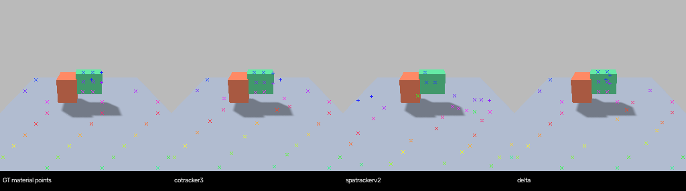

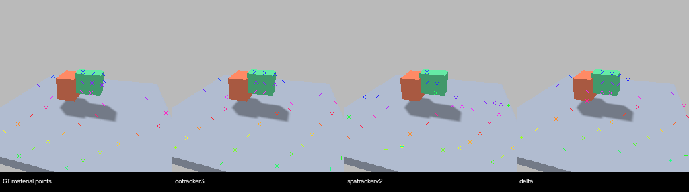

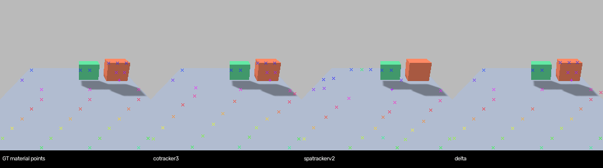

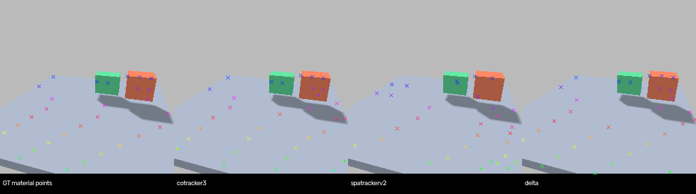

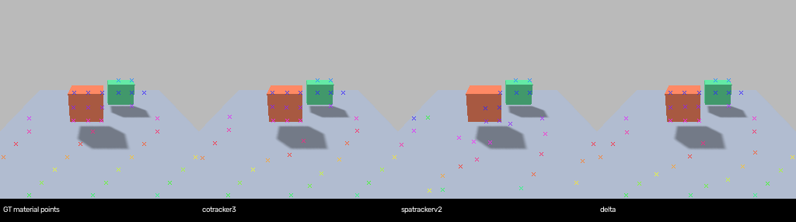

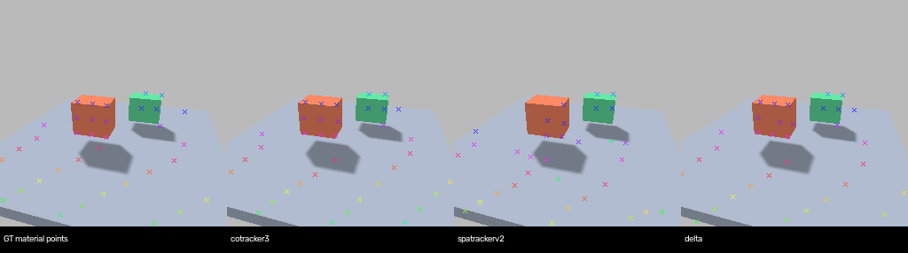

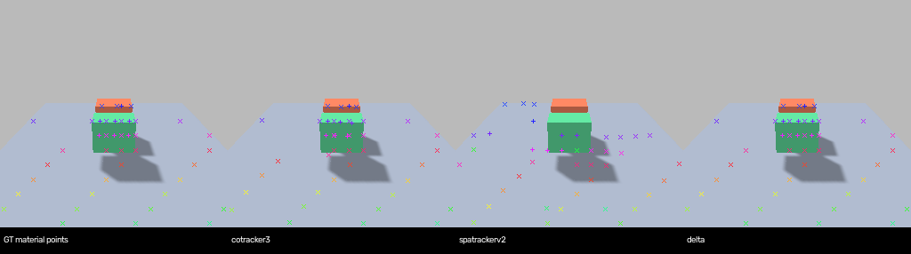

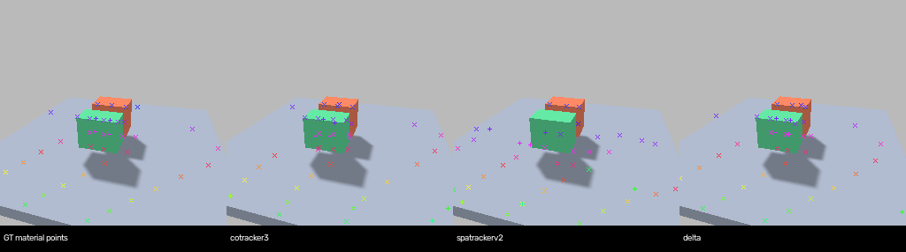

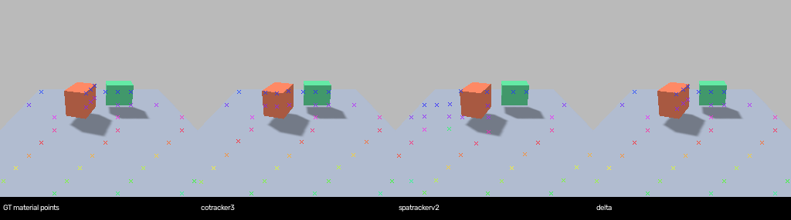

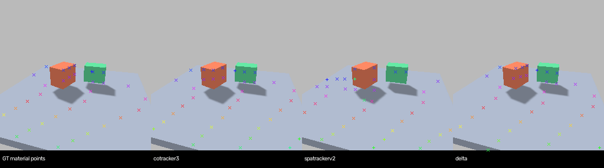

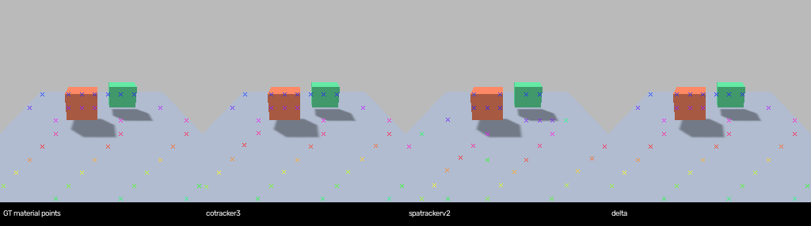

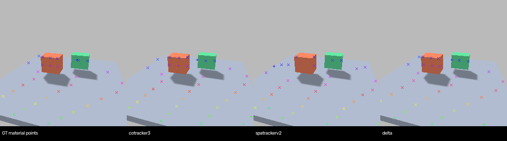

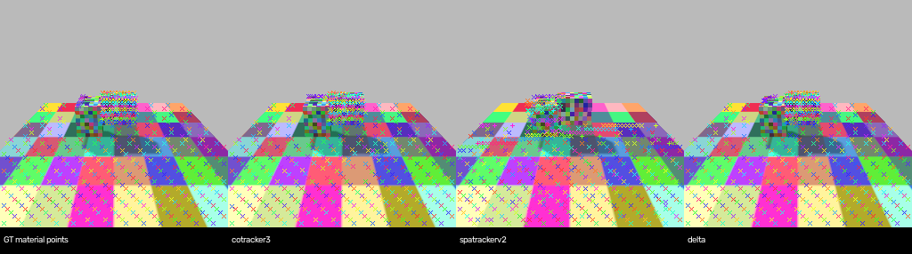

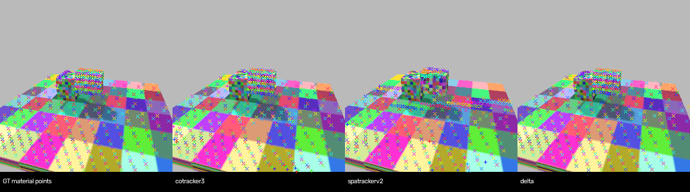

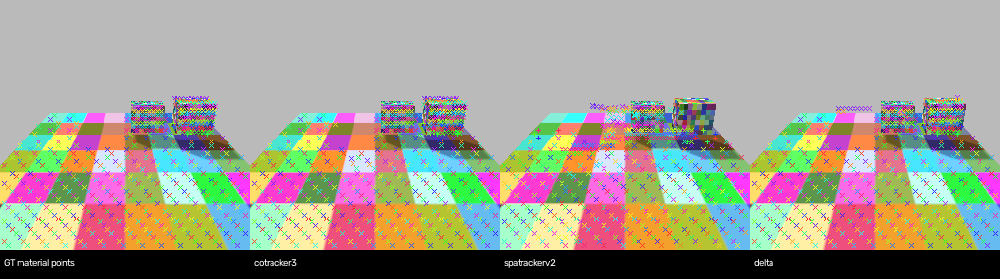

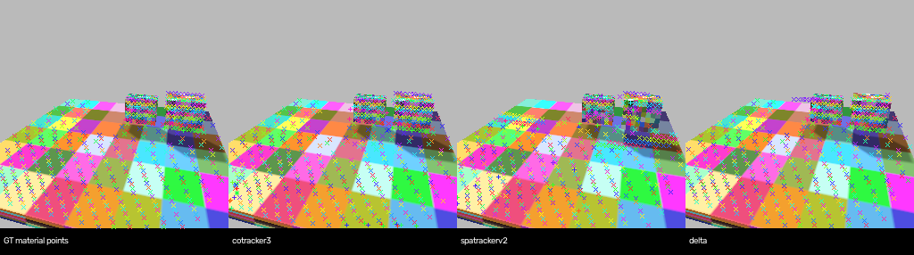

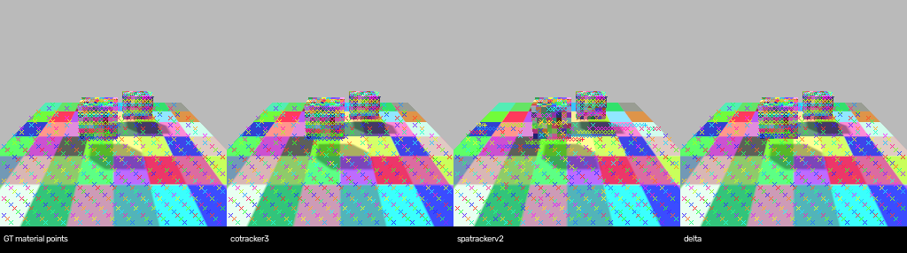

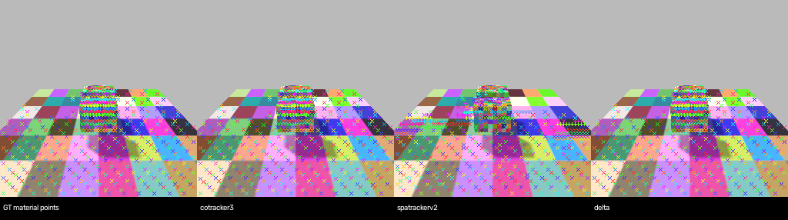

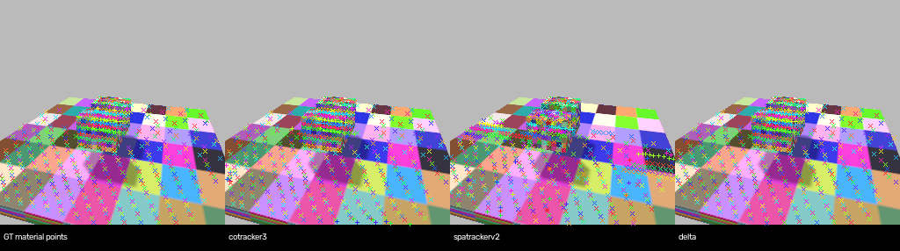

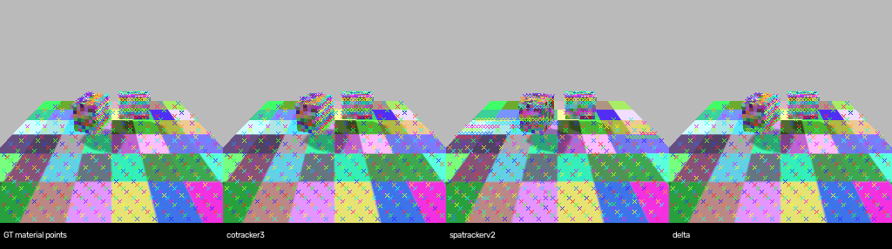

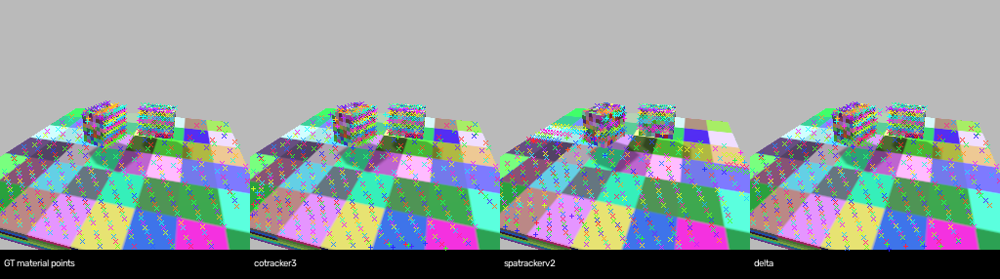

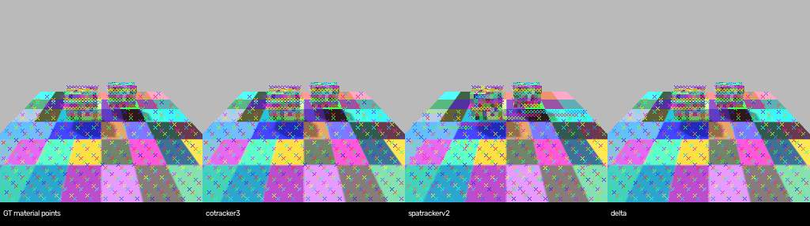

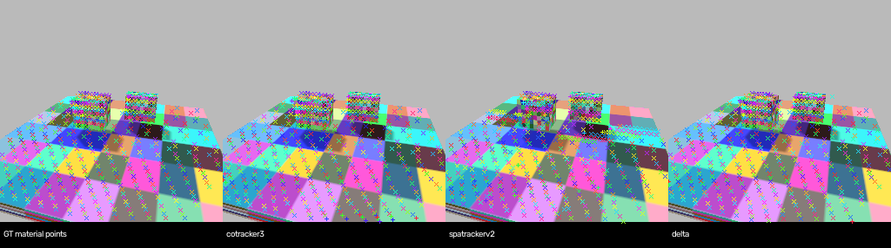

## Full measured tables

### debug-pilot/per_clip.csv

[Original CSV](../debug-pilot/per_clip.csv)

| method | clip | camera | visible_epe_m | all_epe_m | visible_coverage | visible_pck_1cm |
| --- | --- | --- | --- | --- | --- | --- |
| cotracker3_gt_geometry | articulated_links_fixed | fixed | 0.07267899066209793 | 0.07834025472402573 | 1.0 | 0.2854696673189824 |
| cotracker3_gt_geometry | articulated_links_orbit | orbit | 0.2795303761959076 | 0.2918393611907959 | 1.0 | 0.017687434002111934 |
| cotracker3_gt_geometry | depth_speed_out_of_view_stress_fixed | fixed | 0.08576620370149612 | 0.09738989174365997 | 1.0 | 0.3061422675406652 |
| cotracker3_gt_geometry | depth_speed_out_of_view_stress_orbit | orbit | 0.2957884967327118 | 0.3117455244064331 | 1.0 | 0.017576564580559253 |
| cotracker3_gt_geometry | object_translation_fixed | fixed | 0.0387042872607708 | 0.047471072524785995 | 1.0 | 0.457311320754717 |
| cotracker3_gt_geometry | object_translation_orbit | orbit | 0.27451473474502563 | 0.2897820472717285 | 1.0 | 0.03198959687906372 |
| cotracker3_gt_geometry | occlusion_and_return_fixed | fixed | 0.02831047587096691 | 0.06241466850042343 | 1.0 | 0.5496145237503108 |
| cotracker3_gt_geometry | occlusion_and_return_orbit | orbit | 0.1904894858598709 | 0.22847317159175873 | 1.0 | 0.08091853471842538 |
| cotracker3_gt_geometry | rigid_rotation_fixed | fixed | 0.01602134481072426 | 0.023252379149198532 | 1.0 | 0.6084745762711864 |
| cotracker3_gt_geometry | rigid_rotation_orbit | orbit | 0.24126660823822021 | 0.25760617852211 | 1.0 | 0.024751143395211193 |
| cotracker3_gt_geometry | static_scene_fixed | fixed | 0.0061333198100328445 | 0.0061333198100328445 | 1.0 | 0.8035037878787878 |
| cotracker3_gt_geometry | static_scene_orbit | orbit | 0.22432516515254974 | 0.2535687983036041 | 1.0 | 0.03042433947157726 |
| cotracker3_shared_front_initial_GT_scale | articulated_links_fixed | fixed | 0.8148731589317322 | 0.8205356001853943 | 1.0 | 0.018835616438356163 |
| cotracker3_shared_front_initial_GT_scale | articulated_links_orbit | orbit | 1.4310895204544067 | 1.4857544898986816 | 1.0 | 0.014783526927138331 |
| cotracker3_shared_front_initial_GT_scale | depth_speed_out_of_view_stress_fixed | fixed | 0.09615614265203476 | 0.12166634202003479 | 1.0 | 0.059237679048312696 |
| cotracker3_shared_front_initial_GT_scale | depth_speed_out_of_view_stress_orbit | orbit | 0.20506197214126587 | 0.2227611094713211 | 1.0 | 0.008521970705725699 |
| cotracker3_shared_front_initial_GT_scale | object_translation_fixed | fixed | 0.0784483328461647 | 0.0878778025507927 | 1.0 | 0.052122641509433965 |
| cotracker3_shared_front_initial_GT_scale | object_translation_orbit | orbit | 0.18479131162166595 | 0.19838477671146393 | 1.0 | 0.025227568270481143 |
| cotracker3_shared_front_initial_GT_scale | occlusion_and_return_fixed | fixed | 0.3481043875217438 | 0.3704780638217926 | 1.0 | 0.08480477493160905 |
| cotracker3_shared_front_initial_GT_scale | occlusion_and_return_orbit | orbit | 0.40526607632637024 | 0.45442014932632446 | 1.0 | 0.02925095680699836 |
| cotracker3_shared_front_initial_GT_scale | rigid_rotation_fixed | fixed | 0.023340558633208275 | 0.030186576768755913 | 1.0 | 0.11501210653753027 |
| cotracker3_shared_front_initial_GT_scale | rigid_rotation_orbit | orbit | 0.19839826226234436 | 0.21256494522094727 | 1.0 | 0.0191014258810869 |
| cotracker3_shared_front_initial_GT_scale | static_scene_fixed | fixed | 0.008136287331581116 | 0.008136287331581116 | 1.0 | 0.7956912878787878 |
| cotracker3_shared_front_initial_GT_scale | static_scene_orbit | orbit | 0.18723367154598236 | 0.2037942260503769 | 1.0 | 0.02241793434747798 |
| delta_gt_geometry | articulated_links_fixed | fixed | 0.1112641990184784 | 0.11135722696781158 | 1.0 | 0.11081213307240705 |
| delta_gt_geometry | articulated_links_orbit | orbit | 0.394300639629364 | 0.3903181552886963 | 1.0 | 0.002375923970432946 |
| delta_gt_geometry | depth_speed_out_of_view_stress_fixed | fixed | 0.09294049441814423 | 0.09295355528593063 | 1.0 | 0.4518086914299587 |
| delta_gt_geometry | depth_speed_out_of_view_stress_orbit | orbit | 0.2200639396905899 | 0.2188524752855301 | 1.0 | 0.04553928095872171 |
| delta_gt_geometry | object_translation_fixed | fixed | 0.0615396611392498 | 0.06267678737640381 | 1.0 | 0.26108490566037734 |
| delta_gt_geometry | object_translation_orbit | orbit | 0.20620620250701904 | 0.21608977019786835 | 1.0 | 0.007022106631989597 |
| delta_gt_geometry | occlusion_and_return_fixed | fixed | 0.007148107513785362 | 0.007570127956569195 | 1.0 | 0.8167122606316837 |
| delta_gt_geometry | occlusion_and_return_orbit | orbit | 0.11989380419254303 | 0.1260896474123001 | 1.0 | 0.06205576817933297 |
| delta_gt_geometry | rigid_rotation_fixed | fixed | 0.01829090155661106 | 0.02104805037379265 | 1.0 | 0.6191283292978208 |
| delta_gt_geometry | rigid_rotation_orbit | orbit | 0.22629012167453766 | 0.23778463900089264 | 1.0 | 0.011299435028248588 |
| delta_gt_geometry | static_scene_fixed | fixed | 0.007915763184428215 | 0.007915763184428215 | 1.0 | 0.7353219696969697 |
| delta_gt_geometry | static_scene_orbit | orbit | 0.09253107011318207 | 0.09449377655982971 | 1.0 | 0.07552708833733654 |
| gt_uv_exact_front_ray | articulated_links_fixed | fixed | 6.981317992817145e-10 | 0.016166911201822072 | 1.0 | 1.0 |
| gt_uv_exact_front_ray | articulated_links_orbit | orbit | 1.4935480523540965e-09 | 0.022438331301133253 | 1.0 | 1.0 |
| gt_uv_exact_front_ray | depth_speed_out_of_view_stress_fixed | fixed | 1.7870155511892456e-09 | 0.013641548596245695 | 1.0 | 1.0 |
| gt_uv_exact_front_ray | depth_speed_out_of_view_stress_orbit | orbit | 1.8025331493881402e-09 | 0.014077435072830583 | 1.0 | 1.0 |
| gt_uv_exact_front_ray | object_translation_fixed | fixed | 1.992247430656347e-09 | 0.00960913402117351 | 1.0 | 1.0 |
| gt_uv_exact_front_ray | object_translation_orbit | orbit | 2.770625124865419e-09 | 0.028385781114413665 | 1.0 | 1.0 |
| gt_uv_exact_front_ray | occlusion_and_return_fixed | fixed | 1.1066871764379232e-09 | 0.038103235480049236 | 1.0 | 1.0 |
| gt_uv_exact_front_ray | occlusion_and_return_orbit | orbit | 1.919696356627607e-09 | 0.04116944429009323 | 1.0 | 1.0 |
| gt_uv_exact_front_ray | rigid_rotation_fixed | fixed | 2.9294350288628447e-10 | 0.004108112614313914 | 1.0 | 1.0 |
| gt_uv_exact_front_ray | rigid_rotation_orbit | orbit | 1.867160831070902e-09 | 0.028346413833901057 | 1.0 | 1.0 |
| gt_uv_exact_front_ray | static_scene_fixed | fixed | 0.0 | 0.0 | 1.0 | 1.0 |
| gt_uv_exact_front_ray | static_scene_orbit | orbit | 2.877827804987452e-10 | 0.03034979379787911 | 1.0 | 1.0 |
| gt_uv_gt_front_depth | articulated_links_fixed | fixed | 0.0023988268440481813 | 0.01980123395597753 | 1.0 | 0.9911937377690803 |
| gt_uv_gt_front_depth | articulated_links_orbit | orbit | 0.005292651985235083 | 0.02888392438802858 | 1.0 | 0.9076029567053854 |
| gt_uv_gt_front_depth | depth_speed_out_of_view_stress_fixed | fixed | 0.00010383274032665986 | 0.013843685953839915 | 1.0 | 0.9953872299101724 |
| gt_uv_gt_front_depth | depth_speed_out_of_view_stress_orbit | orbit | 0.005516192566024665 | 0.02023798332256697 | 1.0 | 0.9209054593874834 |
| gt_uv_gt_front_depth | object_translation_fixed | fixed | 0.00020840575080072524 | 0.009814821137656403 | 1.0 | 0.9950471698113208 |
| gt_uv_gt_front_depth | object_translation_orbit | orbit | 0.025643106842510012 | 0.05485143834197684 | 1.0 | 0.9214564369310794 |
| gt_uv_gt_front_depth | occlusion_and_return_fixed | fixed | 3.094578393803777e-07 | 0.03798292848359766 | 1.0 | 1.0 |
| gt_uv_gt_front_depth | occlusion_and_return_orbit | orbit | 0.0063778408645371884 | 0.050731602910916794 | 1.0 | 0.9371241115363587 |
| gt_uv_gt_front_depth | rigid_rotation_fixed | fixed | 0.0010431951056495815 | 0.005621704445599763 | 1.0 | 0.9946731234866828 |
| gt_uv_gt_front_depth | rigid_rotation_orbit | orbit | 0.006813709841014035 | 0.03665853743249281 | 1.0 | 0.9322033898305084 |
| gt_uv_gt_front_depth | static_scene_fixed | fixed | 0.0 | 0.0 | 1.0 | 1.0 |
| gt_uv_gt_front_depth | static_scene_orbit | orbit | 0.00555669113776807 | 0.037154437824596036 | 1.0 | 0.9359487590072058 |
| spatrackerv2_gt_geometry | articulated_links_fixed | fixed | 0.1437576860189438 | 0.1492535024881363 | 1.0 | 0.04354207436399217 |
| spatrackerv2_gt_geometry | articulated_links_orbit | orbit | 0.328253835439682 | 0.3399104177951813 | 1.0 | 0.0018479408658922914 |
| spatrackerv2_gt_geometry | depth_speed_out_of_view_stress_fixed | fixed | 0.07357942312955856 | 0.087666355073452 | 1.0 | 0.14882252974022822 |
| spatrackerv2_gt_geometry | depth_speed_out_of_view_stress_orbit | orbit | 0.4529309570789337 | 0.4854685962200165 | 1.0 | 0.0018641810918774966 |
| spatrackerv2_gt_geometry | object_translation_fixed | fixed | 0.11837142705917358 | 0.12021022289991379 | 1.0 | 0.11415094339622642 |
| spatrackerv2_gt_geometry | object_translation_orbit | orbit | 0.20352308452129364 | 0.20701871812343597 | 1.0 | 0.022886866059817945 |
| spatrackerv2_gt_geometry | occlusion_and_return_fixed | fixed | 0.03911362215876579 | 0.04981290176510811 | 1.0 | 0.8254165630440189 |
| spatrackerv2_gt_geometry | occlusion_and_return_orbit | orbit | 0.08068011701107025 | 0.09615539759397507 | 1.0 | 0.17960634226353198 |
| spatrackerv2_gt_geometry | rigid_rotation_fixed | fixed | 0.014558586291968822 | 0.020508255809545517 | 1.0 | 0.5690072639225182 |
| spatrackerv2_gt_geometry | rigid_rotation_orbit | orbit | 0.19759154319763184 | 0.20882634818553925 | 1.0 | 0.0325531342480495 |
| spatrackerv2_gt_geometry | static_scene_fixed | fixed | 0.003970548044890165 | 0.003970548044890165 | 1.0 | 0.9121685606060606 |
| spatrackerv2_gt_geometry | static_scene_orbit | orbit | 0.11556478589773178 | 0.12468039989471436 | 1.0 | 0.07606084867894315 |
| spatrackerv2_gt_geometry_fp32_math | articulated_links_fixed | fixed | 0.14061257243156433 | 0.14641906321048737 | 1.0 | 0.03840508806262231 |
| spatrackerv2_gt_geometry_fp32_math | articulated_links_orbit | orbit | 0.32566580176353455 | 0.33750811219215393 | 1.0 | 0.0015839493136219642 |
| spatrackerv2_gt_geometry_fp32_math | depth_speed_out_of_view_stress_fixed | fixed | 0.07508327066898346 | 0.08916309475898743 | 1.0 | 0.15756251517358583 |
| spatrackerv2_gt_geometry_fp32_math | depth_speed_out_of_view_stress_orbit | orbit | 0.453652024269104 | 0.4863017797470093 | 1.0 | 0.0034620505992010654 |
| spatrackerv2_gt_geometry_fp32_math | object_translation_fixed | fixed | 0.11684176325798035 | 0.11868361383676529 | 1.0 | 0.12193396226415094 |
| spatrackerv2_gt_geometry_fp32_math | object_translation_orbit | orbit | 0.20300666987895966 | 0.20646758377552032 | 1.0 | 0.02860858257477243 |
| spatrackerv2_gt_geometry_fp32_math | occlusion_and_return_fixed | fixed | 0.0386749766767025 | 0.04941089078783989 | 1.0 | 0.8448147227057946 |
| spatrackerv2_gt_geometry_fp32_math | occlusion_and_return_orbit | orbit | 0.0810372605919838 | 0.09636134654283524 | 1.0 | 0.1908146528157463 |
| spatrackerv2_gt_geometry_fp32_math | rigid_rotation_fixed | fixed | 0.014289258979260921 | 0.020244354382157326 | 1.0 | 0.5837772397094431 |
| spatrackerv2_gt_geometry_fp32_math | rigid_rotation_orbit | orbit | 0.19880329072475433 | 0.2101038098335266 | 1.0 | 0.0382028517621738 |
| spatrackerv2_gt_geometry_fp32_math | static_scene_fixed | fixed | 0.002908047055825591 | 0.002908047055825591 | 1.0 | 0.9595170454545454 |
| spatrackerv2_gt_geometry_fp32_math | static_scene_orbit | orbit | 0.11668610572814941 | 0.12578368186950684 | 1.0 | 0.07926341072858287 |
| spatrackerv2_shared_front_initial_GT_scale | articulated_links_fixed | fixed | 0.07467450201511383 | 0.0825604498386383 | 1.0 | 0.02054794520547945 |
| spatrackerv2_shared_front_initial_GT_scale | articulated_links_orbit | orbit | 0.1430562138557434 | 0.14747387170791626 | 1.0 | 0.0034318901795142554 |
| spatrackerv2_shared_front_initial_GT_scale | depth_speed_out_of_view_stress_fixed | fixed | 0.08313482999801636 | 0.09656977653503418 | 1.0 | 0.03593105122602573 |
| spatrackerv2_shared_front_initial_GT_scale | depth_speed_out_of_view_stress_orbit | orbit | 0.5502881407737732 | 0.5669553279876709 | 1.0 | 0.0 |
| spatrackerv2_shared_front_initial_GT_scale | object_translation_fixed | fixed | 0.07729583978652954 | 0.07771612703800201 | 1.0 | 0.01839622641509434 |
| spatrackerv2_shared_front_initial_GT_scale | object_translation_orbit | orbit | 0.10454587638378143 | 0.10477114468812943 | 1.0 | 0.015604681404421327 |
| spatrackerv2_shared_front_initial_GT_scale | occlusion_and_return_fixed | fixed | 0.05122596397995949 | 0.06174825131893158 | 1.0 | 0.30340711265854264 |
| spatrackerv2_shared_front_initial_GT_scale | occlusion_and_return_orbit | orbit | 0.09016112238168716 | 0.09675993770360947 | 1.0 | 0.028977583378895572 |
| spatrackerv2_shared_front_initial_GT_scale | rigid_rotation_fixed | fixed | 0.018965542316436768 | 0.024633705615997314 | 1.0 | 0.23268765133171912 |
| spatrackerv2_shared_front_initial_GT_scale | rigid_rotation_orbit | orbit | 0.046651195734739304 | 0.05165896564722061 | 1.0 | 0.06053268765133172 |
| spatrackerv2_shared_front_initial_GT_scale | static_scene_fixed | fixed | 0.008636290207505226 | 0.008636290207505226 | 1.0 | 0.8555871212121212 |
| spatrackerv2_shared_front_initial_GT_scale | static_scene_orbit | orbit | 0.03610555827617645 | 0.03824027255177498 | 1.0 | 0.13824392847611422 |
| zero_motion_xyz | articulated_links_fixed | fixed | 0.016884025186300278 | 0.028456009924411774 | 1.0 | 0.9596379647749511 |
| zero_motion_xyz | articulated_links_orbit | orbit | 0.02671659365296364 | 0.028456009924411774 | 1.0 | 0.939545934530095 |
| zero_motion_xyz | depth_speed_out_of_view_stress_fixed | fixed | 0.029824957251548767 | 0.04412679374217987 | 1.0 | 0.9686817188638019 |
| zero_motion_xyz | depth_speed_out_of_view_stress_orbit | orbit | 0.023954210802912712 | 0.04412679374217987 | 1.0 | 0.9707057256990679 |
| zero_motion_xyz | object_translation_fixed | fixed | 0.01764201931655407 | 0.017444534227252007 | 1.0 | 0.9320754716981132 |
| zero_motion_xyz | object_translation_orbit | orbit | 0.01945439726114273 | 0.017444534227252007 | 1.0 | 0.9250975292587776 |
| zero_motion_xyz | occlusion_and_return_fixed | fixed | 0.03511875122785568 | 0.04570312798023224 | 1.0 | 0.948520268589903 |
| zero_motion_xyz | occlusion_and_return_orbit | orbit | 0.04136908799409866 | 0.04570312798023224 | 1.0 | 0.941771459814106 |
| zero_motion_xyz | rigid_rotation_fixed | fixed | 0.004894196055829525 | 0.01106959581375122 | 1.0 | 0.9709443099273608 |
| zero_motion_xyz | rigid_rotation_orbit | orbit | 0.00876103900372982 | 0.01106959581375122 | 1.0 | 0.9580306698950767 |
| zero_motion_xyz | static_scene_fixed | fixed | 0.0 | 0.0 | 1.0 | 1.0 |
| zero_motion_xyz | static_scene_orbit | orbit | 0.0 | 0.0 | 1.0 | 1.0 |

### query-density-control/paired_query_density.csv

[Original CSV](../query-density-control/paired_query_density.csv)

| clip | method | mask | epe_16_m | epe_64_same_queries_m | difference_16_minus_64_m | coverage_16 | coverage_64_same_queries | pck1cm_16 | pck1cm_64 |
| --- | --- | --- | --- | --- | --- | --- | --- | --- | --- |
| articulated_links_fixed | cotracker3_gt_geometry | visible | 0.006704259198158979 | 0.010593047365546227 | -0.003888788167387247 | 1.0 | 1.0 | 0.8672609009877138 | 0.8614791616477957 |
| articulated_links_fixed | cotracker3_gt_geometry | foreground_visible | 0.01752435974776745 | 0.014965057373046875 | 0.0025593023747205734 | 1.0 | 1.0 | 0.4314516129032258 | 0.4637096774193548 |
| articulated_links_fixed | spatrackerv2_gt_geometry_fp32_math | visible | 0.03078930638730526 | 0.03706353157758713 | -0.006274225190281868 | 1.0 | 1.0 | 0.9101421344254397 | 0.866779089376054 |
| articulated_links_fixed | spatrackerv2_gt_geometry_fp32_math | foreground_visible | 0.3930836617946625 | 0.33418676257133484 | 0.05889689922332764 | 1.0 | 1.0 | 0.0 | 0.0 |
| articulated_links_fixed | delta_gt_geometry | visible | 0.008291034959256649 | 0.008828697726130486 | -0.0005376627668738365 | 1.0 | 1.0 | 0.824138761744158 | 0.891110575764876 |
| articulated_links_fixed | delta_gt_geometry | foreground_visible | 0.05855279788374901 | 0.07830239832401276 | -0.019749600440263748 | 1.0 | 1.0 | 0.3346774193548387 | 0.3629032258064516 |
| articulated_links_orbit | cotracker3_gt_geometry | visible | 0.038001302629709244 | 0.03769078105688095 | 0.00031052157282829285 | 1.0 | 1.0 | 0.24194400422609613 | 0.25699947173798204 |
| articulated_links_orbit | cotracker3_gt_geometry | foreground_visible | 0.014974403195083141 | 0.014614982530474663 | 0.00035942066460847855 | 1.0 | 1.0 | 0.5346153846153846 | 0.5 |
| articulated_links_orbit | spatrackerv2_gt_geometry_fp32_math | visible | 0.05532684549689293 | 0.06023617833852768 | -0.00490933284163475 | 1.0 | 1.0 | 0.6743264659270999 | 0.7356048600105652 |
| articulated_links_orbit | spatrackerv2_gt_geometry_fp32_math | foreground_visible | 0.44445550441741943 | 0.2803615629673004 | 0.16409394145011902 | 1.0 | 1.0 | 0.0 | 0.06153846153846154 |
| articulated_links_orbit | delta_gt_geometry | visible | 0.04272288456559181 | 0.03894831985235214 | 0.00377456471323967 | 1.0 | 1.0 | 0.12731114632857898 | 0.17934495509772846 |
| articulated_links_orbit | delta_gt_geometry | foreground_visible | 0.04424751549959183 | 0.06097090244293213 | -0.0167233869433403 | 1.0 | 1.0 | 0.2153846153846154 | 0.3269230769230769 |
| depth_speed_out_of_view_stress_fixed | cotracker3_gt_geometry | visible | 0.006273758597671986 | 0.010028415359556675 | -0.0037546567618846893 | 0.99830220713073 | 0.9985447489691972 | 0.9172932330827067 | 0.9189910259519767 |
| depth_speed_out_of_view_stress_fixed | cotracker3_gt_geometry | foreground_visible | 0.06932488828897476 | 0.07129011303186417 | -0.0019652247428894043 | 0.9615384615384616 | 0.967032967032967 | 0.6098901098901099 | 0.6208791208791209 |
| depth_speed_out_of_view_stress_fixed | spatrackerv2_gt_geometry_fp32_math | visible | 0.0422360897064209 | 0.04643535614013672 | -0.00419926643371582 | 1.0 | 1.0 | 0.9347562454523405 | 0.9347562454523405 |
| depth_speed_out_of_view_stress_fixed | spatrackerv2_gt_geometry_fp32_math | foreground_visible | 0.6789510250091553 | 0.7385177612304688 | -0.05956673622131348 | 1.0 | 1.0 | 0.27472527472527475 | 0.0 |
| depth_speed_out_of_view_stress_fixed | delta_gt_geometry | visible | 0.018479222431778908 | 0.006403714884072542 | 0.012075507547706366 | 1.0 | 1.0 | 0.6975503274314819 | 0.8481688091195732 |
| depth_speed_out_of_view_stress_fixed | delta_gt_geometry | foreground_visible | 0.03641245514154434 | 0.02740701660513878 | 0.009005438536405563 | 1.0 | 1.0 | 0.3791208791208791 | 0.3901098901098901 |
| depth_speed_out_of_view_stress_orbit | cotracker3_gt_geometry | visible | 0.033337950706481934 | 0.03495136648416519 | -0.001613415777683258 | 0.996547144754316 | 0.9968127490039841 | 0.27596281540504647 | 0.2749003984063745 |
| depth_speed_out_of_view_stress_orbit | cotracker3_gt_geometry | foreground_visible | 0.08555358648300171 | 0.07712412625551224 | 0.008429460227489471 | 0.9192546583850931 | 0.9254658385093167 | 0.639751552795031 | 0.639751552795031 |
| depth_speed_out_of_view_stress_orbit | spatrackerv2_gt_geometry_fp32_math | visible | 0.049812451004981995 | 0.08537352830171585 | -0.035561077296733856 | 1.0 | 1.0 | 0.801062416998672 | 0.8446215139442231 |
| depth_speed_out_of_view_stress_orbit | spatrackerv2_gt_geometry_fp32_math | foreground_visible | 0.4332696795463562 | 0.8116540312767029 | -0.3783843517303467 | 1.0 | 1.0 | 0.3105590062111801 | 0.0 |
| depth_speed_out_of_view_stress_orbit | delta_gt_geometry | visible | 0.044514499604701996 | 0.043101806193590164 | 0.0014126934111118317 | 1.0 | 1.0 | 0.29057104913678616 | 0.22231075697211156 |
| depth_speed_out_of_view_stress_orbit | delta_gt_geometry | foreground_visible | 0.05483075976371765 | 0.05425586551427841 | 0.0005748942494392395 | 1.0 | 1.0 | 0.22981366459627328 | 0.2484472049689441 |
| object_translation_fixed | cotracker3_gt_geometry | visible | 0.004344614688307047 | 0.005709637887775898 | -0.001365023199468851 | 1.0 | 1.0 | 0.9158096149246592 | 0.9043291078689308 |
| object_translation_fixed | cotracker3_gt_geometry | foreground_visible | 0.011648660525679588 | 0.015505742281675339 | -0.0038570817559957504 | 1.0 | 1.0 | 0.8153409090909091 | 0.8238636363636364 |
| object_translation_fixed | spatrackerv2_gt_geometry_fp32_math | visible | 0.02459062449634075 | 0.03331940621137619 | -0.008728781715035439 | 1.0 | 1.0 | 0.8875867017459937 | 0.8584070796460177 |
| object_translation_fixed | spatrackerv2_gt_geometry_fp32_math | foreground_visible | 0.20523709058761597 | 0.21821807324886322 | -0.012980982661247253 | 1.0 | 1.0 | 0.005681818181818182 | 0.09375 |
| object_translation_fixed | delta_gt_geometry | visible | 0.008085766807198524 | 0.008717449381947517 | -0.0006316825747489929 | 1.0 | 1.0 | 0.8495575221238938 | 0.8718010045443674 |
| object_translation_fixed | delta_gt_geometry | foreground_visible | 0.0379883348941803 | 0.049329712986946106 | -0.011341378092765808 | 1.0 | 1.0 | 0.3352272727272727 | 0.5454545454545454 |
| object_translation_orbit | cotracker3_gt_geometry | visible | 0.02635372243821621 | 0.027811001986265182 | -0.001457279548048973 | 1.0 | 1.0 | 0.3046937151949085 | 0.311323256430655 |
| object_translation_orbit | cotracker3_gt_geometry | foreground_visible | 0.02902306243777275 | 0.025454280897974968 | 0.003568781539797783 | 1.0 | 1.0 | 0.7926136363636364 | 0.8153409090909091 |
| object_translation_orbit | spatrackerv2_gt_geometry_fp32_math | visible | 0.027556162327528 | 0.03600739687681198 | -0.008451234549283981 | 1.0 | 1.0 | 0.7512596128347918 | 0.762132060461416 |
| object_translation_orbit | spatrackerv2_gt_geometry_fp32_math | foreground_visible | 0.21007715165615082 | 0.21842817962169647 | -0.008351027965545654 | 1.0 | 1.0 | 0.005681818181818182 | 0.09375 |
| object_translation_orbit | delta_gt_geometry | visible | 0.048378802835941315 | 0.05172181501984596 | -0.003343012183904648 | 1.0 | 1.0 | 0.15725271811190666 | 0.2047202333598515 |
| object_translation_orbit | delta_gt_geometry | foreground_visible | 0.07025381922721863 | 0.06587770581245422 | 0.004376113414764404 | 1.0 | 1.0 | 0.1534090909090909 | 0.12215909090909091 |
| occlusion_and_return_fixed | cotracker3_gt_geometry | visible | 0.005846639629453421 | 0.006685810163617134 | -0.0008391705341637135 | 1.0 | 1.0 | 0.9614534740977166 | 0.9592438006383501 |
| occlusion_and_return_fixed | cotracker3_gt_geometry | foreground_visible | 0.0032622069120407104 | 0.003293980611488223 | -3.177369944751263e-05 | 1.0 | 1.0 | 0.997093023255814 | 0.997093023255814 |
| occlusion_and_return_fixed | spatrackerv2_gt_geometry_fp32_math | visible | 0.018804186955094337 | 0.036250852048397064 | -0.017446665093302727 | 1.0 | 1.0 | 0.945003682789099 | 0.9130861772649153 |
| occlusion_and_return_fixed | spatrackerv2_gt_geometry_fp32_math | foreground_visible | 0.1449454128742218 | 0.1280849128961563 | 0.01686049997806549 | 1.0 | 1.0 | 0.6075581395348837 | 0.6133720930232558 |
| occlusion_and_return_fixed | delta_gt_geometry | visible | 0.004834027029573917 | 0.0045965248718857765 | 0.00023750215768814087 | 1.0 | 1.0 | 0.9160324085440708 | 0.9204517554628038 |
| occlusion_and_return_fixed | delta_gt_geometry | foreground_visible | 0.012201916426420212 | 0.009305883198976517 | 0.002896033227443695 | 1.0 | 1.0 | 0.7093023255813954 | 0.747093023255814 |
| occlusion_and_return_orbit | cotracker3_gt_geometry | visible | 0.027754127979278564 | 0.02643859200179577 | 0.0013155359774827957 | 1.0 | 1.0 | 0.36968525676421865 | 0.3765875207067918 |
| occlusion_and_return_orbit | cotracker3_gt_geometry | foreground_visible | 0.006071167066693306 | 0.006027604918926954 | 4.35621477663517e-05 | 1.0 | 1.0 | 0.8265895953757225 | 0.815028901734104 |
| occlusion_and_return_orbit | spatrackerv2_gt_geometry_fp32_math | visible | 0.026208754628896713 | 0.05066937208175659 | -0.02446061745285988 | 1.0 | 1.0 | 0.8260629486471562 | 0.8470458310325787 |
| occlusion_and_return_orbit | spatrackerv2_gt_geometry_fp32_math | foreground_visible | 0.16225554049015045 | 0.15104049444198608 | 0.011215046048164368 | 1.0 | 1.0 | 0.4913294797687861 | 0.5606936416184971 |
| occlusion_and_return_orbit | delta_gt_geometry | visible | 0.05600909888744354 | 0.04941542446613312 | 0.006593674421310425 | 1.0 | 1.0 | 0.08586416344561015 | 0.11871893981225842 |
| occlusion_and_return_orbit | delta_gt_geometry | foreground_visible | 0.042679477483034134 | 0.03549783676862717 | 0.007181640714406967 | 1.0 | 1.0 | 0.08959537572254335 | 0.0838150289017341 |
| rigid_rotation_fixed | cotracker3_gt_geometry | visible | 0.0033179582096636295 | 0.0033974177204072475 | -7.945951074361801e-05 | 1.0 | 1.0 | 0.9427812650893288 | 0.9437469821342347 |
| rigid_rotation_fixed | cotracker3_gt_geometry | foreground_visible | 0.013142300769686699 | 0.012650351040065289 | 0.0004919497296214104 | 1.0 | 1.0 | 0.6805555555555556 | 0.6805555555555556 |
| rigid_rotation_fixed | spatrackerv2_gt_geometry_fp32_math | visible | 0.0063340794295072556 | 0.006458580493927002 | -0.0001245010644197464 | 1.0 | 1.0 | 0.960164171897634 | 0.9521970062771608 |
| rigid_rotation_fixed | spatrackerv2_gt_geometry_fp32_math | foreground_visible | 0.09488412737846375 | 0.0973569005727768 | -0.0024727731943130493 | 1.0 | 1.0 | 0.4444444444444444 | 0.2175925925925926 |
| rigid_rotation_fixed | delta_gt_geometry | visible | 0.00563225569203496 | 0.005366332363337278 | 0.0002659233286976814 | 1.0 | 1.0 | 0.8561081603090295 | 0.8681796233703525 |
| rigid_rotation_fixed | delta_gt_geometry | foreground_visible | 0.013694439083337784 | 0.008810588158667088 | 0.004883850924670696 | 1.0 | 1.0 | 0.5462962962962963 | 0.6666666666666666 |
| rigid_rotation_orbit | cotracker3_gt_geometry | visible | 0.02303771674633026 | 0.023219136521220207 | -0.00018141977488994598 | 1.0 | 1.0 | 0.3243679397525551 | 0.33162990855298546 |
| rigid_rotation_orbit | cotracker3_gt_geometry | foreground_visible | 0.02010234445333481 | 0.02020357921719551 | -0.00010123476386070251 | 1.0 | 1.0 | 0.5765765765765766 | 0.5540540540540541 |
| rigid_rotation_orbit | spatrackerv2_gt_geometry_fp32_math | visible | 0.020368492230772972 | 0.01673245057463646 | 0.0036360416561365128 | 1.0 | 1.0 | 0.7947821409359871 | 0.8539537385691232 |
| rigid_rotation_orbit | spatrackerv2_gt_geometry_fp32_math | foreground_visible | 0.1494685709476471 | 0.16308923065662384 | -0.013620659708976746 | 1.0 | 1.0 | 0.2972972972972973 | 0.15315315315315314 |
| rigid_rotation_orbit | delta_gt_geometry | visible | 0.05028534680604935 | 0.08477949351072311 | -0.03449414670467377 | 1.0 | 1.0 | 0.1589564281871974 | 0.0884884346422808 |
| rigid_rotation_orbit | delta_gt_geometry | foreground_visible | 0.029293615370988846 | 0.06376845389604568 | -0.03447483852505684 | 1.0 | 1.0 | 0.25225225225225223 | 0.19369369369369369 |
| static_scene_fixed | cotracker3_gt_geometry | visible | 0.0014587239129468799 | 0.0013865218497812748 | 7.220206316560507e-05 | 1.0 | 1.0 | 1.0 | 1.0 |
| static_scene_fixed | cotracker3_gt_geometry | foreground_visible | 0.000963481783401221 | 0.0008991307695396245 | 6.435101386159658e-05 | 1.0 | 1.0 | 1.0 | 1.0 |
| static_scene_fixed | spatrackerv2_gt_geometry_fp32_math | visible | 0.0010333287063986063 | 0.0010861108312383294 | -5.278212483972311e-05 | 1.0 | 1.0 | 1.0 | 0.9988162878787878 |
| static_scene_fixed | spatrackerv2_gt_geometry_fp32_math | foreground_visible | 0.0013648729072883725 | 0.0010125348344445229 | 0.00035233807284384966 | 1.0 | 1.0 | 1.0 | 1.0 |
| static_scene_fixed | delta_gt_geometry | visible | 0.007442804519087076 | 0.005039492156356573 | 0.002403312362730503 | 1.0 | 1.0 | 0.7163825757575758 | 0.8695549242424242 |
| static_scene_fixed | delta_gt_geometry | foreground_visible | 0.004894904792308807 | 0.003687212010845542 | 0.0012076927814632654 | 1.0 | 1.0 | 0.8993055555555556 | 0.9479166666666666 |
| static_scene_orbit | cotracker3_gt_geometry | visible | 0.02088158018887043 | 0.020412929356098175 | 0.00046865083277225494 | 1.0 | 1.0 | 0.3339483394833948 | 0.34185556141275697 |
| static_scene_orbit | cotracker3_gt_geometry | foreground_visible | 0.01192237064242363 | 0.011469162069261074 | 0.0004532085731625557 | 1.0 | 1.0 | 0.7451737451737451 | 0.7722007722007722 |
| static_scene_orbit | spatrackerv2_gt_geometry_fp32_math | visible | 0.005489723291248083 | 0.010055060498416424 | -0.004565337207168341 | 1.0 | 1.0 | 0.8919346336320506 | 0.8956246705324196 |
| static_scene_orbit | spatrackerv2_gt_geometry_fp32_math | foreground_visible | 0.003672014456242323 | 0.002855171449482441 | 0.000816843006759882 | 1.0 | 1.0 | 0.9845559845559846 | 1.0 |
| static_scene_orbit | delta_gt_geometry | visible | 0.055664099752902985 | 0.054343145340681076 | 0.0013209544122219086 | 1.0 | 1.0 | 0.12045334739061676 | 0.11017395888244597 |
| static_scene_orbit | delta_gt_geometry | foreground_visible | 0.024404259398579597 | 0.03246011584997177 | -0.008055856451392174 | 1.0 | 1.0 | 0.23166023166023167 | 0.3667953667953668 |

### textured16-matched/foreground_and_physical_metrics.csv

[Original CSV](../textured16-matched/foreground_and_physical_metrics.csv)

| method | clip | visible_epe_m | visible_coverage | foreground_visible_epe_m | foreground_object_macro_visible_epe_m | velocity_epe_m_per_s | acceleration_epe_m_per_s2 | dx_mae_m | dy_mae_m | dz_mae_m |
| --- | --- | --- | --- | --- | --- | --- | --- | --- | --- | --- |
| cotracker3_gt_geometry | articulated_links_fixed | 0.006704259198158979 | 1.0 | 0.01752435974776745 | 0.01752435974776745 | 0.061244025347335584 | 1.7589130286683725 | 0.004896759055554867 | 0.0026141665875911713 | 0.015004437416791916 |
| cotracker3_gt_geometry | articulated_links_orbit | 0.038001302629709244 | 1.0 | 0.014974403195083141 | 0.014974403195083141 | 0.20093460238405367 | 5.489674952121919 | 0.03231222927570343 | 0.010756702162325382 | 0.04085779935121536 |
| cotracker3_gt_geometry | depth_speed_out_of_view_stress_fixed | 0.006273758597671986 | 0.99830220713073 | 0.06932488828897476 | 0.048816152673680335 | 0.10857349547681608 | 3.703049582936923 | 0.005663137882947922 | 0.0018523685866966844 | 0.01671595312654972 |
| cotracker3_gt_geometry | depth_speed_out_of_view_stress_orbit | 0.033337950706481934 | 0.996547144754316 | 0.08555358648300171 | 0.06557010067626834 | 0.23769746777090747 | 7.213701291541498 | 0.0355338416993618 | 0.008580386638641357 | 0.03480008617043495 |
| cotracker3_gt_geometry | object_translation_fixed | 0.004344614688307047 | 1.0 | 0.011648660525679588 | 0.007678908761590719 | 0.061644286264745954 | 2.2485569220174493 | 0.0024082104209810495 | 0.0019063816871494055 | 0.009908988140523434 |
| cotracker3_gt_geometry | object_translation_orbit | 0.02635372243821621 | 1.0 | 0.02902306243777275 | 0.019298292230814695 | 0.23743211960784788 | 7.728023775939637 | 0.02777922712266445 | 0.008103732019662857 | 0.03511673957109451 |
| cotracker3_gt_geometry | occlusion_and_return_fixed | 0.005846639629453421 | 1.0 | 0.0032622069120407104 | 0.0035924000258091837 | 0.13771804319142256 | 5.126774571150614 | 0.009420610032975674 | 0.002490442944690585 | 0.036164820194244385 |
| cotracker3_gt_geometry | occlusion_and_return_orbit | 0.027754127979278564 | 1.0 | 0.006071167066693306 | 0.006073027616366744 | 0.27386869039803646 | 8.562312632353173 | 0.03791080042719841 | 0.008187072351574898 | 0.059391334652900696 |
| cotracker3_gt_geometry | rigid_rotation_fixed | 0.0033179582096636295 | 1.0 | 0.013142300769686699 | 0.011932627414353192 | 0.025906423377079286 | 0.6627726967092801 | 0.002622792264446616 | 0.001927438541315496 | 0.004697974771261215 |
| cotracker3_gt_geometry | rigid_rotation_orbit | 0.02303771674633026 | 1.0 | 0.02010234445333481 | 0.01635034242644906 | 0.23597459102990162 | 7.6632974298082095 | 0.02355002425611019 | 0.00559408962726593 | 0.026340758427977562 |
| cotracker3_gt_geometry | static_scene_fixed | 0.0014587239129468799 | 1.0 | 0.000963481783401221 | 0.0010154333722312003 | 0.003340275588116583 | 0.07692540413385461 | 0.001203669118694961 | 0.0005931084742769599 | 9.478640801676973e-17 |
| cotracker3_gt_geometry | static_scene_orbit | 0.02088158018887043 | 1.0 | 0.01192237064242363 | 0.015111067797988653 | 0.259379063978116 | 8.965188072931381 | 0.023877816274762154 | 0.006386728957295418 | 0.03432106971740723 |
| delta_gt_geometry | articulated_links_fixed | 0.008291034959256649 | 1.0 | 0.05855279788374901 | 0.05855279788374901 | 0.03649975267200327 | 0.9602763336063782 | 0.0035040818620473146 | 0.0026403621304780245 | 0.006006043404340744 |
| delta_gt_geometry | articulated_links_orbit | 0.04272288456559181 | 1.0 | 0.04424751549959183 | 0.04424751549959183 | 0.09483614713293945 | 2.2368392206146464 | 0.018203480169177055 | 0.008662191219627857 | 0.03454437479376793 |
| delta_gt_geometry | depth_speed_out_of_view_stress_fixed | 0.018479222431778908 | 1.0 | 0.03641245514154434 | 0.02722125849686563 | 0.04243123663786572 | 0.8289757462468604 | 0.012660948559641838 | 0.003428247757256031 | 0.00985413696616888 |
| delta_gt_geometry | depth_speed_out_of_view_stress_orbit | 0.044514499604701996 | 1.0 | 0.05483075976371765 | 0.05255684442818165 | 0.11821002390703404 | 2.2983858679041407 | 0.022520946338772774 | 0.01102304458618164 | 0.03935901075601578 |
| delta_gt_geometry | object_translation_fixed | 0.008085766807198524 | 1.0 | 0.0379883348941803 | 0.023966451233718544 | 0.029400844460314986 | 0.7990088847576938 | 0.0016028211684897542 | 0.0014993299264460802 | 0.007596857845783234 |
| delta_gt_geometry | object_translation_orbit | 0.048378802835941315 | 1.0 | 0.07025381922721863 | 0.0535897072404623 | 0.09907126812817922 | 2.154967034470013 | 0.018631063401699066 | 0.011783324182033539 | 0.039507441222667694 |
| delta_gt_geometry | occlusion_and_return_fixed | 0.004834027029573917 | 1.0 | 0.012201916426420212 | 0.013520724256522954 | 0.023237784522769655 | 0.6595881416959698 | 0.0010289228521287441 | 0.0009208941482938826 | 0.004678537603467703 |
| delta_gt_geometry | occlusion_and_return_orbit | 0.05600909888744354 | 1.0 | 0.042679477483034134 | 0.04189888946712017 | 0.10775179399600925 | 2.3805354288518914 | 0.026957185938954353 | 0.012232939712703228 | 0.04937043413519859 |
| delta_gt_geometry | rigid_rotation_fixed | 0.00563225569203496 | 1.0 | 0.013694439083337784 | 0.01279993006028235 | 0.026766515952256313 | 0.704942879360344 | 0.0020756961312144995 | 0.0016214223578572273 | 0.006065649911761284 |
| delta_gt_geometry | rigid_rotation_orbit | 0.05028534680604935 | 1.0 | 0.029293615370988846 | 0.028307288885116577 | 0.11505679977403538 | 2.555250855707223 | 0.020714495331048965 | 0.009469459764659405 | 0.040495652705430984 |
| delta_gt_geometry | static_scene_fixed | 0.007442804519087076 | 1.0 | 0.004894904792308807 | 0.005132740829139948 | 0.01845382111494666 | 0.44932347334252737 | 0.001904351869598031 | 0.0015877503901720047 | 0.006841280963271856 |
| delta_gt_geometry | static_scene_orbit | 0.055664099752902985 | 1.0 | 0.024404259398579597 | 0.02673626970499754 | 0.10019233921618038 | 2.0495551769953555 | 0.02827787771821022 | 0.012767734937369823 | 0.04473203793168068 |
| gt_uv_exact_front_ray | articulated_links_fixed | 8.035014320562084e-10 | 1.0 | 1.3448929081505412e-08 | 1.3448929081505412e-08 | 0.03430105729305546 | 1.0791812005941437 | 0.0006052954122424126 | 0.00047855745651759207 | 0.012139718979597092 |
| gt_uv_exact_front_ray | articulated_links_orbit | 1.1687614209776598e-09 | 1.0 | 1.4382580459937344e-08 | 1.4382580459937344e-08 | 0.0498285312319959 | 1.573171412739985 | 0.009909715503454208 | 0.0007487859111279249 | 0.019982565194368362 |
| gt_uv_exact_front_ray | depth_speed_out_of_view_stress_fixed | 1.7026786647278414e-09 | 1.0 | 3.85722209728101e-08 | 2.6591454371782675e-08 | 0.08188015005886165 | 3.017022421671516 | 0.0028024506755173206 | 0.000567370094358921 | 0.013240772299468517 |
| gt_uv_exact_front_ray | depth_speed_out_of_view_stress_orbit | 1.7005165053873839e-09 | 1.0 | 3.532005266038141e-08 | 2.6234710515105064e-08 | 0.0744934288444472 | 2.805323274796237 | 0.0008934866636991501 | 0.0005104540032334626 | 0.013060490600764751 |
| gt_uv_exact_front_ray | object_translation_fixed | 2.0306305525963353e-09 | 1.0 | 2.4119509944853235e-08 | 1.473969923893037e-08 | 0.030278778624401176 | 1.1316877619943813 | 0.0003751509066205472 | 0.0006285305717028677 | 0.008147361688315868 |
| gt_uv_exact_front_ray | object_translation_orbit | 2.6955435661335514e-09 | 1.0 | 2.7030244709180806e-08 | 1.7161729981562956e-08 | 0.07383493209889308 | 2.59920142754342 | 0.012348374351859093 | 0.0018056714907288551 | 0.027443913742899895 |
| gt_uv_exact_front_ray | occlusion_and_return_fixed | 6.548754871715801e-10 | 1.0 | 7.753802044874192e-09 | 8.77403927290743e-09 | 0.11982693476794126 | 4.6685498607811935 | 0.004551829304546118 | 0.0015406757593154907 | 0.035954881459474564 |
| gt_uv_exact_front_ray | occlusion_and_return_orbit | 1.2908020208257653e-09 | 1.0 | 1.1748600314831492e-08 | 1.2360268364375315e-08 | 0.10186590983323798 | 3.2110723344095797 | 0.0166556965559721 | 0.003998062573373318 | 0.05001666396856308 |
| gt_uv_exact_front_ray | rigid_rotation_fixed | 3.4674088600361586e-10 | 1.0 | 6.649077288756189e-09 | 5.984170048378701e-09 | 0.010313209084072048 | 0.3550730568820378 | 0.0002158441348001361 | 0.00010735409159678966 | 0.002891374286264181 |
| gt_uv_exact_front_ray | rigid_rotation_orbit | 1.7627326265312604e-09 | 1.0 | 2.652423525262293e-08 | 2.0090706875919295e-08 | 0.04539056657066381 | 1.6206775221051541 | 0.008881479501724243 | 0.0008346154354512691 | 0.01798071712255478 |
| gt_uv_exact_front_ray | static_scene_fixed | 0.0 | 1.0 | 0.0 | 0.0 | 0.0 | 0.0 | 0.0 | 0.0 | 0.0 |
| gt_uv_exact_front_ray | static_scene_orbit | 1.3264187526118576e-09 | 1.0 | 1.6799603486106207e-08 | 2.4524295039185517e-08 | 0.028656935188759756 | 1.002598496722627 | 0.009722596034407616 | 0.0006703186663798988 | 0.018564948812127113 |
| gt_uv_gt_front_depth | articulated_links_fixed | 0.0013686544261872768 | 0.9990363767766803 | 0.02326151542365551 | 0.02326151542365551 | 0.07561712563562946 | 2.700761230368864 | 0.0006989935063757002 | 0.0005387357086874545 | 0.013526363298296928 |
| gt_uv_gt_front_depth | articulated_links_orbit | 0.0044716596603393555 | 1.0 | 0.004278196953237057 | 0.004278196953237057 | 0.17902698261150257 | 5.730081203414042 | 0.011934887617826462 | 0.0016654084902256727 | 0.02506336010992527 |
| gt_uv_gt_front_depth | depth_speed_out_of_view_stress_fixed | 0.0010392231633886695 | 0.9997574581615328 | 0.023666732013225555 | 0.01634991727769375 | 0.104286246059993 | 3.8403733911273066 | 0.002963381353765726 | 0.0006313610938377678 | 0.014335457235574722 |
| gt_uv_gt_front_depth | depth_speed_out_of_view_stress_orbit | 0.005495115183293819 | 0.9989375830013281 | 0.02095547690987587 | 0.01577103411545977 | 0.2260950470473202 | 7.424406094316987 | 0.0026084952987730503 | 0.0015098690055310726 | 0.01922457106411457 |
| gt_uv_gt_front_depth | object_translation_fixed | 0.0017211595550179482 | 1.0 | 0.020443659275770187 | 0.012493346817791462 | 0.09236512286530893 | 3.5862891703730546 | 0.0005058636888861656 | 0.0008469061576761305 | 0.009827539324760437 |
| gt_uv_gt_front_depth | object_translation_orbit | 0.006907612085342407 | 1.0 | 0.026655787602066994 | 0.01682439271826297 | 0.27464602623939144 | 9.650861460835454 | 0.01525548193603754 | 0.0031211376190185547 | 0.03491160273551941 |
| gt_uv_gt_front_depth | occlusion_and_return_fixed | 0.0001181653278763406 | 1.0 | 0.001399091212078929 | 0.0015831822529435158 | 0.11986266540080544 | 4.668322443376681 | 0.004564519971609116 | 0.0015454256208613515 | 0.036065734922885895 |
| gt_uv_gt_front_depth | occlusion_and_return_orbit | 0.0050201392732560635 | 1.0 | 0.0033247957471758127 | 0.003455824451521039 | 0.2404112617376418 | 7.641445335016426 | 0.01968415267765522 | 0.00526277394965291 | 0.05850309506058693 |
| gt_uv_gt_front_depth | rigid_rotation_fixed | 0.0003823759616352618 | 1.0 | 0.007332413457334042 | 0.006599171552807093 | 0.05829631494832981 | 2.2627264924074604 | 0.00028252697666175663 | 0.00018623407231643796 | 0.004823131952434778 |
| gt_uv_gt_front_depth | rigid_rotation_orbit | 0.006652818527072668 | 0.9994620763851533 | 0.022877655923366547 | 0.017695185029879212 | 0.3067521788993973 | 11.042338538006678 | 0.011796380393207073 | 0.0018780333921313286 | 0.026778241619467735 |
| gt_uv_gt_front_depth | static_scene_fixed | 0.0 | 1.0 | 0.0 | 0.0 | 0.0 | 0.0 | 0.0 | 0.0 | 0.0 |
| gt_uv_gt_front_depth | static_scene_orbit | 0.004718406591564417 | 1.0 | 0.00882816407829523 | 0.01263166288845241 | 0.1721513674726874 | 5.715358417275675 | 0.011938421986997128 | 0.0016136955237016082 | 0.024255728349089622 |
| spatrackerv2_gt_geometry_fp32_math | articulated_links_fixed | 0.03078930638730526 | 1.0 | 0.3930836617946625 | 0.3930836617946625 | 0.0644849330263209 | 0.5848925974644937 | 0.016756802797317505 | 0.010434464551508427 | 0.02682068757712841 |
| spatrackerv2_gt_geometry_fp32_math | articulated_links_orbit | 0.05532684549689293 | 1.0 | 0.44445550441741943 | 0.44445550441741943 | 0.11658713568146988 | 1.3055929730660445 | 0.03206942230463028 | 0.01944112405180931 | 0.044877003878355026 |
| spatrackerv2_gt_geometry_fp32_math | depth_speed_out_of_view_stress_fixed | 0.0422360897064209 | 1.0 | 0.6789510250091553 | 0.46907327976077795 | 0.0857443619590403 | 0.9036609379849158 | 0.052645400166511536 | 0.007234646938741207 | 0.013248317874968052 |
| spatrackerv2_gt_geometry_fp32_math | depth_speed_out_of_view_stress_orbit | 0.049812451004981995 | 1.0 | 0.4332696795463562 | 0.3151978364912793 | 0.13214074405103515 | 2.039539328838129 | 0.06363625824451447 | 0.01024839747697115 | 0.01701866090297699 |
| spatrackerv2_gt_geometry_fp32_math | object_translation_fixed | 0.02459062449634075 | 1.0 | 0.20523709058761597 | 0.22240421175956726 | 0.039452321838467364 | 0.4085020464234759 | 0.012502538040280342 | 0.004697202704846859 | 0.02022957243025303 |
| spatrackerv2_gt_geometry_fp32_math | object_translation_orbit | 0.027556162327528 | 1.0 | 0.21007715165615082 | 0.2249777615070343 | 0.0645470560096292 | 1.2307570206861465 | 0.01531524583697319 | 0.005844522267580032 | 0.02245289646089077 |
| spatrackerv2_gt_geometry_fp32_math | occlusion_and_return_fixed | 0.018804186955094337 | 1.0 | 0.1449454128742218 | 0.1638165733893402 | 0.04186498200134414 | 0.5185767493215412 | 0.025235719978809357 | 0.0006164229125715792 | 0.0006521488539874554 |
| spatrackerv2_gt_geometry_fp32_math | occlusion_and_return_orbit | 0.026208754628896713 | 1.0 | 0.16225554049015045 | 0.18131145276129246 | 0.08167009812077752 | 1.4912038575589737 | 0.038518235087394714 | 0.002961006946861744 | 0.00468826899304986 |
| spatrackerv2_gt_geometry_fp32_math | rigid_rotation_fixed | 0.0063340794295072556 | 1.0 | 0.09488412737846375 | 0.08565675315912813 | 0.024363835353254454 | 0.25396755397708776 | 0.007727664429694414 | 0.0030128932558000088 | 0.007024476304650307 |
| spatrackerv2_gt_geometry_fp32_math | rigid_rotation_orbit | 0.020368492230772972 | 1.0 | 0.1494685709476471 | 0.10732603480573744 | 0.05920285448704121 | 1.2141810598166736 | 0.016211235895752907 | 0.0057615372352302074 | 0.011982971802353859 |
| spatrackerv2_gt_geometry_fp32_math | static_scene_fixed | 0.0010333287063986063 | 1.0 | 0.0013648729072883725 | 0.0012943628244102001 | 0.006352813847390823 | 0.170201688737057 | 0.0005515089142136276 | 0.00040504010394215584 | 0.0005931493942625821 |
| spatrackerv2_gt_geometry_fp32_math | static_scene_orbit | 0.005489723291248083 | 1.0 | 0.003672014456242323 | 0.003459299332462251 | 0.03524372141570355 | 1.0547443412327506 | 0.004020244814455509 | 0.0018400049302726984 | 0.0030759067740291357 |
| zero_motion_xyz | articulated_links_fixed | 0.025883905589580536 | 1.0 | 0.43324223160743713 | 0.43324223160743713 | 0.048175535058311125 | 0.09455446104984537 | 0.015613570809364319 | 0.009735578671097755 | 0.023365387693047523 |
| zero_motion_xyz | articulated_links_orbit | 0.030527299270033836 | 1.0 | 0.4445244371891022 | 0.4445244371891022 | 0.048175535058311125 | 0.09455446104984537 | 0.015613570809364319 | 0.009735578671097755 | 0.023365387693047523 |
| zero_motion_xyz | depth_speed_out_of_view_stress_fixed | 0.03118308074772358 | 1.0 | 0.7064166069030762 | 0.48699939250946045 | 0.05348702584778635 | 8.366227110458692e-07 | 0.0429687462747097 | 0.005919472314417362 | 0.008112984709441662 |
| zero_motion_xyz | depth_speed_out_of_view_stress_orbit | 0.02428438887000084 | 1.0 | 0.5678926706314087 | 0.4118500351905823 | 0.05348702584778635 | 8.366227110458692e-07 | 0.0429687462747097 | 0.005919472314417362 | 0.008112984709441662 |
| zero_motion_xyz | object_translation_fixed | 0.017890973016619682 | 1.0 | 0.21250614523887634 | 0.1298648715019226 | 0.022142523854221212 | 0.013797148547132454 | 0.0087890625 | 0.0029498443473130465 | 0.01496430765837431 |
| zero_motion_xyz | object_translation_orbit | 0.01983615942299366 | 1.0 | 0.21250614523887634 | 0.1298648715019226 | 0.022142523854221212 | 0.013797148547132454 | 0.0087890625 | 0.0029498443473130465 | 0.01496430765837431 |
| zero_motion_xyz | occlusion_and_return_fixed | 0.025504082441329956 | 1.0 | 0.30197131633758545 | 0.3417043685913086 | 0.03693181682716717 | 5.637096175315851e-07 | 0.03046875260770321 | 0.0 | 0.0 |
| zero_motion_xyz | occlusion_and_return_orbit | 0.029879899695515633 | 1.0 | 0.31278902292251587 | 0.3513798713684082 | 0.03693181682716717 | 5.637096175315851e-07 | 0.03046875260770321 | 0.0 | 0.0 |
| zero_motion_xyz | rigid_rotation_fixed | 0.004822514019906521 | 1.0 | 0.09247617423534393 | 0.08322855830192566 | 0.015211708470770984 | 0.023888356892251966 | 0.006981727201491594 | 0.0025390845257788897 | 0.006093800533562899 |
| zero_motion_xyz | rigid_rotation_orbit | 0.00865547638386488 | 1.0 | 0.1449597328901291 | 0.10314442217350006 | 0.015211708470770984 | 0.023888356892251966 | 0.006981727201491594 | 0.0025390845257788897 | 0.006093800533562899 |
| zero_motion_xyz | static_scene_fixed | 0.0 | 1.0 | 0.0 | 0.0 | 0.0 | 0.0 | 0.0 | 0.0 | 0.0 |
| zero_motion_xyz | static_scene_orbit | 0.0 | 1.0 | 0.0 | 0.0 | 0.0 | 0.0 | 0.0 | 0.0 | 0.0 |

### textured16-matched/per_clip.csv

[Original CSV](../textured16-matched/per_clip.csv)

| method | clip | camera | visible_epe_m | all_epe_m | visible_coverage | visible_pck_1cm |
| --- | --- | --- | --- | --- | --- | --- |
| cotracker3_gt_geometry | articulated_links_fixed | fixed | 0.006704259198158979 | 0.01881546899676323 | 1.0 | 0.8672609009877138 |
| cotracker3_gt_geometry | articulated_links_orbit | orbit | 0.038001302629709244 | 0.05929360166192055 | 1.0 | 0.24194400422609613 |
| cotracker3_gt_geometry | depth_speed_out_of_view_stress_fixed | fixed | 0.006273758597671986 | 0.019710643216967583 | 0.99830220713073 | 0.9172932330827067 |
| cotracker3_gt_geometry | depth_speed_out_of_view_stress_orbit | orbit | 0.033337950706481934 | 0.059913270175457 | 0.996547144754316 | 0.27596281540504647 |
| cotracker3_gt_geometry | object_translation_fixed | fixed | 0.004344614688307047 | 0.012000491842627525 | 1.0 | 0.9158096149246592 |
| cotracker3_gt_geometry | object_translation_orbit | orbit | 0.02635372243821621 | 0.05064425244927406 | 1.0 | 0.3046937151949085 |
| cotracker3_gt_geometry | occlusion_and_return_fixed | fixed | 0.005846639629453421 | 0.04176231473684311 | 1.0 | 0.9614534740977166 |
| cotracker3_gt_geometry | occlusion_and_return_orbit | orbit | 0.027754127979278564 | 0.08075367659330368 | 1.0 | 0.36968525676421865 |
| cotracker3_gt_geometry | rigid_rotation_fixed | fixed | 0.0033179582096636295 | 0.006963443011045456 | 1.0 | 0.9427812650893288 |
| cotracker3_gt_geometry | rigid_rotation_orbit | orbit | 0.02303771674633026 | 0.040836285799741745 | 1.0 | 0.3243679397525551 |
| cotracker3_gt_geometry | static_scene_fixed | fixed | 0.0014587239129468799 | 0.0014587239129468799 | 1.0 | 1.0 |
| cotracker3_gt_geometry | static_scene_orbit | orbit | 0.02088158018887043 | 0.047606147825717926 | 1.0 | 0.3339483394833948 |
| delta_gt_geometry | articulated_links_fixed | fixed | 0.008291034959256649 | 0.008503721095621586 | 1.0 | 0.824138761744158 |
| delta_gt_geometry | articulated_links_orbit | orbit | 0.04272288456559181 | 0.04255468770861626 | 1.0 | 0.12731114632857898 |
| delta_gt_geometry | depth_speed_out_of_view_stress_fixed | fixed | 0.018479222431778908 | 0.01974746584892273 | 1.0 | 0.6975503274314819 |
| delta_gt_geometry | depth_speed_out_of_view_stress_orbit | orbit | 0.044514499604701996 | 0.05203048884868622 | 1.0 | 0.29057104913678616 |
| delta_gt_geometry | object_translation_fixed | fixed | 0.008085766807198524 | 0.008110564202070236 | 1.0 | 0.8495575221238938 |
| delta_gt_geometry | object_translation_orbit | orbit | 0.048378802835941315 | 0.04958336427807808 | 1.0 | 0.15725271811190666 |
| delta_gt_geometry | occlusion_and_return_fixed | fixed | 0.004834027029573917 | 0.005023038014769554 | 1.0 | 0.9160324085440708 |
| delta_gt_geometry | occlusion_and_return_orbit | orbit | 0.05600909888744354 | 0.060189925134181976 | 1.0 | 0.08586416344561015 |
| delta_gt_geometry | rigid_rotation_fixed | fixed | 0.00563225569203496 | 0.0068926140666007996 | 1.0 | 0.8561081603090295 |
| delta_gt_geometry | rigid_rotation_orbit | orbit | 0.05028534680604935 | 0.049555983394384384 | 1.0 | 0.1589564281871974 |
| delta_gt_geometry | static_scene_fixed | fixed | 0.007442804519087076 | 0.007442804519087076 | 1.0 | 0.7163825757575758 |
| delta_gt_geometry | static_scene_orbit | orbit | 0.055664099752902985 | 0.05686564743518829 | 1.0 | 0.12045334739061676 |
| gt_uv_exact_front_ray | articulated_links_fixed | fixed | 9.451615890634654e-10 | 0.012168012203906295 | 1.0 | 1.0 |
| gt_uv_exact_front_ray | articulated_links_orbit | orbit | 1.3345164236506703e-09 | 0.022514081845396362 | 1.0 | 1.0 |
| gt_uv_exact_front_ray | depth_speed_out_of_view_stress_fixed | fixed | 1.8092912160866467e-09 | 0.013601319899199701 | 1.0 | 1.0 |
| gt_uv_exact_front_ray | depth_speed_out_of_view_stress_orbit | orbit | 1.7522145352196147e-09 | 0.013113492110070237 | 1.0 | 1.0 |
| gt_uv_exact_front_ray | object_translation_fixed | fixed | 1.989046134627602e-09 | 0.008191789015841413 | 1.0 | 1.0 |
| gt_uv_exact_front_ray | object_translation_orbit | orbit | 2.609001689394598e-09 | 0.03074305773416558 | 1.0 | 1.0 |
| gt_uv_exact_front_ray | occlusion_and_return_fixed | fixed | 9.072280855877364e-10 | 0.036382760241810155 | 1.0 | 1.0 |
| gt_uv_exact_front_ray | occlusion_and_return_orbit | orbit | 1.4542650159474674e-09 | 0.05343423831991483 | 1.0 | 1.0 |
| gt_uv_exact_front_ray | rigid_rotation_fixed | fixed | 3.378303335321928e-10 | 0.0029053954837316596 | 1.0 | 1.0 |
| gt_uv_exact_front_ray | rigid_rotation_orbit | orbit | 1.76463140010861e-09 | 0.020219504282605955 | 1.0 | 1.0 |
| gt_uv_exact_front_ray | static_scene_fixed | fixed | 0.0 | 0.0 | 1.0 | 1.0 |
| gt_uv_exact_front_ray | static_scene_orbit | orbit | 1.326418871656076e-09 | 0.02110494407168968 | 1.0 | 1.0 |
| gt_uv_gt_front_depth | articulated_links_fixed | fixed | 0.0013686543630087053 | 0.013560187379978002 | 0.9990363767766803 | 0.9898819561551433 |
| gt_uv_gt_front_depth | articulated_links_orbit | orbit | 0.004471659676121093 | 0.028265517817477836 | 1.0 | 0.910459587955626 |
| gt_uv_gt_front_depth | depth_speed_out_of_view_stress_fixed | fixed | 0.001039223253833879 | 0.014715817334004443 | 0.9997574581615328 | 0.9912684938151831 |
| gt_uv_gt_front_depth | depth_speed_out_of_view_stress_orbit | orbit | 0.005495115116440127 | 0.01983952951141194 | 0.9989375830013281 | 0.9123505976095617 |
| gt_uv_gt_front_depth | object_translation_fixed | fixed | 0.0017211595863555061 | 0.009895084145320875 | 1.0 | 0.9906720880172207 |
| gt_uv_gt_front_depth | object_translation_orbit | orbit | 0.0069076119148815856 | 0.039109955829291145 | 1.0 | 0.9217714134181915 |
| gt_uv_gt_front_depth | occlusion_and_return_fixed | fixed | 0.0001181653646964359 | 0.03649462545311117 | 1.0 | 0.999754480726737 |
| gt_uv_gt_front_depth | occlusion_and_return_orbit | orbit | 0.005020139492786887 | 0.06278797239631757 | 1.0 | 0.9246272777471011 |
| gt_uv_gt_front_depth | rigid_rotation_fixed | fixed | 0.0003823759376583387 | 0.0048401946165396465 | 1.0 | 0.9951714147754708 |
| gt_uv_gt_front_depth | rigid_rotation_orbit | orbit | 0.006652818643660281 | 0.02987456385688913 | 0.9994620763851533 | 0.9206562668101129 |
| gt_uv_gt_front_depth | static_scene_fixed | fixed | 0.0 | 0.0 | 1.0 | 1.0 |
| gt_uv_gt_front_depth | static_scene_orbit | orbit | 0.004718406257993507 | 0.027514796217158185 | 1.0 | 0.9206642066420664 |
| spatrackerv2_gt_geometry_fp32_math | articulated_links_fixed | fixed | 0.03078930638730526 | 0.036838091909885406 | 1.0 | 0.9101421344254397 |
| spatrackerv2_gt_geometry_fp32_math | articulated_links_orbit | orbit | 0.05532684549689293 | 0.06312231719493866 | 1.0 | 0.6743264659270999 |
| spatrackerv2_gt_geometry_fp32_math | depth_speed_out_of_view_stress_fixed | fixed | 0.0422360897064209 | 0.05633297190070152 | 1.0 | 0.9347562454523405 |
| spatrackerv2_gt_geometry_fp32_math | depth_speed_out_of_view_stress_orbit | orbit | 0.049812451004981995 | 0.0686052143573761 | 1.0 | 0.801062416998672 |
| spatrackerv2_gt_geometry_fp32_math | object_translation_fixed | fixed | 0.02459062449634075 | 0.024867195636034012 | 1.0 | 0.8875867017459937 |
| spatrackerv2_gt_geometry_fp32_math | object_translation_orbit | orbit | 0.027556162327528 | 0.029088696464896202 | 1.0 | 0.7512596128347918 |
| spatrackerv2_gt_geometry_fp32_math | occlusion_and_return_fixed | fixed | 0.018804186955094337 | 0.025620995089411736 | 1.0 | 0.945003682789099 |
| spatrackerv2_gt_geometry_fp32_math | occlusion_and_return_orbit | orbit | 0.026208754628896713 | 0.041583385318517685 | 1.0 | 0.8260629486471562 |
| spatrackerv2_gt_geometry_fp32_math | rigid_rotation_fixed | fixed | 0.0063340794295072556 | 0.012407167814671993 | 1.0 | 0.960164171897634 |
| spatrackerv2_gt_geometry_fp32_math | rigid_rotation_orbit | orbit | 0.020368492230772972 | 0.02398678846657276 | 1.0 | 0.7947821409359871 |
| spatrackerv2_gt_geometry_fp32_math | static_scene_fixed | fixed | 0.0010333287063986063 | 0.0010333287063986063 | 1.0 | 1.0 |
| spatrackerv2_gt_geometry_fp32_math | static_scene_orbit | orbit | 0.005489723291248083 | 0.006147820968180895 | 1.0 | 0.8919346336320506 |
| zero_motion_xyz | articulated_links_fixed | fixed | 0.025883905589580536 | 0.03201301023364067 | 1.0 | 0.9402553601541798 |
| zero_motion_xyz | articulated_links_orbit | orbit | 0.030527299270033836 | 0.03201301023364067 | 1.0 | 0.9313259376650819 |
| zero_motion_xyz | depth_speed_out_of_view_stress_fixed | fixed | 0.03118308074772358 | 0.04412679374217987 | 1.0 | 0.967984477322338 |
| zero_motion_xyz | depth_speed_out_of_view_stress_orbit | orbit | 0.02428438887000084 | 0.04412679374217987 | 1.0 | 0.9705179282868526 |
| zero_motion_xyz | object_translation_fixed | fixed | 0.017890973016619682 | 0.01770884543657303 | 1.0 | 0.9311169576656302 |
| zero_motion_xyz | object_translation_orbit | orbit | 0.01983615942299366 | 0.01770884543657303 | 1.0 | 0.9236276849642004 |
| zero_motion_xyz | occlusion_and_return_fixed | fixed | 0.025504082441329956 | 0.03046874888241291 | 1.0 | 0.9626810704640314 |
| zero_motion_xyz | occlusion_and_return_orbit | orbit | 0.029879899695515633 | 0.03046874888241291 | 1.0 | 0.9574820541137493 |
| zero_motion_xyz | rigid_rotation_fixed | fixed | 0.004822514019906521 | 0.010939160361886024 | 1.0 | 0.9710284886528248 |
| zero_motion_xyz | rigid_rotation_orbit | orbit | 0.00865547638386488 | 0.010939160361886024 | 1.0 | 0.958041958041958 |
| zero_motion_xyz | static_scene_fixed | fixed | 0.0 | 0.0 | 1.0 | 1.0 |
| zero_motion_xyz | static_scene_orbit | orbit | 0.0 | 0.0 | 1.0 | 1.0 |

### textured64-pilot/foreground_and_physical_metrics.csv

[Original CSV](../textured64-pilot/foreground_and_physical_metrics.csv)

| method | clip | visible_epe_m | visible_coverage | foreground_visible_epe_m | foreground_object_macro_visible_epe_m | velocity_epe_m_per_s | acceleration_epe_m_per_s2 | dx_mae_m | dy_mae_m | dz_mae_m |
| --- | --- | --- | --- | --- | --- | --- | --- | --- | --- | --- |
| cotracker3_gt_geometry | articulated_links_fixed | 0.013246559537947178 | 0.9985059836877811 | 0.03552399203181267 | 0.1290750950574875 | 0.09576666589435938 | 2.652024452230689 | 0.007295125629752874 | 0.004778212867677212 | 0.0276752021163702 |
| cotracker3_gt_geometry | articulated_links_orbit | 0.035460490733385086 | 0.9989745561750946 | 0.036478228867053986 | 0.20040700305253267 | 0.2058140460149144 | 5.820712793271299 | 0.027515586465597153 | 0.009829583577811718 | 0.03752705082297325 |
| cotracker3_gt_geometry | depth_speed_out_of_view_stress_fixed | 0.007216678000986576 | 0.9993053877748248 | 0.025182170793414116 | 0.019783252791967243 | 0.10622270599963891 | 3.436769943069818 | 0.009236305952072144 | 0.0021296024788171053 | 0.014069030061364174 |
| cotracker3_gt_geometry | depth_speed_out_of_view_stress_orbit | 0.02845742180943489 | 0.9990357108418244 | 0.024388862773776054 | 0.02142817876301706 | 0.2425386118542394 | 7.472761251417453 | 0.03237485885620117 | 0.007033464033156633 | 0.027912456542253494 |
| cotracker3_gt_geometry | object_translation_fixed | 0.006591287441551685 | 1.0 | 0.005790343042463064 | 0.004811981518287212 | 0.061326923079890086 | 2.0421483084801797 | 0.003755828831344843 | 0.0034358848351985216 | 0.02227841131389141 |
| cotracker3_gt_geometry | object_translation_orbit | 0.02838478982448578 | 0.9996453500556156 | 0.010234910063445568 | 0.009373283013701439 | 0.21501308500141794 | 6.794327373561583 | 0.028653297573328018 | 0.007897809147834778 | 0.04029768705368042 |
| cotracker3_gt_geometry | occlusion_and_return_fixed | 0.004979312885552645 | 1.0 | 0.004099836573004723 | 0.005261411773972213 | 0.13307175069886623 | 4.864827990836835 | 0.0074915289878845215 | 0.0022580435033887625 | 0.03320581465959549 |
| cotracker3_gt_geometry | occlusion_and_return_orbit | 0.026409901678562164 | 0.9999005403971754 | 0.007203725166618824 | 0.007682067574933171 | 0.24866347743491804 | 7.742642252916138 | 0.03100716881453991 | 0.005946666933596134 | 0.04607993736863136 |
| cotracker3_gt_geometry | rigid_rotation_fixed | 0.004310513846576214 | 0.9999850507526946 | 0.024993591010570526 | 0.02447412456967868 | 0.04377462539757001 | 1.349918489751293 | 0.0025998742785304785 | 0.0020891146268695593 | 0.008072216995060444 |
| cotracker3_gt_geometry | rigid_rotation_orbit | 0.02103429101407528 | 0.9989636314354502 | 0.034119199961423874 | 0.030837224330753088 | 0.20959900679381463 | 6.705819698126045 | 0.02210887148976326 | 0.004965696018189192 | 0.023816382512450218 |
| cotracker3_gt_geometry | static_scene_fixed | 0.0012733773328363895 | 1.0 | 0.0009294308256357908 | 0.000941152306040749 | 0.0032543625647437494 | 0.07525247118372404 | 0.0009499526931904256 | 0.0006287587457336485 | 2.9510334570659325e-05 |
| cotracker3_gt_geometry | static_scene_orbit | 0.018489833921194077 | 0.9992715410074905 | 0.014449620619416237 | 0.01306970277801156 | 0.1810037493789912 | 5.858743037084985 | 0.02063492126762867 | 0.004535648971796036 | 0.027202321216464043 |
| delta_gt_geometry | articulated_links_fixed | 0.006770865060389042 | 1.0 | 0.04228143393993378 | 0.15089754667133093 | 0.030027526894157223 | 0.7815470218752304 | 0.002009073505178094 | 0.0015846012393012643 | 0.006137036718428135 |
| delta_gt_geometry | articulated_links_orbit | 0.03640943765640259 | 1.0 | 0.0440477654337883 | 0.16029439307749271 | 0.08696176880045958 | 1.8854229943462038 | 0.014851490966975689 | 0.007829833775758743 | 0.030580122023820877 |
| delta_gt_geometry | depth_speed_out_of_view_stress_fixed | 0.013902919366955757 | 1.0 | 0.11920687556266785 | 0.09325352683663368 | 0.04223291317334911 | 0.8110943778410229 | 0.01256502978503704 | 0.0026383709628134966 | 0.008302250877022743 |
| delta_gt_geometry | depth_speed_out_of_view_stress_orbit | 0.045648425817489624 | 1.0 | 0.10677437484264374 | 0.09485204517841339 | 0.11346159117843858 | 2.027847034422235 | 0.024272937327623367 | 0.008992645889520645 | 0.04206429049372673 |
| delta_gt_geometry | object_translation_fixed | 0.005822375882416964 | 1.0 | 0.01530199870467186 | 0.012843160540796816 | 0.021300715602763705 | 0.5750884385413291 | 0.0016014057910069823 | 0.0012707144487649202 | 0.005408898927271366 |
| delta_gt_geometry | object_translation_orbit | 0.047287508845329285 | 1.0 | 0.03678029775619507 | 0.034490423277020454 | 0.09421899692926228 | 1.9298620246130789 | 0.017456965520977974 | 0.008535363711416721 | 0.039628803730010986 |
| delta_gt_geometry | occlusion_and_return_fixed | 0.004520053043961525 | 1.0 | 0.008040839806199074 | 0.009820099221542478 | 0.022085386204364756 | 0.626364619305985 | 0.0015950294909998775 | 0.0009531531832180917 | 0.004456933122128248 |
| delta_gt_geometry | occlusion_and_return_orbit | 0.045878153294324875 | 1.0 | 0.03720657899975777 | 0.03639855608344078 | 0.0909396196006487 | 1.897105402723427 | 0.01794341206550598 | 0.009196807630360126 | 0.039910562336444855 |
| delta_gt_geometry | rigid_rotation_fixed | 0.006290578283369541 | 1.0 | 0.01955844834446907 | 0.019243047572672367 | 0.024825832944252155 | 0.6420552835000328 | 0.0025907985400408506 | 0.0016401322791352868 | 0.005979290697723627 |
| delta_gt_geometry | rigid_rotation_orbit | 0.08263515681028366 | 1.0 | 0.08775599300861359 | 0.09453235194087029 | 0.12826574872747437 | 1.9598521138965679 | 0.028265636414289474 | 0.016827775165438652 | 0.07271099835634232 |
| delta_gt_geometry | static_scene_fixed | 0.005194561555981636 | 1.0 | 0.004235138185322285 | 0.004387969383969903 | 0.016679306296511837 | 0.395269435841587 | 0.0013528584968298674 | 0.0011368108680471778 | 0.004742232616990805 |
| delta_gt_geometry | static_scene_orbit | 0.053505562245845795 | 1.0 | 0.05083073303103447 | 0.05707269348204136 | 0.08900271930290918 | 1.7213960597291245 | 0.023242050781846046 | 0.011315480805933475 | 0.044213250279426575 |
| gt_uv_exact_front_ray | articulated_links_fixed | 6.998357449106152e-10 | 1.0 | 1.1849697223453859e-08 | 1.3803710174897788e-08 | 0.058578252811069986 | 1.8087643851473572 | 0.0007863134960643947 | 0.0006041094893589616 | 0.019809680059552193 |
| gt_uv_exact_front_ray | articulated_links_orbit | 1.0913732140238608e-09 | 1.0 | 1.4124100999879374e-08 | 1.8949362079467846e-08 | 0.058432039079900785 | 1.8182006281917262 | 0.00733928382396698 | 0.0005945128505118191 | 0.019346043467521667 |
| gt_uv_exact_front_ray | depth_speed_out_of_view_stress_fixed | 1.8713299798633898e-09 | 1.0 | 2.6958222321127323e-08 | 2.0765238417652654e-08 | 0.07287346715948266 | 2.6122798472651554 | 0.002268862212076783 | 0.00034297959064133465 | 0.011324973776936531 |
| gt_uv_exact_front_ray | depth_speed_out_of_view_stress_orbit | 1.752866407578324e-09 | 1.0 | 2.3698692785956155e-08 | 2.0079801821282217e-08 | 0.06856805104658663 | 2.4704240800140735 | 0.0012956048594787717 | 0.0003966322692576796 | 0.013751830905675888 |
| gt_uv_exact_front_ray | object_translation_fixed | 1.301489249705412e-09 | 1.0 | 1.5641276718270092e-08 | 1.2343065236564144e-08 | 0.03828510084712296 | 1.2539973493552592 | 0.0005641921306960285 | 0.0011949501931667328 | 0.020745551213622093 |
| gt_uv_exact_front_ray | object_translation_orbit | 1.8245034372199598e-09 | 1.0 | 1.8499784815162457e-08 | 1.5199978165014727e-08 | 0.07547504334031943 | 2.4658980947631046 | 0.01590828411281109 | 0.0021901840809732676 | 0.03109249286353588 |
| gt_uv_exact_front_ray | occlusion_and_return_fixed | 6.85163481506379e-10 | 1.0 | 6.556768905596755e-09 | 8.842022225508117e-09 | 0.10721067337298101 | 4.062032609210718 | 0.004069427959620953 | 0.0011484869755804539 | 0.03197481483221054 |
| gt_uv_exact_front_ray | occlusion_and_return_orbit | 1.525819692815844e-09 | 1.0 | 1.1779738073869339e-08 | 1.3352046357439917e-08 | 0.09073869423612337 | 2.8047564968809984 | 0.01289245393127203 | 0.002767133992165327 | 0.03929430618882179 |
| gt_uv_exact_front_ray | rigid_rotation_fixed | 3.929936653879196e-10 | 1.0 | 5.579058992566388e-09 | 5.458580698558535e-09 | 0.019808457821434793 | 0.6967825305169536 | 0.0003775973164010793 | 0.00018237694166600704 | 0.005618383642286062 |
| gt_uv_exact_front_ray | rigid_rotation_orbit | 2.3317974218173276e-09 | 1.0 | 2.6330731373036542e-08 | 2.3421469430573438e-08 | 0.03756543031371187 | 1.222035395760534 | 0.009582655504345894 | 0.0006887423223815858 | 0.02100144512951374 |
| gt_uv_exact_front_ray | static_scene_fixed | 0.0 | 1.0 | 0.0 | 0.0 | 0.0 | 0.0 | 0.0 | 0.0 | 0.0 |
| gt_uv_exact_front_ray | static_scene_orbit | 9.125796229803029e-10 | 1.0 | 8.143032026453056e-09 | 8.980554522253215e-09 | 0.031878883445672294 | 1.0647515859351846 | 0.01042602676898241 | 0.0007417817250825465 | 0.021445205435156822 |
| gt_uv_gt_front_depth | articulated_links_fixed | 0.0007642070995643735 | 0.9996950987117921 | 0.013002823106944561 | 0.01085776835680008 | 0.08210121624834603 | 2.724311584181651 | 0.0008390787406824529 | 0.0006371843046508729 | 0.020565221086144447 |
| gt_uv_gt_front_depth | articulated_links_orbit | 0.004609785042703152 | 0.9998718195218869 | 0.004138471558690071 | 0.00645110011100769 | 0.18239292761483628 | 5.719833472805934 | 0.009137267246842384 | 0.0014817494666203856 | 0.024081910029053688 |
| gt_uv_gt_front_depth | depth_speed_out_of_view_stress_fixed | 0.0003429618664085865 | 0.9983993718289442 | 0.005049198865890503 | 0.003939533140510321 | 0.08408034101360912 | 3.0079880411568114 | 0.002350697759538889 | 0.00036924908636137843 | 0.011775344610214233 |
| gt_uv_gt_front_depth | depth_speed_out_of_view_stress_orbit | 0.004623368848115206 | 0.9986821381504934 | 0.006328918971121311 | 0.005746936425566673 | 0.19600899915147307 | 6.489647454328795 | 0.002877047983929515 | 0.0013038782635703683 | 0.018648037686944008 |
| gt_uv_gt_front_depth | object_translation_fixed | 0.000476574816275388 | 1.0 | 0.005727468524128199 | 0.004519741516560316 | 0.053728315413771724 | 1.8511611086686977 | 0.0006057745777070522 | 0.0012509137159213424 | 0.021203666925430298 |
| gt_uv_gt_front_depth | object_translation_orbit | 0.004961270838975906 | 0.9998871568358777 | 0.006960323080420494 | 0.006070075090974569 | 0.20660534049706925 | 6.788702895612059 | 0.018186109140515327 | 0.0031897148583084345 | 0.0364825576543808 |
| gt_uv_gt_front_depth | occlusion_and_return_fixed | 8.886957220965996e-05 | 1.0 | 0.0008504498400725424 | 0.0011468601878732443 | 0.11216897266833824 | 4.263689827303493 | 0.0040790848433971405 | 0.0011505812872201204 | 0.03209099546074867 |
| gt_uv_gt_front_depth | occlusion_and_return_orbit | 0.00529495719820261 | 0.9998839637967045 | 0.004188990220427513 | 0.004693777882494032 | 0.2177709716189373 | 6.927576797278812 | 0.015009279362857342 | 0.003758710576221347 | 0.04565739631652832 |
| gt_uv_gt_front_depth | rigid_rotation_fixed | 0.00048553087981417775 | 0.9997608120431136 | 0.006914576515555382 | 0.006787384860217571 | 0.04223370877375152 | 1.5331058390768917 | 0.0004119779623579234 | 0.00021012801153119653 | 0.00633042398840189 |
| gt_uv_gt_front_depth | rigid_rotation_orbit | 0.006413742899894714 | 0.9993622347295078 | 0.024521101266145706 | 0.023073925636708736 | 0.2294485489855105 | 7.946180132839642 | 0.0121786342933774 | 0.0016334275715053082 | 0.027688009664416313 |
| gt_uv_gt_front_depth | static_scene_fixed | 0.0 | 1.0 | 0.0 | 0.0 | 0.0 | 0.0 | 0.0 | 0.0 | 0.0 |
| gt_uv_gt_front_depth | static_scene_orbit | 0.0047879936173558235 | 0.9996040983736362 | 0.0073363808915019035 | 0.006729676621034741 | 0.15702585318136866 | 5.0778687329082395 | 0.012541515752673149 | 0.0016422137850895524 | 0.026532355695962906 |
| spatrackerv2_gt_geometry_fp32_math | articulated_links_fixed | 0.03072497621178627 | 1.0 | 0.3591436743736267 | 0.3104395717382431 | 0.06754358593015812 | 0.8205622089845616 | 0.017389334738254547 | 0.010898125357925892 | 0.025980936363339424 |
| spatrackerv2_gt_geometry_fp32_math | articulated_links_orbit | 0.04707709699869156 | 1.0 | 0.353350430727005 | 0.3935683071613312 | 0.10125412776019466 | 1.2873228846173976 | 0.02665640413761139 | 0.015329282730817795 | 0.03709709644317627 |
| spatrackerv2_gt_geometry_fp32_math | depth_speed_out_of_view_stress_fixed | 0.049968425184488297 | 1.0 | 0.5319316387176514 | 0.4393133372068405 | 0.10976236554614695 | 1.4433514688246118 | 0.0626007691025734 | 0.009140552952885628 | 0.01310107484459877 |
| spatrackerv2_gt_geometry_fp32_math | depth_speed_out_of_view_stress_orbit | 0.0659315288066864 | 1.0 | 0.53855299949646 | 0.508714109659195 | 0.1463527276969007 | 1.6434631599312133 | 0.08812568336725235 | 0.013124384917318821 | 0.02022860012948513 |
| spatrackerv2_gt_geometry_fp32_math | object_translation_fixed | 0.021624835208058357 | 1.0 | 0.14285069704055786 | 0.11720149964094162 | 0.03635024053877615 | 0.43048388439899615 | 0.010854687541723251 | 0.004003874026238918 | 0.017986241728067398 |
| spatrackerv2_gt_geometry_fp32_math | object_translation_orbit | 0.025405017659068108 | 1.0 | 0.14371250569820404 | 0.11876401677727699 | 0.0572985956343586 | 1.0346326871669511 | 0.013789516873657703 | 0.005170479416847229 | 0.02038087323307991 |
| spatrackerv2_gt_geometry_fp32_math | occlusion_and_return_fixed | 0.03206024691462517 | 1.0 | 0.17085731029510498 | 0.22991834016283974 | 0.06231182564889402 | 0.5868397128454271 | 0.04301971197128296 | 0.001013179193250835 | 0.000905409047845751 |
| spatrackerv2_gt_geometry_fp32_math | occlusion_and_return_orbit | 0.03913413733243942 | 1.0 | 0.18182258307933807 | 0.2299531390890479 | 0.08827487011570473 | 1.126406854956928 | 0.049330759793519974 | 0.002649288857355714 | 0.003632812760770321 |
| spatrackerv2_gt_geometry_fp32_math | rigid_rotation_fixed | 0.00727647403255105 | 1.0 | 0.08420474827289581 | 0.08251573098823428 | 0.026722196378467813 | 0.35207791320752063 | 0.0074954768642783165 | 0.0033166951034218073 | 0.007499676197767258 |
| spatrackerv2_gt_geometry_fp32_math | rigid_rotation_orbit | 0.01734139770269394 | 1.0 | 0.12848594784736633 | 0.11840053834021091 | 0.05372326127660769 | 1.1159730624262219 | 0.013636691495776176 | 0.005300853401422501 | 0.011609922163188457 |
| spatrackerv2_gt_geometry_fp32_math | static_scene_fixed | 0.0010624593123793602 | 1.0 | 0.001355431042611599 | 0.0013694504741579294 | 0.008479158863925876 | 0.2547220731444544 | 0.0006077986909076571 | 0.00040102581260725856 | 0.0005621395539492369 |
| spatrackerv2_gt_geometry_fp32_math | static_scene_orbit | 0.005273544229567051 | 1.0 | 0.003710055723786354 | 0.0037405811017379165 | 0.031547351753377695 | 0.9462310682691693 | 0.0031626971904188395 | 0.0016146493144333363 | 0.0029429709538817406 |
| zero_motion_xyz | articulated_links_fixed | 0.024655019864439964 | 1.0 | 0.4174615442752838 | 0.3262413740158081 | 0.045403316455366674 | 0.08911340801496265 | 0.014844863675534725 | 0.009122127667069435 | 0.021892698481678963 |
| zero_motion_xyz | articulated_links_orbit | 0.02734694443643093 | 1.0 | 0.42594894766807556 | 0.33052879571914673 | 0.045403316455366674 | 0.08911340801496265 | 0.014844863675534725 | 0.009122127667069435 | 0.021892698481678963 |
| zero_motion_xyz | depth_speed_out_of_view_stress_fixed | 0.043914634734392166 | 1.0 | 0.6326305866241455 | 0.487299382686615 | 0.07498237570917117 | 1.1728443945451304e-06 | 0.06023694574832916 | 0.008298388682305813 | 0.011373414658010006 |
| zero_motion_xyz | depth_speed_out_of_view_stress_orbit | 0.032959431409835815 | 1.0 | 0.4981301426887512 | 0.4104887545108795 | 0.07498237570917117 | 1.1728443945451304e-06 | 0.06023694574832916 | 0.008298388682305813 | 0.011373414658010006 |
| zero_motion_xyz | object_translation_fixed | 0.013693333603441715 | 1.0 | 0.1645662635564804 | 0.1298648566007614 | 0.01672107454020547 | 0.010419008728081759 | 0.006637119222432375 | 0.0022275904193520546 | 0.011300413869321346 |
| zero_motion_xyz | object_translation_orbit | 0.014604117721319199 | 1.0 | 0.1636447310447693 | 0.1298648566007614 | 0.01672107454020547 | 0.010419008728081759 | 0.006637119222432375 | 0.0022275904193520546 | 0.011300413869321346 |
| zero_motion_xyz | occlusion_and_return_fixed | 0.02583036758005619 | 1.0 | 0.24718734622001648 | 0.33334046602249146 | 0.04306948266090841 | 6.573920181528801e-07 | 0.035532258450984955 | 0.0 | 0.0 |
| zero_motion_xyz | occlusion_and_return_orbit | 0.03211359307169914 | 1.0 | 0.27822554111480713 | 0.3536481261253357 | 0.04306948266090841 | 6.573920181528801e-07 | 0.035532258450984955 | 0.0 | 0.0 |
| zero_motion_xyz | rigid_rotation_fixed | 0.0056999786756932735 | 1.0 | 0.08091864734888077 | 0.07917124032974243 | 0.015416972824238961 | 0.024210701403485708 | 0.006700160913169384 | 0.0027347393333911896 | 0.006563371513038874 |
| zero_motion_xyz | rigid_rotation_orbit | 0.008856899105012417 | 1.0 | 0.10824159532785416 | 0.09421571344137192 | 0.015416972824238961 | 0.024210701403485708 | 0.006700160913169384 | 0.0027347393333911896 | 0.006563371513038874 |
| zero_motion_xyz | static_scene_fixed | 0.0 | 1.0 | 0.0 | 0.0 | 0.0 | 0.0 | 0.0 | 0.0 | 0.0 |
| zero_motion_xyz | static_scene_orbit | 0.0 | 1.0 | 0.0 | 0.0 | 0.0 | 0.0 | 0.0 | 0.0 | 0.0 |

### textured64-pilot/per_clip.csv

[Original CSV](../textured64-pilot/per_clip.csv)

| method | clip | camera | visible_epe_m | all_epe_m | visible_coverage | visible_pck_1cm |
| --- | --- | --- | --- | --- | --- | --- |
| cotracker3_gt_geometry | articulated_links_fixed | fixed | 0.013246559537947178 | 0.0323902927339077 | 0.9985059836877811 | 0.8734812104581142 |
| cotracker3_gt_geometry | articulated_links_orbit | orbit | 0.035460490733385086 | 0.05335952714085579 | 0.9989745561750946 | 0.29023264756777545 |
| cotracker3_gt_geometry | depth_speed_out_of_view_stress_fixed | fixed | 0.007216678000986576 | 0.020443003624677658 | 0.9993053877748248 | 0.9378171055810582 |
| cotracker3_gt_geometry | depth_speed_out_of_view_stress_orbit | orbit | 0.02845742180943489 | 0.05219303444027901 | 0.9990357108418244 | 0.3384976374915625 |
| cotracker3_gt_geometry | object_translation_fixed | fixed | 0.006591287441551685 | 0.024914773181080818 | 1.0 | 0.8928641605828384 |
| cotracker3_gt_geometry | object_translation_orbit | orbit | 0.02838478982448578 | 0.05552197992801666 | 0.9996453500556156 | 0.3459932616510567 |
| cotracker3_gt_geometry | occlusion_and_return_fixed | fixed | 0.004979312885552645 | 0.037031471729278564 | 1.0 | 0.9673417288024782 |
| cotracker3_gt_geometry | occlusion_and_return_orbit | orbit | 0.026409901678562164 | 0.06409858912229538 | 0.9999005403971754 | 0.41305573053078276 |
| cotracker3_gt_geometry | rigid_rotation_fixed | fixed | 0.004310513846576214 | 0.010186254978179932 | 0.9999850507526946 | 0.947513192710747 |
| cotracker3_gt_geometry | rigid_rotation_orbit | orbit | 0.02103429101407528 | 0.03756516054272652 | 0.9989636314354502 | 0.3696009183819895 |
| cotracker3_gt_geometry | static_scene_fixed | fixed | 0.0012733773328363895 | 0.0012733773328363895 | 1.0 | 1.0 |
| cotracker3_gt_geometry | static_scene_orbit | orbit | 0.018489833921194077 | 0.03858496621251106 | 0.9992715410074905 | 0.38887041347965856 |
| delta_gt_geometry | articulated_links_fixed | fixed | 0.006770865060389042 | 0.006966833956539631 | 1.0 | 0.8835734430977971 |
| delta_gt_geometry | articulated_links_orbit | orbit | 0.03640943765640259 | 0.03730582445859909 | 1.0 | 0.1823847977952958 |
| delta_gt_geometry | depth_speed_out_of_view_stress_fixed | fixed | 0.013902919366955757 | 0.017890721559524536 | 1.0 | 0.8247010147378594 |
| delta_gt_geometry | depth_speed_out_of_view_stress_orbit | orbit | 0.045648425817489624 | 0.05603921413421631 | 1.0 | 0.21845970878467424 |
| delta_gt_geometry | object_translation_fixed | fixed | 0.005822375882416964 | 0.005945651791989803 | 1.0 | 0.8869088105926631 |
| delta_gt_geometry | object_translation_orbit | orbit | 0.047287508845329285 | 0.047509897500276566 | 1.0 | 0.21735205455160964 |
| delta_gt_geometry | occlusion_and_return_fixed | fixed | 0.004520053043961525 | 0.005150387994945049 | 1.0 | 0.925779486620694 |
| delta_gt_geometry | occlusion_and_return_orbit | orbit | 0.045878153294324875 | 0.04724780470132828 | 1.0 | 0.13788416271591022 |
| delta_gt_geometry | rigid_rotation_fixed | fixed | 0.006290578283369541 | 0.007293143775314093 | 1.0 | 0.8524210306011092 |
| delta_gt_geometry | rigid_rotation_orbit | orbit | 0.08263515681028366 | 0.08484954386949539 | 1.0 | 0.09654171782075607 |
| delta_gt_geometry | static_scene_fixed | fixed | 0.005194561555981636 | 0.005194561555981636 | 1.0 | 0.8558628578132332 |
| delta_gt_geometry | static_scene_orbit | orbit | 0.053505562245845795 | 0.05415717512369156 | 1.0 | 0.12417058609276767 |
| gt_uv_exact_front_ray | articulated_links_fixed | fixed | 8.787543348529071e-10 | 0.01985003557208162 | 1.0 | 1.0 |
| gt_uv_exact_front_ray | articulated_links_orbit | orbit | 1.2573894427928022e-09 | 0.021147037351042144 | 1.0 | 1.0 |
| gt_uv_exact_front_ray | depth_speed_out_of_view_stress_fixed | fixed | 1.9706084855642433e-09 | 0.011625648707344961 | 1.0 | 1.0 |
| gt_uv_exact_front_ray | depth_speed_out_of_view_stress_orbit | orbit | 1.851744410179145e-09 | 0.013864107984732608 | 1.0 | 1.0 |
| gt_uv_exact_front_ray | object_translation_fixed | fixed | 1.2724139181897895e-09 | 0.02081936834673629 | 1.0 | 1.0 |
| gt_uv_exact_front_ray | object_translation_orbit | orbit | 1.7597635765638977e-09 | 0.035434899669545966 | 1.0 | 1.0 |
| gt_uv_exact_front_ray | occlusion_and_return_fixed | fixed | 9.496213973072288e-10 | 0.032366760920099255 | 1.0 | 1.0 |
| gt_uv_exact_front_ray | occlusion_and_return_orbit | orbit | 1.7825587117330374e-09 | 0.04186914660802647 | 1.0 | 1.0 |
| gt_uv_exact_front_ray | rigid_rotation_fixed | fixed | 3.8975569008519137e-10 | 0.005645012235646666 | 1.0 | 1.0 |
| gt_uv_exact_front_ray | rigid_rotation_orbit | orbit | 2.327835086032571e-09 | 0.023297800090821465 | 1.0 | 1.0 |
| gt_uv_exact_front_ray | static_scene_fixed | fixed | 0.0 | 0.0 | 1.0 | 1.0 |
| gt_uv_exact_front_ray | static_scene_orbit | orbit | 9.125796290411623e-10 | 0.024097350577516552 | 1.0 | 1.0 |
| gt_uv_gt_front_depth | articulated_links_fixed | fixed | 0.0007642070807273803 | 0.020609220099061125 | 0.9996950987117921 | 0.9919658510557207 |
| gt_uv_gt_front_depth | articulated_links_orbit | orbit | 0.0046097854240206865 | 0.026489247127892086 | 0.9998718195218869 | 0.9186855091969494 |
| gt_uv_gt_front_depth | depth_speed_out_of_view_stress_fixed | fixed | 0.00034296188054375436 | 0.012089117878100367 | 0.9983993718289442 | 0.9929179753563663 |
| gt_uv_gt_front_depth | depth_speed_out_of_view_stress_orbit | orbit | 0.0046233688357384855 | 0.019300350230819028 | 0.9986821381504934 | 0.922101507505384 |
| gt_uv_gt_front_depth | object_translation_fixed | fixed | 0.000476574836370765 | 0.02128401712122995 | 1.0 | 0.9969316343959249 |
| gt_uv_gt_front_depth | object_translation_orbit | orbit | 0.004961271233736262 | 0.04156938809503126 | 0.9998871568358777 | 0.9327132332790612 |
| gt_uv_gt_front_depth | occlusion_and_return_fixed | fixed | 8.886961080779481e-05 | 0.03248408003995109 | 1.0 | 0.9991749817095001 |
| gt_uv_gt_front_depth | occlusion_and_return_orbit | orbit | 0.005294957229318755 | 0.04886976049908776 | 0.9998839637967045 | 0.9344063919371415 |
| gt_uv_gt_front_depth | rigid_rotation_fixed | fixed | 0.0004855309137650244 | 0.006358944397441703 | 0.9997608120431136 | 0.9912696395736474 |
| gt_uv_gt_front_depth | rigid_rotation_orbit | orbit | 0.006413742798006847 | 0.030756343008358705 | 0.9993622347295078 | 0.9192110843604011 |
| gt_uv_gt_front_depth | static_scene_fixed | fixed | 0.0 | 0.0 | 1.0 | 1.0 |
| gt_uv_gt_front_depth | static_scene_orbit | orbit | 0.004787993403084752 | 0.02987938983717368 | 0.9996040983736362 | 0.9278667236765009 |
| spatrackerv2_gt_geometry_fp32_math | articulated_links_fixed | fixed | 0.03072497621178627 | 0.03644891083240509 | 1.0 | 0.9015778641664761 |
| spatrackerv2_gt_geometry_fp32_math | articulated_links_orbit | orbit | 0.04707709699869156 | 0.05206663906574249 | 1.0 | 0.7746747420367878 |
| spatrackerv2_gt_geometry_fp32_math | depth_speed_out_of_view_stress_fixed | fixed | 0.049968425184488297 | 0.06540918350219727 | 1.0 | 0.928983450108722 |
| spatrackerv2_gt_geometry_fp32_math | depth_speed_out_of_view_stress_orbit | orbit | 0.0659315288066864 | 0.09288645535707474 | 1.0 | 0.8447012310758253 |
| spatrackerv2_gt_geometry_fp32_math | object_translation_fixed | fixed | 0.021624835208058357 | 0.021811192855238914 | 1.0 | 0.9049108964766699 |
| spatrackerv2_gt_geometry_fp32_math | object_translation_orbit | orbit | 0.025405017659068108 | 0.026213552802801132 | 1.0 | 0.8057163122853965 |
| spatrackerv2_gt_geometry_fp32_math | occlusion_and_return_fixed | fixed | 0.03206024691462517 | 0.04348721355199814 | 1.0 | 0.9323173674133342 |
| spatrackerv2_gt_geometry_fp32_math | occlusion_and_return_orbit | orbit | 0.03913413733243942 | 0.051305659115314484 | 1.0 | 0.8711335079401916 |
| spatrackerv2_gt_geometry_fp32_math | rigid_rotation_fixed | fixed | 0.00727647403255105 | 0.012659171596169472 | 1.0 | 0.9494117471185326 |
| spatrackerv2_gt_geometry_fp32_math | rigid_rotation_orbit | orbit | 0.01734139770269394 | 0.0211125947535038 | 1.0 | 0.8413558889650664 |
| spatrackerv2_gt_geometry_fp32_math | static_scene_fixed | fixed | 0.0010624593123793602 | 0.0010624593123793602 | 1.0 | 0.9999266776161426 |
| spatrackerv2_gt_geometry_fp32_math | static_scene_orbit | orbit | 0.005273544229567051 | 0.0051858979277312756 | 1.0 | 0.9102095111406717 |
| zero_motion_xyz | articulated_links_fixed | fixed | 0.024655019864439964 | 0.030170854181051254 | 1.0 | 0.9409406204741215 |
| zero_motion_xyz | articulated_links_orbit | orbit | 0.02734694443643093 | 0.030170854181051254 | 1.0 | 0.9357976030250593 |
| zero_motion_xyz | depth_speed_out_of_view_stress_fixed | fixed | 0.043914634734392166 | 0.06186045706272125 | 1.0 | 0.9549408069582025 |
| zero_motion_xyz | depth_speed_out_of_view_stress_orbit | orbit | 0.032959431409835815 | 0.06186045706272125 | 1.0 | 0.9598534280479574 |
| zero_motion_xyz | object_translation_fixed | fixed | 0.013693333603441715 | 0.013372952118515968 | 1.0 | 0.9472785259753019 |
| zero_motion_xyz | object_translation_orbit | orbit | 0.014604117721319199 | 0.013372952118515968 | 1.0 | 0.9437718633630487 |
| zero_motion_xyz | occlusion_and_return_fixed | fixed | 0.02583036758005619 | 0.03553232550621033 | 1.0 | 0.961255273112187 |
| zero_motion_xyz | occlusion_and_return_orbit | orbit | 0.03211359307169914 | 0.03553232550621033 | 1.0 | 0.954596691310546 |
| zero_motion_xyz | rigid_rotation_fixed | fixed | 0.0056999786756932735 | 0.011086772195994854 | 1.0 | 0.9641666542089605 |
| zero_motion_xyz | rigid_rotation_orbit | orbit | 0.008856899105012417 | 0.011086772195994854 | 1.0 | 0.9531720850141105 |
| zero_motion_xyz | static_scene_fixed | fixed | 0.0 | 0.0 | 1.0 | 1.0 |
| zero_motion_xyz | static_scene_orbit | orbit | 0.0 | 0.0 | 1.0 | 1.0 |

