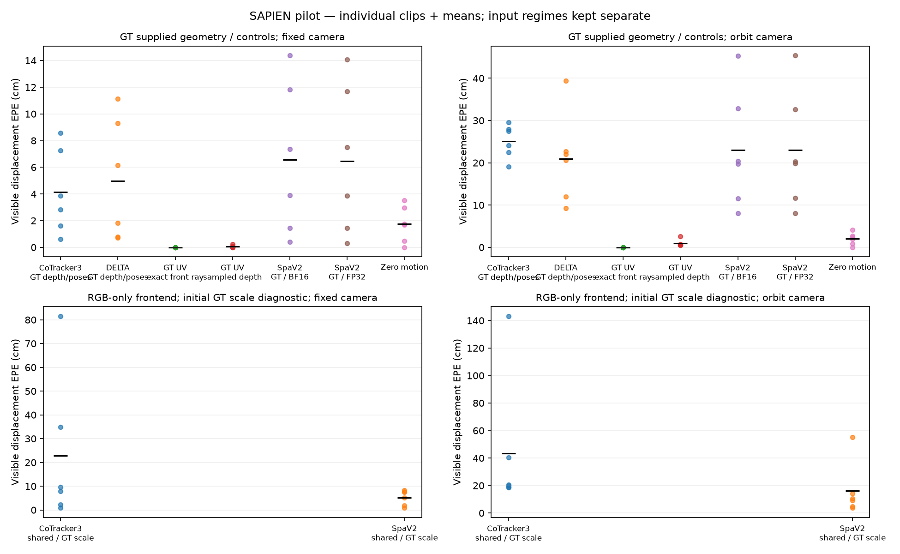
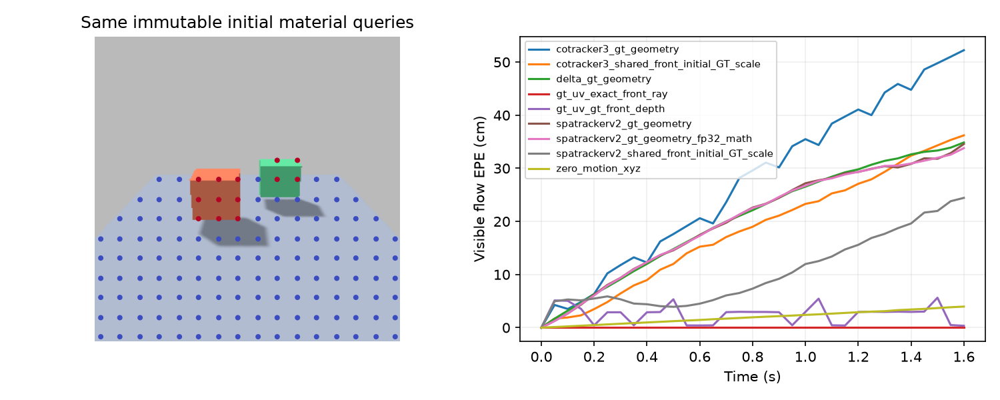

# Experiment 1 executed Uniform-color debug pilot

Real SAPIEN rendered scenes: 12 test clips + 12 disjoint-seeded calibration clips, 33 frames at 20 Hz, 256×256 RGB. Queries: 16×16, 132 valid material points in the static scene. Exact actor-local material GT and time-varying ray visibility.

Uniform colored surfaces produce substantial correspondence ambiguity. Scripted linked rigid boxes stand in for articulation; no native robot-joint or broad OOD ranking claim. SpaTrackerV2, CoTracker3 depth lifts and independent DELTA frozen3D are measured separately below. Predicted-geometry rows use one GT initial-depth scale and are privileged-scale diagnostics, not raw metric monocular scores.

## GT supplied geometry / controls

| Method / geometry regime | Fixed visible EPE (cm) | Orbit visible EPE (cm) |
|---|---:|---:|
| cotracker3_gt_geometry | 4.127 | 25.099 |
| delta_gt_geometry | 4.985 | 20.988 |
| gt_uv_exact_front_ray | 0.000 | 0.000 |
| gt_uv_gt_front_depth | 0.063 | 0.920 |
| spatrackerv2_gt_geometry | 6.556 | 22.976 |
| spatrackerv2_gt_geometry_fp32_math | 6.473 | 22.981 |
| zero_motion_xyz | 1.739 | 2.004 |

## RGB-only frontend; initial GT scale diagnostic

| Method / geometry regime | Fixed visible EPE (cm) | Orbit visible EPE (cm) |
|---|---:|---:|
| cotracker3_shared_front_initial_GT_scale | 22.818 | 43.531 |
| spatrackerv2_shared_front_initial_GT_scale | 5.232 | 16.180 |

EPE excludes frame 0, uses GT visibility, and is conditional on finite predictions. Coverage and per-clip numbers are in `per_clip.csv`. Clip means are macro-averaged separately for each camera mode. GT-UV/exact-front-ray baseline verifies numerical closure; GT-UV/rendered-nearest-depth shows raster/sampling error. Both are visible-only; hidden material depth is never leaked. Raw tracker outputs are retained beside canonical trajectories.

SpaTracker BF16 diagnostic and corrected FP32 SDPA/math precision control appear as separate variants, not independent architectures. The initial FP32 attempt hit an upstream swallowed attention exception and was quarantined, excluded from all summaries; the tracked fail-closed patch enables supported SDPA math fallback and raises remaining failures. Model rankings must wait for input convention verification, textured scene evaluation and wider independent scene replication.

