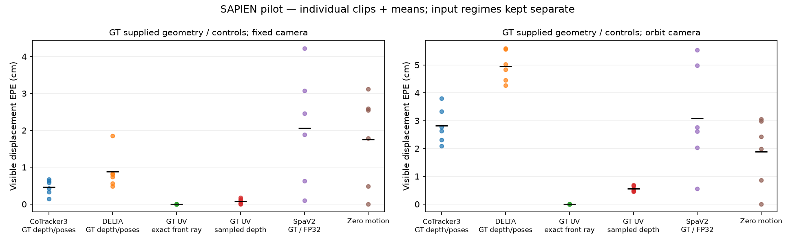
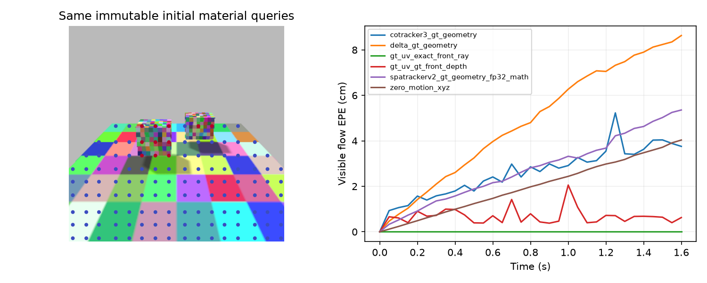

# Experiment 1 executed Textured exact-query-subset control

Real SAPIEN rendered scenes: 12 test clips + 0 disjoint-seeded calibration clips, 33 frames at 20 Hz, 256×256 RGB. Queries: 16×16, 132 valid material points in the static scene. Exact actor-local material GT and time-varying ray visibility.

Seeded nonrepeating material textures improve correspondence observability. Scripted linked rigid boxes stand in for articulation; no native robot-joint or broad OOD ranking claim. SpaTrackerV2, CoTracker3 depth lifts and independent DELTA frozen3D are measured separately below. Predicted-geometry rows use one GT initial-depth scale and are privileged-scale diagnostics, not raw metric monocular scores.

## GT supplied geometry / controls

| Method / geometry regime | Fixed visible EPE (cm) | Orbit visible EPE (cm) |
|---|---:|---:|
| cotracker3_gt_geometry | 0.466 | 2.823 |
| delta_gt_geometry | 0.879 | 4.960 |
| gt_uv_exact_front_ray | 0.000 | 0.000 |
| gt_uv_gt_front_depth | 0.077 | 0.554 |
| spatrackerv2_gt_geometry_fp32_math | 2.063 | 3.079 |
| zero_motion_xyz | 1.755 | 1.886 |

EPE excludes frame 0, uses GT visibility, and is conditional on finite predictions. Coverage and per-clip numbers are in `per_clip.csv`. Clip means are macro-averaged separately for each camera mode. GT-UV/exact-front-ray baseline verifies numerical closure; GT-UV/rendered-nearest-depth shows raster/sampling error. Both are visible-only; hidden material depth is never leaked. Raw tracker outputs are retained beside canonical trajectories.

SpaTracker BF16 diagnostic and corrected FP32 SDPA/math precision control appear as separate variants, not independent architectures. The initial FP32 attempt hit an upstream swallowed attention exception and was quarantined, excluded from all summaries; the tracked fail-closed patch enables supported SDPA math fallback and raises remaining failures. Model rankings must wait for input convention verification, textured scene evaluation and wider independent scene replication.

## Foreground accuracy and physical diagnostics

The visible-scene mean is dominated by background points. The table below weights each foreground object equally within each clip and then averages clips. Occluded-point errors and missing-prediction coverage remain separate in extended_metrics.json and the CSV.

| Method | Visible foreground-object macro EPE (cm) | Visible coverage |
|---|---:|---:|
| cotracker3_gt_geometry | 1.899 | 0.9996 |
| delta_gt_geometry | 3.238 | 1.0000 |
| gt_uv_exact_front_ray | 0.000 | 1.0000 |
| gt_uv_gt_front_depth | 1.091 | 0.9998 |
| spatrackerv2_gt_geometry_fp32_math | 21.767 | 1.0000 |
| zero_motion_xyz | 24.298 | 1.0000 |

Per-axis MAE/RMSE, velocity (m/s), acceleration (m/s²), visibility/motion strata and per-object scores are retained beside every source bundle. CoTracker lifting rejects nonpositive or missing sensor depth; missing geometry counts as a failure in threshold scores. Older uniform-color debug sources are not merged into this primary leaderboard.
