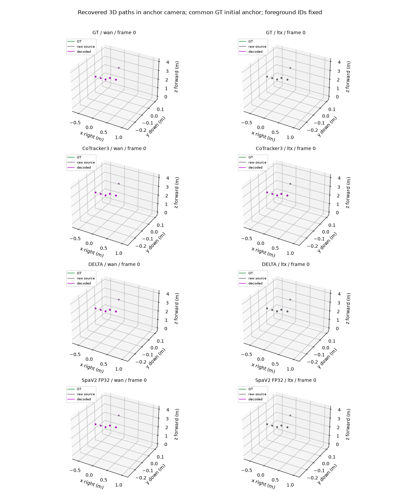
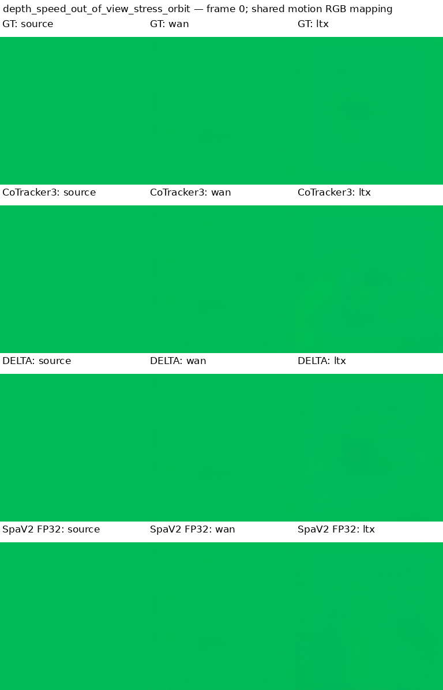
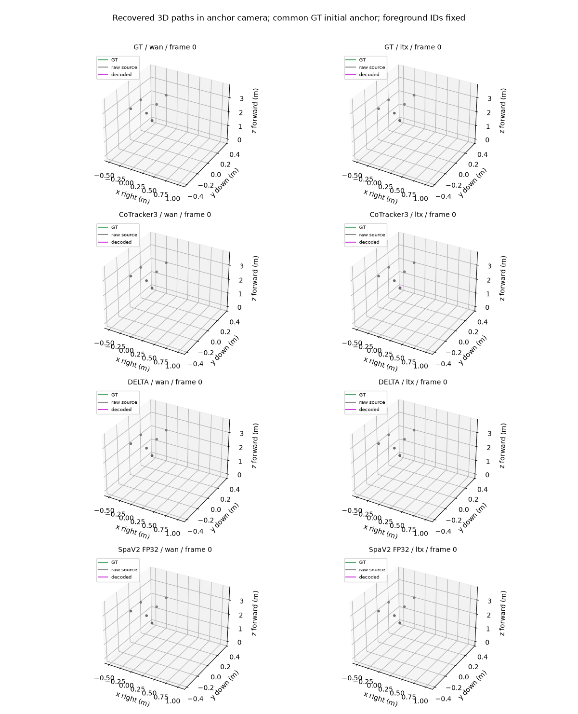
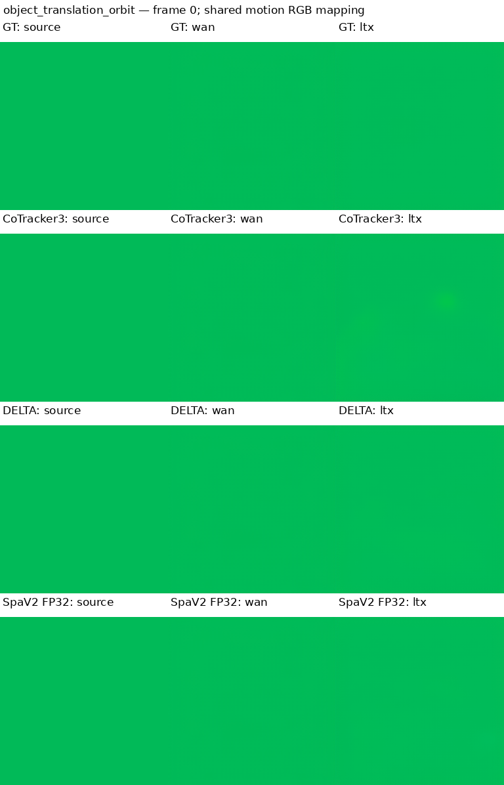
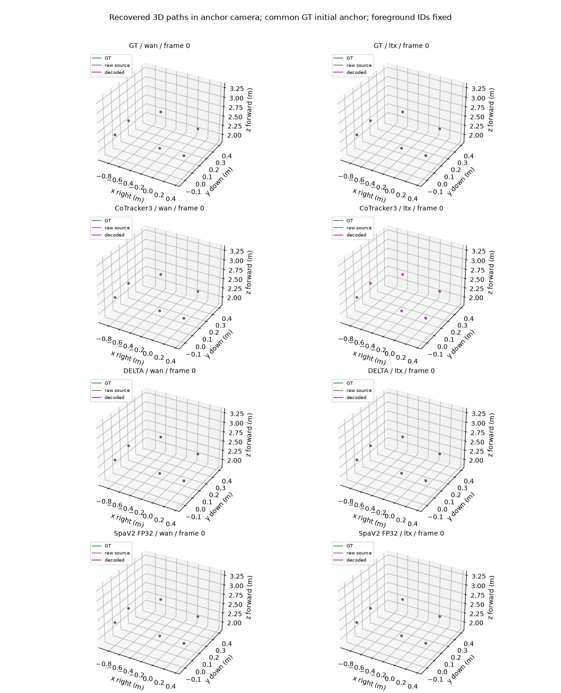
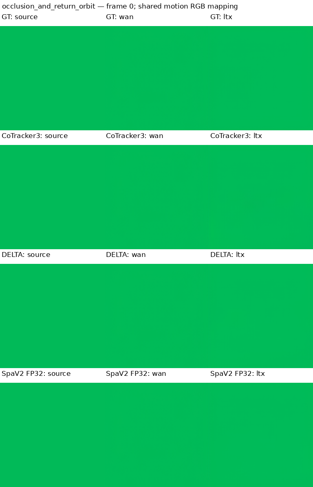

# Measured pilot animations

RGB rows compare GT, CoTracker3, DELTA and corrected SpaTrackerV2 FP32-math motion labels with the two frozen codecs under identical mapping. Three-dimensional trails add the common GT query-frame position to raw/decoded displacement; this is a flow-reconstruction diagnostic and does not score the model initial-position error. Foreground query IDs and axes are held fixed over time and across panels. Display timing is 10fps for readability; source sampling is20Hz.

