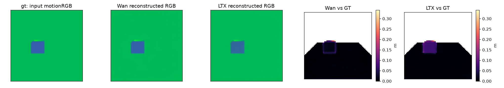
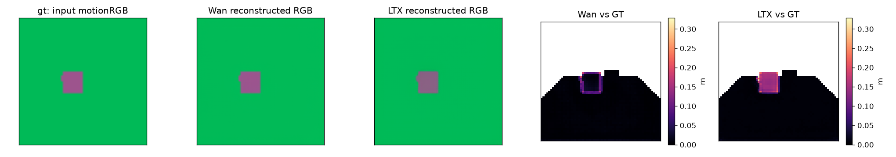
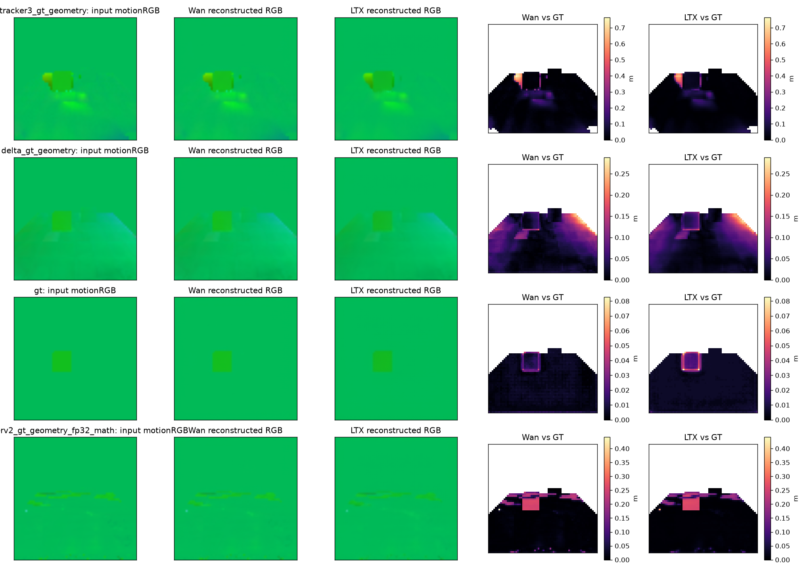
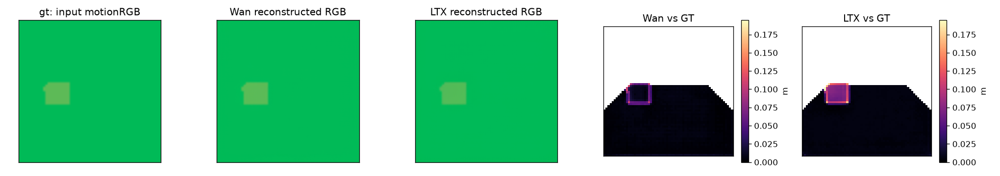
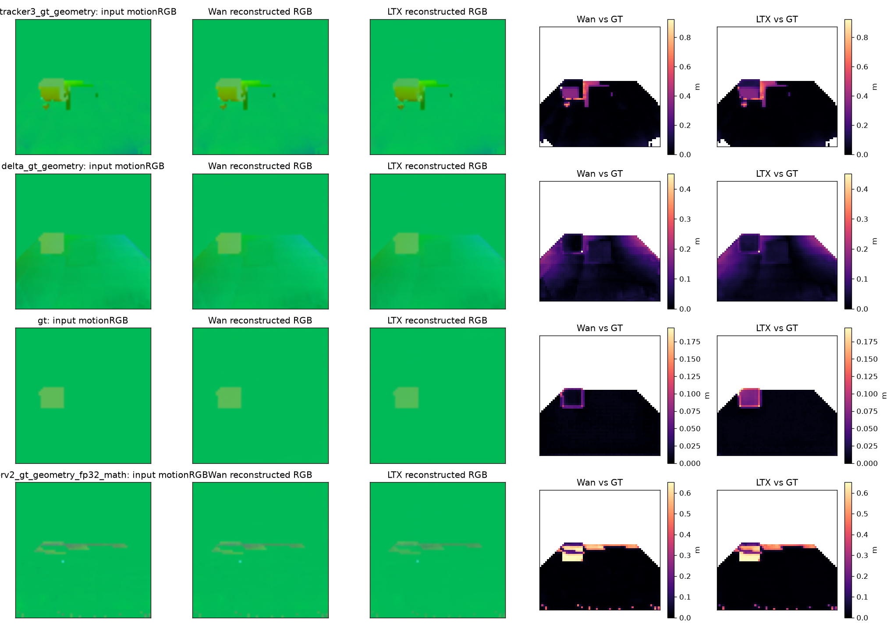
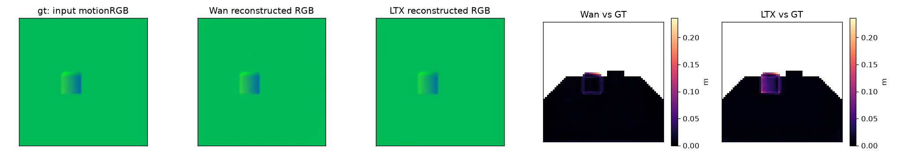
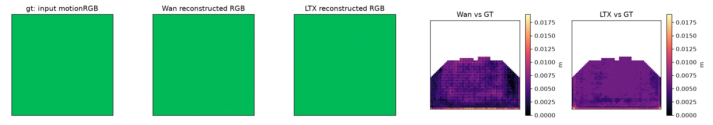

# Experiment 2 GPU pilot results

These are measured frozen VAE reconstructions of 17-frame motion windows from exact SAPIEN scripted-box/link trajectories. One scene seed per archetype and paired fixed/orbit cameras; this bounded pilot does not establish a statistically general model ranking. Both VAEs are frozen; no T5, DiT, training, or diffusion generation is loaded.

All methods/codecs share calibration-only bounds (12 separate scene clips), a 64×64 initial query grid upsampled bilinearly to 256×256, and deterministic posterior mode. Query frame is excluded from main physical averages. Errors below are **macro means across clips**; tracker nonfinite coordinates are excluded from conditional EPE and their coverage is reported separately. Supplied GT depth/cameras are privileged geometry inputs.

| Source | Codec | Clips | Tracking (mm) | Range (mm) | Raster (mm) | Codec self (mm) | Decoded to GT (mm) | Foreground to GT (mm) | Background to GT (mm) | Coverage |
|---|---|---:|---:|---:|---:|---:|---:|---:|---:|---:|
| cotracker3_gt_geometry | wan | 2 | 38.293 | 13.085 | 2.781 | 7.124 | 25.829 | 40.296 | 23.792 | 99.523% |
| cotracker3_gt_geometry | ltx | 2 | 38.293 | 13.085 | 2.781 | 11.468 | 24.481 | 45.859 | 21.665 | 99.523% |
| delta_gt_geometry | wan | 2 | 30.337 | 0.170 | 1.508 | 4.644 | 29.894 | 26.259 | 30.256 | 100.000% |
| delta_gt_geometry | ltx | 2 | 30.337 | 0.170 | 1.508 | 7.890 | 29.319 | 27.986 | 29.422 | 100.000% |
| gt | wan | 12 | 0.000 | 0.100 | 0.569 | 3.721 | 4.277 | 12.807 | 3.532 | 100.000% |
| gt | ltx | 12 | 0.000 | 0.100 | 0.569 | 6.046 | 6.522 | 17.652 | 5.530 | 100.000% |
| spatrackerv2_gt_geometry_fp32_math | wan | 2 | 20.824 | 0.095 | 2.318 | 4.504 | 21.204 | 96.400 | 12.678 | 100.000% |
| spatrackerv2_gt_geometry_fp32_math | ltx | 2 | 20.824 | 0.095 | 2.318 | 7.608 | 21.894 | 98.451 | 13.251 | 100.000% |

Scalar EPE terms are not additive. The decoded-to-GT quantities include tracking, shared range clipping, rasterization and codec loss; codec-self is measured relative to the no-VAE inverse-rendered flow. Foreground/background values are clip-macro means on initial query group masks. Raw decoder overshoot, RGB error, axis errors, native signatures, and exact vector-error identity checks are in each metrics.json. Complete inputs, raw/clamped RGB, reconstructed flows, masks and latents are retained. Preview figures use shared physical error limits.

## Frozen mapping and visual interpretation

Axis lower bounds (m): [-0.0061800298281013966, -0.27625635266304016, -0.34161990880966187]; upper bounds (m): [1.787500023841858, 0.10148724168539047, 0.6503063440322876]. Zero-displacement RGB: [0.003445447149538596, 0.7313329909394078, 0.3444005114602956]. Calibration sampling excludes the anchor frame and uses all32 non-anchor frames, whereas the primary codec window uses16 non-anchor frames. High-speed calibration motion broadens the shared range, so ordinary motion can appear nearly uniform in the RGB previews. Physical error maps use meter units and shared Wan/LTX color limits within each source row. No per-source contrast normalization is applied.

## Side-by-side diagnostics

