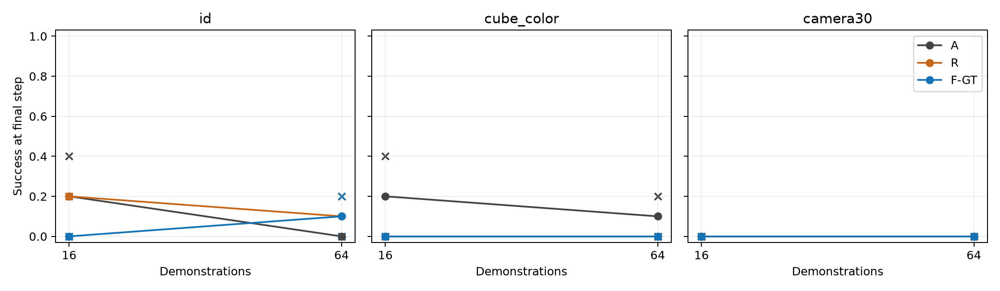

# Experiment 3: recorded evaluation results

## Motivation and hypothesis

Compare action-only, RGB-future-supervised and GT-flow-supervised policies at fixed demonstration count and training budget. Hypothesis: auxiliary supervision changes paired task success and OOD performance.

## Experimental setup

12 saved final LoRA policies; N16/N64, A/R/F-GT, two optimizer seeds. PushCube-v1/Panda, native8D control, RGB+instruction, seeds20000–20004, ID/color/camera30, 150 steps, four-action execution, eight Euler sampler steps, shift5. H100 inference, CPU PhysX and CPU Vulkan rendering. No extra training.

## Measured results

Completed condition groups: 36/36. Rollouts: 180/180.

| N | Arm | Optimizer seed | Condition | Successes / rollouts |
|---|---|---|---|---|
| 16 | A | 0 | id | 0/5 |
| 16 | A | 0 | cube_color | 0/5 |
| 16 | A | 0 | camera30 | 0/5 |
| 16 | A | 1 | id | 2/5 |
| 16 | A | 1 | cube_color | 2/5 |
| 16 | A | 1 | camera30 | 0/5 |
| 16 | R | 0 | id | 1/5 |
| 16 | R | 0 | cube_color | 0/5 |
| 16 | R | 0 | camera30 | 0/5 |
| 16 | R | 1 | id | 1/5 |
| 16 | R | 1 | cube_color | 0/5 |
| 16 | R | 1 | camera30 | 0/5 |
| 16 | F-GT | 0 | id | 0/5 |
| 16 | F-GT | 0 | cube_color | 0/5 |
| 16 | F-GT | 0 | camera30 | 0/5 |
| 16 | F-GT | 1 | id | 0/5 |
| 16 | F-GT | 1 | cube_color | 0/5 |
| 16 | F-GT | 1 | camera30 | 0/5 |
| 64 | A | 0 | id | 0/5 |
| 64 | A | 0 | cube_color | 1/5 |
| 64 | A | 0 | camera30 | 0/5 |
| 64 | A | 1 | id | 0/5 |
| 64 | A | 1 | cube_color | 0/5 |
| 64 | A | 1 | camera30 | 0/5 |
| 64 | R | 0 | id | 1/5 |
| 64 | R | 0 | cube_color | 0/5 |
| 64 | R | 0 | camera30 | 0/5 |
| 64 | R | 1 | id | 0/5 |
| 64 | R | 1 | cube_color | 0/5 |
| 64 | R | 1 | camera30 | 0/5 |
| 64 | F-GT | 0 | id | 1/5 |
| 64 | F-GT | 0 | cube_color | 0/5 |
| 64 | F-GT | 0 | camera30 | 0/5 |
| 64 | F-GT | 1 | id | 0/5 |
| 64 | F-GT | 1 | cube_color | 0/5 |
| 64 | F-GT | 1 | camera30 | 0/5 |

## Visuals

## Recordings

- [N016_A_seed0 / id / cohort_000000.mp4](videos/N016_A_seed0/id/cohort_000000.mp4)
- [N016_A_seed0 / id / cohort_000001.mp4](videos/N016_A_seed0/id/cohort_000001.mp4)
- [N016_A_seed0 / id / cohort_000002.mp4](videos/N016_A_seed0/id/cohort_000002.mp4)
- [N016_A_seed0 / id / cohort_000003.mp4](videos/N016_A_seed0/id/cohort_000003.mp4)
- [N016_A_seed0 / id / cohort_000004.mp4](videos/N016_A_seed0/id/cohort_000004.mp4)
- [N016_A_seed0 / cube_color / cohort_000000.mp4](videos/N016_A_seed0/cube_color/cohort_000000.mp4)
- [N016_A_seed0 / cube_color / cohort_000001.mp4](videos/N016_A_seed0/cube_color/cohort_000001.mp4)
- [N016_A_seed0 / cube_color / cohort_000002.mp4](videos/N016_A_seed0/cube_color/cohort_000002.mp4)
- [N016_A_seed0 / cube_color / cohort_000003.mp4](videos/N016_A_seed0/cube_color/cohort_000003.mp4)
- [N016_A_seed0 / cube_color / cohort_000004.mp4](videos/N016_A_seed0/cube_color/cohort_000004.mp4)
- [N016_A_seed0 / camera30 / cohort_000000.mp4](videos/N016_A_seed0/camera30/cohort_000000.mp4)
- [N016_A_seed0 / camera30 / cohort_000001.mp4](videos/N016_A_seed0/camera30/cohort_000001.mp4)
- [N016_A_seed0 / camera30 / cohort_000002.mp4](videos/N016_A_seed0/camera30/cohort_000002.mp4)
- [N016_A_seed0 / camera30 / cohort_000003.mp4](videos/N016_A_seed0/camera30/cohort_000003.mp4)
- [N016_A_seed0 / camera30 / cohort_000004.mp4](videos/N016_A_seed0/camera30/cohort_000004.mp4)
- [N016_A_seed1 / id / cohort_000000.mp4](videos/N016_A_seed1/id/cohort_000000.mp4)
- [N016_A_seed1 / id / cohort_000001.mp4](videos/N016_A_seed1/id/cohort_000001.mp4)
- [N016_A_seed1 / id / cohort_000002.mp4](videos/N016_A_seed1/id/cohort_000002.mp4)
- [N016_A_seed1 / id / cohort_000003.mp4](videos/N016_A_seed1/id/cohort_000003.mp4)
- [N016_A_seed1 / id / cohort_000004.mp4](videos/N016_A_seed1/id/cohort_000004.mp4)
- [N016_A_seed1 / cube_color / cohort_000000.mp4](videos/N016_A_seed1/cube_color/cohort_000000.mp4)
- [N016_A_seed1 / cube_color / cohort_000001.mp4](videos/N016_A_seed1/cube_color/cohort_000001.mp4)
- [N016_A_seed1 / cube_color / cohort_000002.mp4](videos/N016_A_seed1/cube_color/cohort_000002.mp4)
- [N016_A_seed1 / cube_color / cohort_000003.mp4](videos/N016_A_seed1/cube_color/cohort_000003.mp4)
- [N016_A_seed1 / cube_color / cohort_000004.mp4](videos/N016_A_seed1/cube_color/cohort_000004.mp4)
- [N016_A_seed1 / camera30 / cohort_000000.mp4](videos/N016_A_seed1/camera30/cohort_000000.mp4)
- [N016_A_seed1 / camera30 / cohort_000001.mp4](videos/N016_A_seed1/camera30/cohort_000001.mp4)
- [N016_A_seed1 / camera30 / cohort_000002.mp4](videos/N016_A_seed1/camera30/cohort_000002.mp4)
- [N016_A_seed1 / camera30 / cohort_000003.mp4](videos/N016_A_seed1/camera30/cohort_000003.mp4)
- [N016_A_seed1 / camera30 / cohort_000004.mp4](videos/N016_A_seed1/camera30/cohort_000004.mp4)
- [N016_R_seed0 / id / cohort_000000.mp4](videos/N016_R_seed0/id/cohort_000000.mp4)
- [N016_R_seed0 / id / cohort_000001.mp4](videos/N016_R_seed0/id/cohort_000001.mp4)
- [N016_R_seed0 / id / cohort_000002.mp4](videos/N016_R_seed0/id/cohort_000002.mp4)
- [N016_R_seed0 / id / cohort_000003.mp4](videos/N016_R_seed0/id/cohort_000003.mp4)
- [N016_R_seed0 / id / cohort_000004.mp4](videos/N016_R_seed0/id/cohort_000004.mp4)
- [N016_R_seed0 / cube_color / cohort_000000.mp4](videos/N016_R_seed0/cube_color/cohort_000000.mp4)
- [N016_R_seed0 / cube_color / cohort_000001.mp4](videos/N016_R_seed0/cube_color/cohort_000001.mp4)
- [N016_R_seed0 / cube_color / cohort_000002.mp4](videos/N016_R_seed0/cube_color/cohort_000002.mp4)
- [N016_R_seed0 / cube_color / cohort_000003.mp4](videos/N016_R_seed0/cube_color/cohort_000003.mp4)
- [N016_R_seed0 / cube_color / cohort_000004.mp4](videos/N016_R_seed0/cube_color/cohort_000004.mp4)
- [N016_R_seed0 / camera30 / cohort_000000.mp4](videos/N016_R_seed0/camera30/cohort_000000.mp4)
- [N016_R_seed0 / camera30 / cohort_000001.mp4](videos/N016_R_seed0/camera30/cohort_000001.mp4)
- [N016_R_seed0 / camera30 / cohort_000002.mp4](videos/N016_R_seed0/camera30/cohort_000002.mp4)
- [N016_R_seed0 / camera30 / cohort_000003.mp4](videos/N016_R_seed0/camera30/cohort_000003.mp4)
- [N016_R_seed0 / camera30 / cohort_000004.mp4](videos/N016_R_seed0/camera30/cohort_000004.mp4)
- [N016_R_seed1 / id / cohort_000000.mp4](videos/N016_R_seed1/id/cohort_000000.mp4)
- [N016_R_seed1 / id / cohort_000001.mp4](videos/N016_R_seed1/id/cohort_000001.mp4)
- [N016_R_seed1 / id / cohort_000002.mp4](videos/N016_R_seed1/id/cohort_000002.mp4)
- [N016_R_seed1 / id / cohort_000003.mp4](videos/N016_R_seed1/id/cohort_000003.mp4)
- [N016_R_seed1 / id / cohort_000004.mp4](videos/N016_R_seed1/id/cohort_000004.mp4)
- [N016_R_seed1 / cube_color / cohort_000000.mp4](videos/N016_R_seed1/cube_color/cohort_000000.mp4)
- [N016_R_seed1 / cube_color / cohort_000001.mp4](videos/N016_R_seed1/cube_color/cohort_000001.mp4)
- [N016_R_seed1 / cube_color / cohort_000002.mp4](videos/N016_R_seed1/cube_color/cohort_000002.mp4)
- [N016_R_seed1 / cube_color / cohort_000003.mp4](videos/N016_R_seed1/cube_color/cohort_000003.mp4)
- [N016_R_seed1 / cube_color / cohort_000004.mp4](videos/N016_R_seed1/cube_color/cohort_000004.mp4)
- [N016_R_seed1 / camera30 / cohort_000000.mp4](videos/N016_R_seed1/camera30/cohort_000000.mp4)
- [N016_R_seed1 / camera30 / cohort_000001.mp4](videos/N016_R_seed1/camera30/cohort_000001.mp4)
- [N016_R_seed1 / camera30 / cohort_000002.mp4](videos/N016_R_seed1/camera30/cohort_000002.mp4)
- [N016_R_seed1 / camera30 / cohort_000003.mp4](videos/N016_R_seed1/camera30/cohort_000003.mp4)
- [N016_R_seed1 / camera30 / cohort_000004.mp4](videos/N016_R_seed1/camera30/cohort_000004.mp4)
- [N016_F-GT_seed0 / id / cohort_000000.mp4](videos/N016_F-GT_seed0/id/cohort_000000.mp4)
- [N016_F-GT_seed0 / id / cohort_000001.mp4](videos/N016_F-GT_seed0/id/cohort_000001.mp4)
- [N016_F-GT_seed0 / id / cohort_000002.mp4](videos/N016_F-GT_seed0/id/cohort_000002.mp4)
- [N016_F-GT_seed0 / id / cohort_000003.mp4](videos/N016_F-GT_seed0/id/cohort_000003.mp4)
- [N016_F-GT_seed0 / id / cohort_000004.mp4](videos/N016_F-GT_seed0/id/cohort_000004.mp4)
- [N016_F-GT_seed0 / cube_color / cohort_000000.mp4](videos/N016_F-GT_seed0/cube_color/cohort_000000.mp4)
- [N016_F-GT_seed0 / cube_color / cohort_000001.mp4](videos/N016_F-GT_seed0/cube_color/cohort_000001.mp4)
- [N016_F-GT_seed0 / cube_color / cohort_000002.mp4](videos/N016_F-GT_seed0/cube_color/cohort_000002.mp4)
- [N016_F-GT_seed0 / cube_color / cohort_000003.mp4](videos/N016_F-GT_seed0/cube_color/cohort_000003.mp4)
- [N016_F-GT_seed0 / cube_color / cohort_000004.mp4](videos/N016_F-GT_seed0/cube_color/cohort_000004.mp4)
- [N016_F-GT_seed0 / camera30 / cohort_000000.mp4](videos/N016_F-GT_seed0/camera30/cohort_000000.mp4)
- [N016_F-GT_seed0 / camera30 / cohort_000001.mp4](videos/N016_F-GT_seed0/camera30/cohort_000001.mp4)
- [N016_F-GT_seed0 / camera30 / cohort_000002.mp4](videos/N016_F-GT_seed0/camera30/cohort_000002.mp4)
- [N016_F-GT_seed0 / camera30 / cohort_000003.mp4](videos/N016_F-GT_seed0/camera30/cohort_000003.mp4)
- [N016_F-GT_seed0 / camera30 / cohort_000004.mp4](videos/N016_F-GT_seed0/camera30/cohort_000004.mp4)
- [N016_F-GT_seed1 / id / cohort_000000.mp4](videos/N016_F-GT_seed1/id/cohort_000000.mp4)
- [N016_F-GT_seed1 / id / cohort_000001.mp4](videos/N016_F-GT_seed1/id/cohort_000001.mp4)
- [N016_F-GT_seed1 / id / cohort_000002.mp4](videos/N016_F-GT_seed1/id/cohort_000002.mp4)
- [N016_F-GT_seed1 / id / cohort_000003.mp4](videos/N016_F-GT_seed1/id/cohort_000003.mp4)
- [N016_F-GT_seed1 / id / cohort_000004.mp4](videos/N016_F-GT_seed1/id/cohort_000004.mp4)
- [N016_F-GT_seed1 / cube_color / cohort_000000.mp4](videos/N016_F-GT_seed1/cube_color/cohort_000000.mp4)
- [N016_F-GT_seed1 / cube_color / cohort_000001.mp4](videos/N016_F-GT_seed1/cube_color/cohort_000001.mp4)
- [N016_F-GT_seed1 / cube_color / cohort_000002.mp4](videos/N016_F-GT_seed1/cube_color/cohort_000002.mp4)
- [N016_F-GT_seed1 / cube_color / cohort_000003.mp4](videos/N016_F-GT_seed1/cube_color/cohort_000003.mp4)
- [N016_F-GT_seed1 / cube_color / cohort_000004.mp4](videos/N016_F-GT_seed1/cube_color/cohort_000004.mp4)
- [N016_F-GT_seed1 / camera30 / cohort_000000.mp4](videos/N016_F-GT_seed1/camera30/cohort_000000.mp4)
- [N016_F-GT_seed1 / camera30 / cohort_000001.mp4](videos/N016_F-GT_seed1/camera30/cohort_000001.mp4)
- [N016_F-GT_seed1 / camera30 / cohort_000002.mp4](videos/N016_F-GT_seed1/camera30/cohort_000002.mp4)
- [N016_F-GT_seed1 / camera30 / cohort_000003.mp4](videos/N016_F-GT_seed1/camera30/cohort_000003.mp4)
- [N016_F-GT_seed1 / camera30 / cohort_000004.mp4](videos/N016_F-GT_seed1/camera30/cohort_000004.mp4)
- [N064_A_seed0 / id / cohort_000000.mp4](videos/N064_A_seed0/id/cohort_000000.mp4)
- [N064_A_seed0 / id / cohort_000001.mp4](videos/N064_A_seed0/id/cohort_000001.mp4)
- [N064_A_seed0 / id / cohort_000002.mp4](videos/N064_A_seed0/id/cohort_000002.mp4)
- [N064_A_seed0 / id / cohort_000003.mp4](videos/N064_A_seed0/id/cohort_000003.mp4)
- [N064_A_seed0 / id / cohort_000004.mp4](videos/N064_A_seed0/id/cohort_000004.mp4)
- [N064_A_seed0 / cube_color / cohort_000000.mp4](videos/N064_A_seed0/cube_color/cohort_000000.mp4)
- [N064_A_seed0 / cube_color / cohort_000001.mp4](videos/N064_A_seed0/cube_color/cohort_000001.mp4)
- [N064_A_seed0 / cube_color / cohort_000002.mp4](videos/N064_A_seed0/cube_color/cohort_000002.mp4)
- [N064_A_seed0 / cube_color / cohort_000003.mp4](videos/N064_A_seed0/cube_color/cohort_000003.mp4)
- [N064_A_seed0 / cube_color / cohort_000004.mp4](videos/N064_A_seed0/cube_color/cohort_000004.mp4)
- [N064_A_seed0 / camera30 / cohort_000000.mp4](videos/N064_A_seed0/camera30/cohort_000000.mp4)
- [N064_A_seed0 / camera30 / cohort_000001.mp4](videos/N064_A_seed0/camera30/cohort_000001.mp4)
- [N064_A_seed0 / camera30 / cohort_000002.mp4](videos/N064_A_seed0/camera30/cohort_000002.mp4)
- [N064_A_seed0 / camera30 / cohort_000003.mp4](videos/N064_A_seed0/camera30/cohort_000003.mp4)
- [N064_A_seed0 / camera30 / cohort_000004.mp4](videos/N064_A_seed0/camera30/cohort_000004.mp4)
- [N064_A_seed1 / id / cohort_000000.mp4](videos/N064_A_seed1/id/cohort_000000.mp4)
- [N064_A_seed1 / id / cohort_000001.mp4](videos/N064_A_seed1/id/cohort_000001.mp4)
- [N064_A_seed1 / id / cohort_000002.mp4](videos/N064_A_seed1/id/cohort_000002.mp4)
- [N064_A_seed1 / id / cohort_000003.mp4](videos/N064_A_seed1/id/cohort_000003.mp4)
- [N064_A_seed1 / id / cohort_000004.mp4](videos/N064_A_seed1/id/cohort_000004.mp4)
- [N064_A_seed1 / cube_color / cohort_000000.mp4](videos/N064_A_seed1/cube_color/cohort_000000.mp4)
- [N064_A_seed1 / cube_color / cohort_000001.mp4](videos/N064_A_seed1/cube_color/cohort_000001.mp4)
- [N064_A_seed1 / cube_color / cohort_000002.mp4](videos/N064_A_seed1/cube_color/cohort_000002.mp4)
- [N064_A_seed1 / cube_color / cohort_000003.mp4](videos/N064_A_seed1/cube_color/cohort_000003.mp4)
- [N064_A_seed1 / cube_color / cohort_000004.mp4](videos/N064_A_seed1/cube_color/cohort_000004.mp4)
- [N064_A_seed1 / camera30 / cohort_000000.mp4](videos/N064_A_seed1/camera30/cohort_000000.mp4)
- [N064_A_seed1 / camera30 / cohort_000001.mp4](videos/N064_A_seed1/camera30/cohort_000001.mp4)
- [N064_A_seed1 / camera30 / cohort_000002.mp4](videos/N064_A_seed1/camera30/cohort_000002.mp4)
- [N064_A_seed1 / camera30 / cohort_000003.mp4](videos/N064_A_seed1/camera30/cohort_000003.mp4)
- [N064_A_seed1 / camera30 / cohort_000004.mp4](videos/N064_A_seed1/camera30/cohort_000004.mp4)
- [N064_R_seed0 / id / cohort_000000.mp4](videos/N064_R_seed0/id/cohort_000000.mp4)
- [N064_R_seed0 / id / cohort_000001.mp4](videos/N064_R_seed0/id/cohort_000001.mp4)
- [N064_R_seed0 / id / cohort_000002.mp4](videos/N064_R_seed0/id/cohort_000002.mp4)
- [N064_R_seed0 / id / cohort_000003.mp4](videos/N064_R_seed0/id/cohort_000003.mp4)
- [N064_R_seed0 / id / cohort_000004.mp4](videos/N064_R_seed0/id/cohort_000004.mp4)
- [N064_R_seed0 / cube_color / cohort_000000.mp4](videos/N064_R_seed0/cube_color/cohort_000000.mp4)
- [N064_R_seed0 / cube_color / cohort_000001.mp4](videos/N064_R_seed0/cube_color/cohort_000001.mp4)
- [N064_R_seed0 / cube_color / cohort_000002.mp4](videos/N064_R_seed0/cube_color/cohort_000002.mp4)
- [N064_R_seed0 / cube_color / cohort_000003.mp4](videos/N064_R_seed0/cube_color/cohort_000003.mp4)
- [N064_R_seed0 / cube_color / cohort_000004.mp4](videos/N064_R_seed0/cube_color/cohort_000004.mp4)
- [N064_R_seed0 / camera30 / cohort_000000.mp4](videos/N064_R_seed0/camera30/cohort_000000.mp4)
- [N064_R_seed0 / camera30 / cohort_000001.mp4](videos/N064_R_seed0/camera30/cohort_000001.mp4)
- [N064_R_seed0 / camera30 / cohort_000002.mp4](videos/N064_R_seed0/camera30/cohort_000002.mp4)
- [N064_R_seed0 / camera30 / cohort_000003.mp4](videos/N064_R_seed0/camera30/cohort_000003.mp4)
- [N064_R_seed0 / camera30 / cohort_000004.mp4](videos/N064_R_seed0/camera30/cohort_000004.mp4)
- [N064_R_seed1 / id / cohort_000000.mp4](videos/N064_R_seed1/id/cohort_000000.mp4)
- [N064_R_seed1 / id / cohort_000001.mp4](videos/N064_R_seed1/id/cohort_000001.mp4)
- [N064_R_seed1 / id / cohort_000002.mp4](videos/N064_R_seed1/id/cohort_000002.mp4)
- [N064_R_seed1 / id / cohort_000003.mp4](videos/N064_R_seed1/id/cohort_000003.mp4)
- [N064_R_seed1 / id / cohort_000004.mp4](videos/N064_R_seed1/id/cohort_000004.mp4)
- [N064_R_seed1 / cube_color / cohort_000000.mp4](videos/N064_R_seed1/cube_color/cohort_000000.mp4)
- [N064_R_seed1 / cube_color / cohort_000001.mp4](videos/N064_R_seed1/cube_color/cohort_000001.mp4)
- [N064_R_seed1 / cube_color / cohort_000002.mp4](videos/N064_R_seed1/cube_color/cohort_000002.mp4)
- [N064_R_seed1 / cube_color / cohort_000003.mp4](videos/N064_R_seed1/cube_color/cohort_000003.mp4)
- [N064_R_seed1 / cube_color / cohort_000004.mp4](videos/N064_R_seed1/cube_color/cohort_000004.mp4)
- [N064_R_seed1 / camera30 / cohort_000000.mp4](videos/N064_R_seed1/camera30/cohort_000000.mp4)
- [N064_R_seed1 / camera30 / cohort_000001.mp4](videos/N064_R_seed1/camera30/cohort_000001.mp4)
- [N064_R_seed1 / camera30 / cohort_000002.mp4](videos/N064_R_seed1/camera30/cohort_000002.mp4)
- [N064_R_seed1 / camera30 / cohort_000003.mp4](videos/N064_R_seed1/camera30/cohort_000003.mp4)
- [N064_R_seed1 / camera30 / cohort_000004.mp4](videos/N064_R_seed1/camera30/cohort_000004.mp4)
- [N064_F-GT_seed0 / id / cohort_000000.mp4](videos/N064_F-GT_seed0/id/cohort_000000.mp4)
- [N064_F-GT_seed0 / id / cohort_000001.mp4](videos/N064_F-GT_seed0/id/cohort_000001.mp4)
- [N064_F-GT_seed0 / id / cohort_000002.mp4](videos/N064_F-GT_seed0/id/cohort_000002.mp4)
- [N064_F-GT_seed0 / id / cohort_000003.mp4](videos/N064_F-GT_seed0/id/cohort_000003.mp4)
- [N064_F-GT_seed0 / id / cohort_000004.mp4](videos/N064_F-GT_seed0/id/cohort_000004.mp4)
- [N064_F-GT_seed0 / cube_color / cohort_000000.mp4](videos/N064_F-GT_seed0/cube_color/cohort_000000.mp4)
- [N064_F-GT_seed0 / cube_color / cohort_000001.mp4](videos/N064_F-GT_seed0/cube_color/cohort_000001.mp4)
- [N064_F-GT_seed0 / cube_color / cohort_000002.mp4](videos/N064_F-GT_seed0/cube_color/cohort_000002.mp4)
- [N064_F-GT_seed0 / cube_color / cohort_000003.mp4](videos/N064_F-GT_seed0/cube_color/cohort_000003.mp4)
- [N064_F-GT_seed0 / cube_color / cohort_000004.mp4](videos/N064_F-GT_seed0/cube_color/cohort_000004.mp4)
- [N064_F-GT_seed0 / camera30 / cohort_000000.mp4](videos/N064_F-GT_seed0/camera30/cohort_000000.mp4)
- [N064_F-GT_seed0 / camera30 / cohort_000001.mp4](videos/N064_F-GT_seed0/camera30/cohort_000001.mp4)
- [N064_F-GT_seed0 / camera30 / cohort_000002.mp4](videos/N064_F-GT_seed0/camera30/cohort_000002.mp4)
- [N064_F-GT_seed0 / camera30 / cohort_000003.mp4](videos/N064_F-GT_seed0/camera30/cohort_000003.mp4)
- [N064_F-GT_seed0 / camera30 / cohort_000004.mp4](videos/N064_F-GT_seed0/camera30/cohort_000004.mp4)
- [N064_F-GT_seed1 / id / cohort_000000.mp4](videos/N064_F-GT_seed1/id/cohort_000000.mp4)
- [N064_F-GT_seed1 / id / cohort_000001.mp4](videos/N064_F-GT_seed1/id/cohort_000001.mp4)
- [N064_F-GT_seed1 / id / cohort_000002.mp4](videos/N064_F-GT_seed1/id/cohort_000002.mp4)
- [N064_F-GT_seed1 / id / cohort_000003.mp4](videos/N064_F-GT_seed1/id/cohort_000003.mp4)
- [N064_F-GT_seed1 / id / cohort_000004.mp4](videos/N064_F-GT_seed1/id/cohort_000004.mp4)
- [N064_F-GT_seed1 / cube_color / cohort_000000.mp4](videos/N064_F-GT_seed1/cube_color/cohort_000000.mp4)
- [N064_F-GT_seed1 / cube_color / cohort_000001.mp4](videos/N064_F-GT_seed1/cube_color/cohort_000001.mp4)
- [N064_F-GT_seed1 / cube_color / cohort_000002.mp4](videos/N064_F-GT_seed1/cube_color/cohort_000002.mp4)
- [N064_F-GT_seed1 / cube_color / cohort_000003.mp4](videos/N064_F-GT_seed1/cube_color/cohort_000003.mp4)
- [N064_F-GT_seed1 / cube_color / cohort_000004.mp4](videos/N064_F-GT_seed1/cube_color/cohort_000004.mp4)
- [N064_F-GT_seed1 / camera30 / cohort_000000.mp4](videos/N064_F-GT_seed1/camera30/cohort_000000.mp4)
- [N064_F-GT_seed1 / camera30 / cohort_000001.mp4](videos/N064_F-GT_seed1/camera30/cohort_000001.mp4)
- [N064_F-GT_seed1 / camera30 / cohort_000002.mp4](videos/N064_F-GT_seed1/camera30/cohort_000002.mp4)
- [N064_F-GT_seed1 / camera30 / cohort_000003.mp4](videos/N064_F-GT_seed1/camera30/cohort_000003.mp4)
- [N064_F-GT_seed1 / camera30 / cohort_000004.mp4](videos/N064_F-GT_seed1/camera30/cohort_000004.mp4)

## Measurement scope

One task, one subset seed, two optimizer seeds and five resets per condition. The recovered cohort uses CPU rendering and Torch2.8; the original node used GPU rendering and Torch2.12. Missing cells are omitted. No original partial summaries are merged into this cohort.
