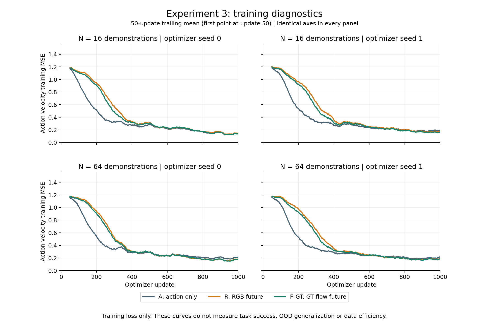
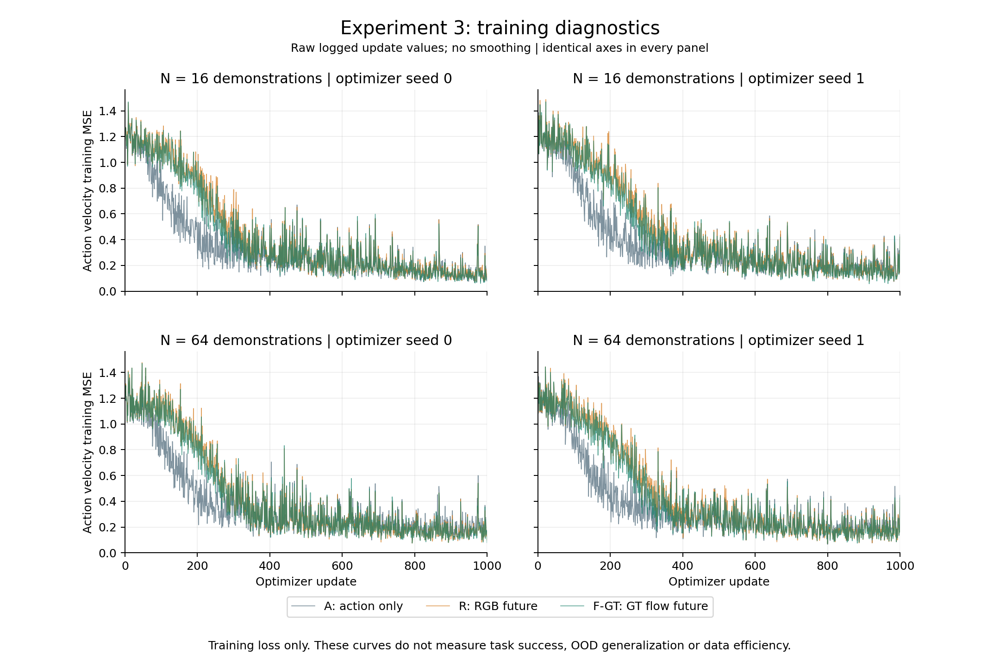

# Experiment 3 training diagnostics

All 12 verified local training logs contain 1,000 updates. These figures compare the saved action velocity **training MSE**, with identical axis ranges across N16/N64 and optimizer seeds 0/1.

The plotted value is the logged `action` term: mean squared error between the predicted flow-matching action velocity and `noise − normalized_action`, averaged over action dimensions and the training batch. It is not an error measured in physical joint units. Each update uses effective batch 4; the plots preserve the logged metric rather than recomputing a gradient-accumulation average.

The primary figure applies a 50-update trailing arithmetic mean. Its first point is update 50; there is no edge padding or extrapolation. The companion figure shows all raw logged values with the same axes. The CSV retains all 12,000 observations.

All arms reduce training loss over the bounded pilot. The final-100-update means are:

| Training demonstrations | Arm | Seed 0 | Seed 1 |
|---|---|---:|---:|
| 16 | A | 0.138312 | 0.193909 |
| 16 | R | 0.142360 | 0.177360 |
| 16 | F-GT | 0.131350 | 0.166795 |
| 64 | A | 0.198544 | 0.212324 |
| 64 | R | 0.169080 | 0.192209 |
| 64 | F-GT | 0.165480 | 0.187423 |

Across all 12,000 raw values, the observed range is 0.057229623–1.488081694. Both figures use the same 0–1.56249 vertical axis; **0 raw observations are clipped**. This axis was checked against every saved observation, including the first updates.

A uses action supervision with a masked dummy future stream; R adds RGB future supervision; F-GT adds simulator GT flow future supervision. All use LTX2B with rank-16 LoRA, matching action interfaces, 1,000 updates and effective batch 4. Every saved frozen-base integrity audit passed. The main comparison plots only the common action term: total losses would include different auxiliary objectives and are unsuitable for this direct comparison.

These are training diagnostics, **not task success or evidence of data efficiency/OOD generalization**. N16 and N64 are trained on different episode distributions, with subset-specific normalization; their training loss levels do not constitute a held-out cross-N comparison. Two optimizer seeds and one subset seed do not support strong uncertainty estimates. The plots therefore show each seed individually, without confidence bands or significance claims.

Final evaluation records remain on the unreachable GPU node. The last confirmed status was 25 of 36 condition cells completed; no final task-success aggregates were available for this offline report.

Source: `metrics.jsonl` entries previously streamed from the SHA-verified local `exp03-core.tar.gz`, accessed through `work/exp03/local_core_metadata.json`. Per-run final-100 means were checked against `outputs/experiment-03-verified-training.json`; exactly 1,000 sequential finite updates per run were required. No weights were loaded and no GPU, network connection or archive extraction was used.
